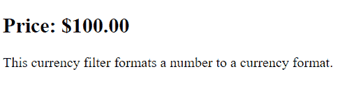
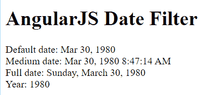
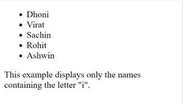
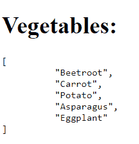
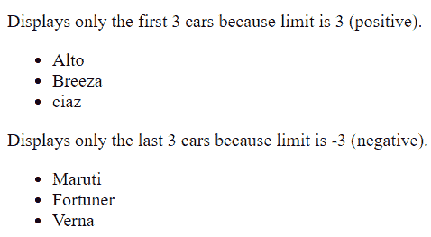
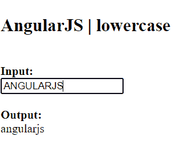
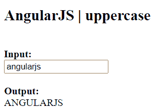
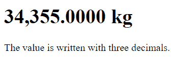
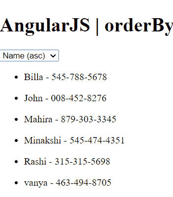

# AngularJS 中的过滤器是什么？

> 原文:[https://www . geeksforgeeks . org/什么是 in-angularjs 中的过滤器/](https://www.geeksforgeeks.org/what-are-filters-in-angularjs/)

在本文中，我们将讨论 AngularJS 中的过滤器。可以在 AngularJS 中添加过滤器，在不改变原始格式的情况下格式化数据以在用户界面上显示。可以使用管道|符号将过滤器添加到表达式或指令中。

```
{{expression | filterName:parameter }}
```

**AngularJS 过滤器:** AngularJS 提供过滤器来转换不同数据类型的数据。下表显示了重要的过滤器:

<figure class="table">

| Filter name | describe |
| --- | --- |
| money | Used to convert numbers to currency format. |
| date | Used to convert the date to the specified format. |
| filter | Used to filter array and object elements and return filtered items. |
| json | Convert a JavaScript object into JSON. |
| 有限 | Returns an array or string containing a specified number of elements. |
| small letter | It is used to convert strings into lowercase letters. |
| capitalize | It is used to convert strings into uppercase letters. |
| figure | It is used to convert numbers into strings or text. |
| 以...排序 | It sorts the array according to the specified predicate expression. |

</figure>

**1。货币过滤器:**该过滤器用于将数字转换为货币格式。当没有实现货币格式时，货币过滤器使用本地货币格式。

**语法:**

```
{{ currency_expression | currency : symbol : fractionSize}}
```

**示例:**

## 超文本标记语言

```
<!DOCTYPE html>
<html>

<head>
    <script src=
"https://ajax.googleapis.com/ajax/libs/angularjs/1.6.9/angular.min.js">
    </script>
</head>

<body>
    <div ng-app="app1" ng-controller="costCtrl">
        <h2>Price: {{ price | currency }}</h2>
    </div>

    <script>
        var app = angular.module("app1", []);
        app.controller("costCtrl", function ($scope) {
            $scope.price = 100;
        });
    </script>

<p>
        This currency filter formats a
        number to a currency format.
    </p>

</body>

</html>
```

**输出:**



货币过滤器将数字格式化为货币。

**2。日期过滤器:**该过滤器用于将日期转换为指定的格式。如果未指定日期格式，则使用默认日期格式“MMM d，yyyy”。

**语法:**

```
{{ date | date : format : timezone }}
```

**示例:**

## 超文本标记语言

```
<!DOCTYPE html>
<html>

<head>
    <script src=
"https://ajax.googleapis.com/ajax/libs/angularjs/1.3.16/angular.min.js">
    </script>
</head>

<body ng-app>
    <h1>AngularJS Date Filter</h1>

    <div ng-init="person.DOB = 323234234898">
        Default date: {{person.DOB| date}} <br />
        Medium date: {{person.DOB| date:'medium'}} <br />
        Full date: {{person.DOB | date:'fullDate'}} <br />
        Year: {{person.DOB | date:'yyyy'}} <br />
    </div>
</body>

</html>
```

**输出:**



日期过滤器

**3。filter Filter:** 此过滤器用于过滤数组和对象元素，并返回一个新数组。

**语法:**

```
{{ expression | filter : filter_criteria }}
```

**示例:**

## 超文本标记语言

```
<!DOCTYPE html>
<html>

<head>
    <script src=
"https://ajax.googleapis.com/ajax/libs/angularjs/1.6.9/angular.min.js">
    </script>
</head>

<body>
    <div ng-app="app1" ng-controller="namesCtrl">
        <ul>
            <li ng-repeat="x in names | filter : 'i'">{{ x }}</li>
        </ul>
    </div>

    <script>
        angular.module("app1", []).controller(
            "namesCtrl", function ($scope) {
                $scope.names = [
                    "Dhoni",
                    "Virat",
                    "Sachin",
                    "Rohit",
                    "Suresh",
                    "Sehwag",
                    "Zadeja",
                    "Ashwin",
                    "Harbhajan",
                ];
            });
    </script>

<p>
        This example displays only the names
        containing the letter "i".
    </p>

</body>

</html>
```

**输出:**



过滤器过滤器

**4。json 过滤器:**这个过滤器用来将一个 JavaScript 对象转换成 JSON。

**语法:**

```
 {{ object | json : spacing }}
```

**示例:**

## 超文本标记语言

```
<!DOCTYPE html>
<html>

<head>
    <script src=
"https://ajax.googleapis.com/ajax/libs/angularjs/1.6.9/angular.min.js">
    </script>
</head>

<body>
    <div ng-app="vegetable" ng-controller="vegetableCtrl">
        <h1>Vegetable:</h1>

        <pre>{{vegetable | json : 10}}</pre>
    </div>

    <script>
        var app = angular.module("vegetable", []);
        app.controller("vegetableCtrl", function ($scope) {
            $scope.vegetable = [
                "Beetroot",
                "Carrot",
                "Potato",
                "Asparagus",
                "Eggplant",
            ];
        });
    </script>
</body>

</html>
```

**输出:**



json 过滤器。

**5。limitTo Filter:** 这个过滤器是用来返回一个数组或者一个包含了详细元素个数的字符串。它用于字符串和数字。它返回一个只包含指定数字和字符数的字符串。

**语法:**

```
{{ object | limitTo : limit : begin }}
```

**参数:**

**限制:**指定返回的数组或字符串的长度。

**开始:**指定限制开始的索引。默认情况下，它的值为零。

**示例:**

## 超文本标记语言

```
<!DOCTYPE html>
<html>

<head>
    <script src=
"https://ajax.googleapis.com/ajax/libs/angularjs/1.4.8/angular.min.js">
    </script>
</head>

<body>
    <div ng-app="app1" ng-controller="sizeCtrl">

<p>
            Displays only the first 3 cars
            because limit is 3 (positive).
        </p>

        <ul>
            <li ng-repeat="x in cars | limitTo : 3">{{x}}</li>
        </ul>

<p>
            Displays only the last 3 cars
            because limit is -3 (negative).
        </p>

        <ul>
            <li ng-repeat="x in cars | limitTo : -3">{{x}}</li>
        </ul>
    </div>

    <script>
        var app = angular.module("app1", []);
        app.controller("sizeCtrl", function ($scope) {
            $scope.cars = ["Alto", "Breeza",
            "ciaz", "Maruti", "Fortuner", "Verna"];
        });
    </script>
</body>

</html>
```

**输出:**



有限过滤器。

**6。小写:**这个过滤器是用来把一个字符串转换成小写字母。

**语法:**

```
{{expression|lowercase}}
```

**示例:**

## 超文本标记语言

```
<!DOCTYPE html>
<html>

<head>
    <script src=
"https://ajax.googleapis.com/ajax/libs/angularjs/1.6.9/angular.min.js">
    </script>
</head>

<body>
    <h2>AngularJS | lowercase</h2>

    <div ng-app="app1" ng-controller="lowCtrl">
        <strong>Input:</strong>
        <input type="text" ng-model="string" />
        <strong>Output:</strong>
        {{string|lowercase}}
    </div>

    <script>
        var app = angular.module("app1", []);
        app.controller("lowCtrl", function ($scope) {
            $scope.string = "";
        });
    </script>
</body>

</html>
```

**输出:**



小写过滤器。

**7。大写:**该过滤器用于将字符串转换为大写字母。

**语法:**

```
{{ string | uppercase}}
```

**示例:**

## 超文本标记语言

```
<!DOCTYPE html>
<html>

<head>
    <script src=
"https://ajax.googleapis.com/ajax/libs/angularjs/1.6.9/angular.min.js">
    </script>
</head>

<body>
    <h2>AngularJS | uppercase</h2>
    <div ng-app="app1" ng-controller="upCtrl">
        <strong>Input:</strong>
        <input type="text" ng-model="string" />
        <strong>Output:</strong>
        {{string|uppercase}}
    </div>

    <script>
        var app = angular.module("app1", []);
        app.controller("upCtrl", function ($scope) {
            $scope.string = "";
        });
    </script>
</body>

</html>
```

**输出:**



大写过滤器。

**8。数字过滤器:**该过滤器用于将数字转换为字符串或文本。

**语法:**

```
{{ string| number : fractionSize}}
```

**示例:**

## 超文本标记语言

```
<!DOCTYPE html>
<html>

<head>
    <script src=
"https://ajax.googleapis.com/ajax/libs/angularjs/1.6.9/angular.min.js">
    </script>
</head>

<body>
    <div ng-app="app1" ng-controller="nCtrl">
        <h1>{{value | number : 4}} kg</h1>
    </div>

    <script>
        var app = angular.module("app1", []);
        app.controller("nCtrl", function ($scope) {
            $scope.value = 34355;
        });
    </script>

<p>The value is written with three decimals.</p>

</body>

</html>
```

**输出:**



数字过滤器。

**9。orderBy 筛选器:**此筛选器基于指定的谓词表达式对数组进行排序。

**语法:**

```
{{ orderBy_expression | orderBy : expression : reverse }}  
```

**示例:**

## 超文本标记语言

```
<!DOCTYPE html>
<html>

<head>
    <script src=
"https://ajax.googleapis.com/ajax/libs/angularjs/1.3.16/angular.min.js">
    </script>
</head>

<body ng-app="app1">
    <h1>AngularJS | orderBy</h1>
    <div ng-controller="myController">
        <select ng-model="SortOrder">
            <option value="+name">Name (asc)</option>
            <option value="-name">Name (dec)</option>
            <option value="+phone">Phone (asc)</option>
            <option value="-phone">Phone (dec)</option>
        </select>
        <ul ng-repeat="person in persons | orderBy:SortOrder">
            <li>{{person.name}} - {{person.phone}}</li>
        </ul>
    </div>

    <script>
        var myApp = angular.module("app1", []);
        myApp.controller("myController", function ($scope) {
            $scope.persons = [
                { name: "John", phone: "008-452-8276" },
                { name: "Mahira", phone: "879-303-3345" },
                { name: "Minakshi", phone: "545-474-4351" },
                { name: "Billa", phone: "545-788-5678" },
                { name: "vanya", phone: "463-494-8705" },
                { name: "Rashi", phone: "315-315-5698" },
            ];
            $scope.SortOrder = "+name";
        });
    </script>
</body>

</html>
```

**输出:**



排序依据过滤器。