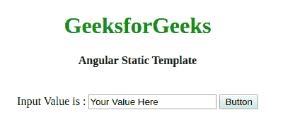
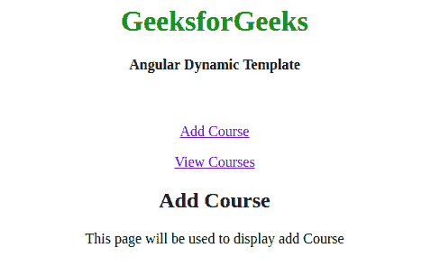
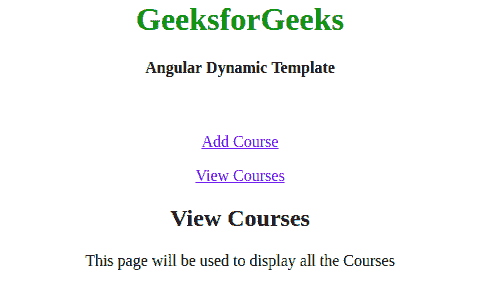

# AngularJS 中有哪些模板？

> 原文:[https://www . geesforgeks . org/什么是模板 in-angularjs/](https://www.geeksforgeeks.org/what-are-templates-in-angularjs/)

**AngularJS 中的模板**仅仅是一个 HTML 文件，用属性和指令之类的 AngularJS 填充或丰富。指令是一个标记元素，用于根据需要定位特定的属性或类以呈现其行为。Angular 中的模型和控制器与模板相结合，以操纵用户在其浏览器中看到的视图。角度模板还可以容纳 **CSS** 、**表单控件**、**过滤器**和**表达式**。

模板有两种类型:

*   静态模板
*   动态模板

以下示例说明了这两种模板:

*   **Static Template:** A static template is defined by using script tag. An id and type attribute with value text/ng-template must be provided to it for the static template to work. Also, it should be noted that static template will work only if it is under the **ng-app** scope, otherwise it will be ignored by Angular.
    A static template can be rendered by using the **ng-include directive**. For example:

    **示例:**这显示了一个简单的模板

    ```
    <!DOCTYPE html>
    <html ng-app>

    <head>
        <title>
            Angular Static Template
        </title>
        <style>
            h1{
                color:green;
            }
        </style>
    </head>
    <!-- Body tag augmented with ngController directive -->

    <body ng-controller="GeekController">
        <center>
        <h1>GeeksforGeeks</h1>
        <h4>Angular Static Template</h4>
        <br> 
         Input Value is :
        <input ng-model="geek" value="Your Value Here">
        <button ng-click="gfg()">Button</button>
        <script src="angular.js"></script>
        </center>
    </body>

    </html>
    ```

    **输出:** 

*   **Dynamic Templates:** Just like the name says, dynamic templates are used to work with the runtime environments. It is compiled and rendered by Angular on user demand. A dynamic template can be rendered by using **ng-include directive**. For example:

    **示例:**

    ```
    <html>

    <head>
        <script src=
    "https://ajax.googleapis.com/ajax/libs/angularjs/1.3.14/angular.min.js">
        </script>
        <script src=
    "https://ajax.googleapis.com/ajax/libs/angularjs/1.3.14/angular-route.min.js">
        </script>
        <style>
            h1{
                color:green;
            }
        </style>
    </head>

    <body>
        <center>
            <h1>GeeksforGeeks</h1>
            <h4>Angular Dynamic Template</h4>
            <br>
            <div ng-app="gfg">
                <p><a href="#addCourse">Add Course</a></p>
                <p><a href="#viewCourses">View Courses</a></p>
                <div ng-view></div>

                <script type="text/ng-template" id="addCourse.htm">
                    <h2> Add Course </h2> {{message}}
                </script>

                <script type="text/ng-template" id="viewCourses.htm">
                    <h2> View Courses </h2> {{message}}
                </script>
            </div>
      </center>
            <script>
                var gfg = angular.module("gfg", ['ngRoute']);
                gfg.config(['$routeProvider', function($routeProvider) {
                    $routeProvider

                        .when('/addCourse', {
                        templateUrl: 'addCourse.htm',
                        controller: 'AddCourseController'
                    })

                    .when('/viewCourses', {
                        templateUrl: 'viewCourses.htm',
                        controller: 'ViewCoursesController'
                    })

                    .otherwise({
                        redirectTo: '/addCourse'
                    });
                }]);

                gfg.controller('AddCourseController', function($scope) {
                    $scope.message = 
                      "This page will be used to display add Course";
                });

                gfg.controller('ViewCoursesController', function($scope) {
                    $scope.message = 
                      "This page will be used to display all the Courses";
                });
            </script>

    </body>

    </html>
    ```

    **输出:**

    *   点击【添加课程】时:
        
    *   点击查看课程时:
        