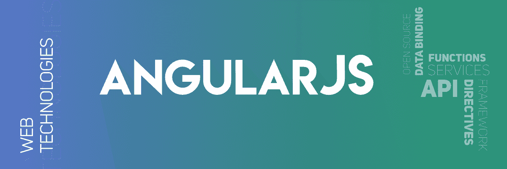

# 什么是 AngularJs 全局 API？

> 原文:[https://www . geesforgeks . org/what-the-anglarjs-global-API/](https://www.geeksforgeeks.org/what-are-the-angularjs-global-api/)



**AngularJS**中的全局 API
API 代表*应用编程接口*。它是一组用于构建软件应用程序的协议、例程和工具，允许用户与应用程序交互并执行若干任务。

在 AngularJS 中，全局 API 是一组全局 Javascript 函数，用于执行比较对象、迭代对象、转换数据等任务。

AngularJS 中的一些 API 函数如下所示:

*   **[angular.lowercase:](https://www.geeksforgeeks.org/angularjs-angular-lowercase-function/)** This converts the string into lowercase.

    **语法:**

    ```ts
    angular.lowercase(string);
    ```

    **例 1:**

    ```ts
    <html>
    <script src=
    "https://ajax.googleapis.com/ajax/libs/angularjs/1.6.9/angular.min.js">
      </script>

    <body>
        <div ng-app="App" ng-controller="Ctrl">
            <p>{{"Before Conversion: " + i1 }}</p>
            <p>{{"After Conversion: " + i2 }}</p>
        </div>
        <script>
            var app = angular.module('App', []);
            app.controller('Ctrl', function($scope) {
                $scope.i1 = "GeeksforGeeks";
                // converting string into lowercase
                $scope.i2 = angular.lowercase($scope.i1); 
            });
        </script>
    </body>

    </html>
    ```

    **输出:**

    ```ts
    Before Conversion: GeeksforGeeks                   
    After Conversion: geeksforgeeks                   

    ```

*   **[angular.uppercase:](https://www.geeksforgeeks.org/angularjs-angular-uppercase-function/)** This converts the string into uppercase.

    **语法:**

    ```ts
    angular.uppercase(string);
    ```

    **例 2:**

    ```ts
    <html>
    <script src=
    "https://ajax.googleapis.com/ajax/libs/angularjs/1.6.9/angular.min.js">
      </script>

    <body>
        <div ng-app="App" ng-controller="Ctrl">
            <p>{{"Before Conversion: " + i1 }}</p>
            <p>{{"After Conversion: " + i2 }}</p>
        </div>
        <script>
            var app = angular.module('App', []);
            app.controller('Ctrl', function($scope) {
                $scope.i1 = "geeksforGeeks";
                // converting string into uppercase
                $scope.i2 = angular.uppercase($scope.i1); 
            });
        </script>
    </body>

    </html>
    ```

    **输出:**

    ```ts
    Before Conversion: geeksforgeeks
    After Conversion: GEEKSFORGEEKS

    ```

*   **[angular.isString:](https://www.geeksforgeeks.org/angularjs-angular-isstring-function/)** This check the given value is a string or not, if the value is string then it returns true else it returns false.

    **语法:**

    ```ts
    angular.isString(value);
    ```

    **例**

    ```ts
    <html>
    <script src=
    "https://ajax.googleapis.com/ajax/libs/angularjs/1.6.9/angular.min.js">
      </script>

    <body>
        <div ng-app="App" ng-controller="Ctrl">
            <p>{{"Value is: " + i1 }}</p>
            <p>{{"Value is string: " + i2 }}</p>
        </div>
        <script>
            var app = angular.module('App', []);
            app.controller('Ctrl', function($scope) {
                $scope.i1 = 15;
                // checks whether the given value is a string
                $scope.i2 = angular.isString($scope.i1); 
            });
        </script>
    </body>

    </html>
    ```

    **输出:**

    ```ts
    Value is: 15
    Value is String: false

    ```

*   **[angular.isNumber:](https://www.geeksforgeeks.org/angularjs-angular-isnumber-function/)** This checks whether the given value is number or not, if it is a number then it returns true else it returns false.

    **语法:**

    ```ts
    angular.isNumber(value);
    ```

    **例**

    ```ts
    <html>
    <script src=
    "https://ajax.googleapis.com/ajax/libs/angularjs/1.6.9/angular.min.js">
      </script>

    <body>
        <div ng-app="App" ng-controller="Ctrl">
            <p>{{"Value is: " + i1 }}</p>
            <p>{{"Value is string: " + i2 }}</p>
        </div>
        <script>
            var app = angular.module('App', []);
            app.controller('Ctrl', function($scope) {
                $scope.i1 = 15;
                // checks whether the given value is a number
                $scope.i2 = angular.isNumber($scope.i1); 
            });
        </script>
    </body>

    </html>
    ```

    **输出:**

    ```ts
    Value is: 15
    Value is Number: true

    ```

    **AngularJS 中更多的 API 如下:**

*   **[angular.isDate:](https://www.geeksforgeeks.org/angularjs-angular-isdate-function/)** 检查给定值是否为日期
*   **[angular.isArray:](https://www.geeksforgeeks.org/angularjs-angular-isarray-function/)** 检查给定的引用是否是数组
*   **[angular . is function:](https://www.geeksforgeeks.org/angularjs-angular-isfunction-function/)**检查给定的引用是否是函数
*   **[angular . isobject:](https://www.geeksforgeeks.org/angularjs-angular-isobject-function/)**检查给定的引用是否是对象