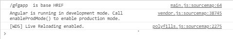

# 什么是角 10°的 APP_BASE_HREF？

> 原文:[https://www . geesforgeks . org/what-is-app _ base _ href-in-angular-10/](https://www.geeksforgeeks.org/what-is-app_base_href-in-angular-10/)

在这篇文章中，我们将看到在 Angular 10 中什么是 APP_BASE_HREF 以及如何使用它。

APP_BASE_HREF 为当前页面的基本 HREF 返回一个预定义的 DI 令牌。APP _ BASE _ HREF 是应该保留的 URL 前缀。

**语法:**

```ts
 provide: APP_BASE_HREF, useValue: '/gfgapp'
```

**进场:**

*   在 app.module.ts 和 APP_BASE_HREF 中，在具有 useValue 的提供程序中。
*   在 app.component.ts 中，将 APP_BASE_HREF 存储到任何变量中并使用它。

**例 1:**

**app.module.ts**

## java 描述语言

```ts
import { BrowserModule } from '@angular/platform-browser';
import { NgModule } from '@angular/core';

import { AppRoutingModule } from './app-routing.module';
import { AppComponent } from './app.component';
import {APP_BASE_HREF} from '@angular/common';

@NgModule({
  declarations: [
    AppComponent
  ],
  imports: [
    BrowserModule,
    AppRoutingModule
  ],
  providers: [ {provide: APP_BASE_HREF, useValue: '/gfgapp'} ],
  bootstrap: [AppComponent]
})
export class AppModule { }
```

**app.component.ts**

## java 描述语言

```ts
import { Component, Inject } from '@angular/core';
import {APP_BASE_HREF} from '@angular/common';

@Component({
  selector: 'app-root',
  templateUrl: './app.component.html',
  styleUrls: ['./app.component.css']
})
export class AppComponent {
  title = 'demo1';
  constructor(@Inject(APP_BASE_HREF) private baseHref:string) {
    var a = this.baseHref;
    console.log(a, " is base HREF")
  }

}
```

**输出:**

