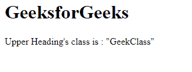

# 什么是角度 10 中的公共模块？

> 原文:[https://www . geesforgeks . org/what-is-common module-in-angular-10/](https://www.geeksforgeeks.org/what-is-commonmodule-in-angular-10/)

在本文中，我们将看到什么是 Angular 10 中的 **CommonModule** 以及如何使用它。

CommonModule 用于导出所有基本角度指令和管道。当我们将 BrowserModule 导入到我们的 angular 应用程序中时，它会被重新导出，当我们使用**‘ng new’**命令创建 Angular 应用程序时，BrowserModule 会自动导入到我们的应用程序中

**语法:** CommonModule 在创建应用时由 BrowserModule 自动导入。

```
 import { BrowserModule } from '@angular/platform-browser';

 @NgModule({

  imports: [
    BrowserModule,
  ]
})
export class AppModule { }
```

**进口指令:**

*   ngclass
*   **ngcomponent outlets**
*   **NgForOf**
*   **烟气化物**
*   **瓶颈症:**
*   **NgStyle**
*   **ng witch**
*   **导航案例**
*   **ng witchdefault**
*   **系列化出口**

**进口管道:**

*   异步管道
*   课程管道
*   **日期管道**
*   **十进制管**
*   **十八层浮筒管**
*   i18 管
*   **JsonPipe**
*   关键值管
*   **下半部分**
*   **感知**
*   **切片皮**
*   **【titecaseppe】**
*   **上肢管**

**进场:**

*   创建要使用的角度应用程序
*   使用通用模块不需要任何导入
*   在**app . module . ts**common module 通过 BrowserModule 导入。
*   管道和指令将自动导入，因此我们可以轻松使用它们。
*   制作所需输出的必要文件。
*   使用 ng serve 为 angular app 服务，以查看输出。

**例 1:**

## app.module.ts

```
import { NgModule } from '@angular/core';
// BrowserModule automatically imports all CommonModule Dependencies

import { BrowserModule } from '@angular/platform-browser';
import { AppComponent } from './app.component';

@NgModule({
  declarations: [
    AppComponent
  ],
  imports: [
    // Adding Imports
    BrowserModule,
  ],
  providers: [],
  bootstrap: [AppComponent]
})
export class AppModule { }
```

## app.component.ts

```
import { Component, OnInit } from '@angular/core';

@Component({
    selector: 'app-root',
    templateUrl: './app.component.html'
})
export class AppComponent {
    geek = "GeekClass";
    g = document.getElementsByClassName(this.geek);
}
```

## app.component.html

```
<!-- use of ngClass directive -->
<h1 [ngClass] = "geek">
  GeeksforGeeks
</h1>
  Upper Heading's class is : "{{ g[0].className }}"
```

**输出:**

