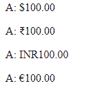

# 角 10°中的电流是多少？

> 原文:[https://www . geesforgeks . org/what-is-currency pipe-in-angular-10/](https://www.geeksforgeeks.org/what-is-currencypipe-in-angular-10/)

在本文中，我们将看到什么是 Angular 10 中的 **CurrencyPipe** 以及如何使用它。CurrencyPipe 用于将数字转换为货币字符串，根据确定组大小和分隔符的区域设置规则格式化，小数点字符

**语法:**

```
{{ value | currency }}
```

**进场:**

*   创建要使用的角度应用程序
*   使用*电流管道*不需要任何进口
*   在 app.component.ts 中，定义接受货币值的变量。
*   在 app.component.html，使用上面带有“|”符号的语法来构成货币元素。
*   使用 ng serve 为 angular app 服务，以查看输出

**参数:**

*   **currencyCode:** 需要一个字符串
*   **显示:**需要字符串或布尔值
*   **digitinfo:**需要一个字符串
*   **地点:**需要一根弦

**例 1:**

## app.component.ts

```
import { Component } from '@angular/core';

@Component({
    selector: 'app-root',
    templateUrl: './app.component.html'
})
export class AppComponent {
  // Currency variable to be used
  a = 100;
}
```

## app.component.html

```
<!-- Default currency is in Dollars-->

<p>A: {{a | currency}}</p>

<!-- INR CurrrenyCode is used for Rupees symbol-->

<p>A: {{a | currency:'INR'}}</p>

<!-- INR CurrrenyCode is used-->

<p>A: {{a | currency:'INR':'code'}}</p>

<!-- EUR CurrrenyCode is used for Europeon Currency-->

<p>A: {{a | currency:'EUR'}}</p>
```

**输出:**

