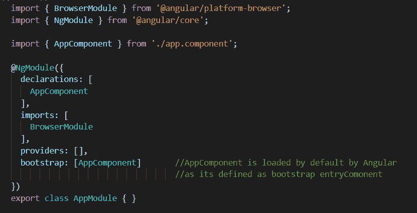
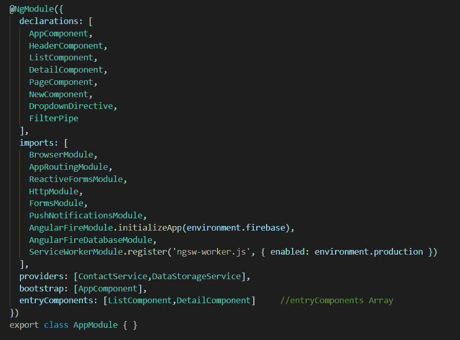

# 什么是角模的熵成分？

> 原文:[https://www . geesforgeks . org/what-is-entrycomponents-in-angular-ng module/](https://www.geeksforgeeks.org/what-is-entrycomponents-in-angular-ngmodule/)

entryComponent 是通过力加载角度的组件，这意味着这些组件在 HTML 模板中没有被引用。在大多数情况下，当组件在组件模板中显式声明时，Angular 会加载组件。但 entryComponents 的情况并非如此。entryComponents 只能动态加载，在组件模板中永远不会被引用。它指的是在 HTML 中找不到的组件数组，而是由 ComponentFactoryResolver 添加的。

首先，Angular 通过 [ComponentFactoryResolver](https://angular.io/api/core/ComponentFactoryResolver) 类为每个引导入口组件创建一个组件工厂，然后在运行时，它将使用这些工厂来实例化组件。

```ts
abstract class ComponentFactoryResolver {
  static NULL: ComponentFactoryResolver
  abstract resolveComponentFactory(component: Type): ComponentFactory
}

```

**角形中入口组件的类型:**

1.  引导程序根组件
2.  布线元件(在布线中指定的元件)

**引导 entryComponent:** 在应用程序启动时或引导过程中，引导组件由 Angular 加载到 DOM(文档对象模型)中。

```ts
import { BrowserModule } from '@angular/platform-browser';
import { NgModule } from '@angular/core';

import { AppComponent } from './app.component';

@NgModule({
  declarations: [
    AppComponent
  ],
  imports: [
    BrowserModule
  ],
  providers: [],
  bootstrap: [AppComponent]
})
export class AppModule { }
```

引导组件是一个 entryComponent，它为应用程序提供入口点。默认情况下，角载荷 AppComponent 列在@ **模块引导**中。



app.module.ts

**Routed entryComponent:** 这类组件被声明为组件，并作为数组添加到应用程序的声明部分。但是，您可能需要通过组件的类来引用它。路由器组件没有在组件的 HTML 中明确指定，而是在 routes 数组中注册。这些组件也是动态加载的，因此 Angular 需要了解它们。
这些成分添加在两个地方:

*   路由器
*   entryComponents

**app-routing.module.ts**

```ts
import { NgModule } from '@angular/core';
import {  RouterModule, Routes } from '@angular/router';
import { ListComponent } from './list/list.component';
import { DetailComponent } from './detail/detail.component';

const routes: Routes = [
  {
     path:'',
     redirectTo:'/contact', 
     pathMatch:'full'
  },
  {
    path: 'list',
    component: ListComponent
  },
  {
    path: 'detail',
    component: DetailComponent
  },
  { 
    path:'**',
    redirectTo:'/not-found'
  }
];
@NgModule({
    imports:[RouterModule.forRoot(routes)],
    exports:[RouterModule]

})
export class AppRoutingModule{

}
```

您不需要将组件显式添加到 entryComponent 数组，Angular 会自动添加。编译器将所有路由器组件添加到 entryComponent 数组中。


**需要 entryComponent 数组:** Angular 仅包括模板中引用的最终束中的那些组件。这样做是为了通过不包含不需要的组件来减小最终包装的尺寸。但是这会破坏最终的应用程序，因为所有的 entryComponents 永远不会包含在最终的包中(因为它们从来没有被引用过)。因此，我们需要在角度的 entyComponents 数组下注册这些组件，以便将它们包含在包中。