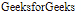

# Angular 10 中的 NgClass 是什么？

> 原文:[https://www . geeksforgeeks . org/什么是 ngclass-in-angular-10/](https://www.geeksforgeeks.org/what-is-ngclass-in-angular-10/)

在本文中，我们将看到 Angular 10 中什么是 **NgClass** 以及如何使用它。

NgClass 用于在一个 HTML 元素上添加或删除 CSS 类

**语法:**

```ts
<element [ngClass] = "typescript_property">
```

**进场:**

*   创建要使用的角度应用程序
*   在 app.component.html，使用 ngclass 指令创建一个元素并设置它的类
*   使用 ng serve 为 angular app 服务，以查看输出

**例 1:**

## app.component.ts

```ts
import { Component, OnInit } from '@angular/core';

@Component({
    selector: 'app-root',
    templateUrl: './app.component.html'
})
export class AppComponent {

  }
```

## app.component.html

```ts
<div [ngClass] ="'gfgclass'">
  GeeksforGeeks
</div>
```

**输出:**

