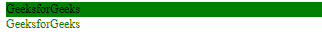

# Angular 10 中的 NgStyle 是什么？

> 原文:[https://www . geesforgeks . org/what-is-ngstyle-in-angular-10/](https://www.geeksforgeeks.org/what-is-ngstyle-in-angular-10/)

在这篇文章中，我们将看到什么是 Angular 10 中的**样式**以及如何使用它。

*样式* 用于给 HTML 元素添加一些样式

**语法:**

```
<element [ngStyle] = "typescript_property">
```

**进场:**

*   创建要使用的角度应用程序
*   在 app.component.html，创建一个元素并使用 ngStyle 指令设置它的类
*   使用 ng serve 为 angular app 服务，以查看输出

**例 1:**

## app.component.ts

```
import { Component, OnInit } from '@angular/core';

@Component({
    selector: 'app-root',
    templateUrl: './app.component.html'
})
export class AppComponent {

  }
```

## app.component.html

```
<div [ngStyle] ="{'background-color':'green'}">
  GeeksforGeeks
</div>

<div [ngStyle] ="{'color':'GREEN'}">
  GeeksforGeeks
</div>
```

**输出:**

