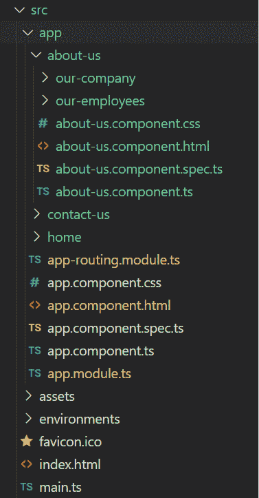
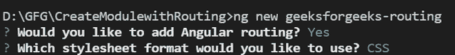
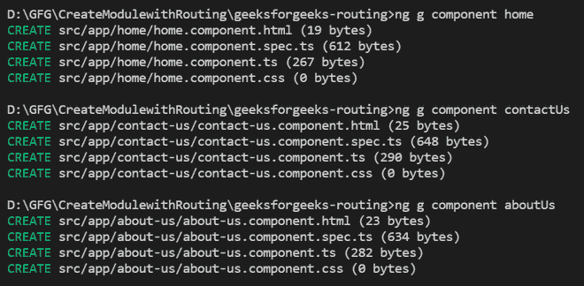
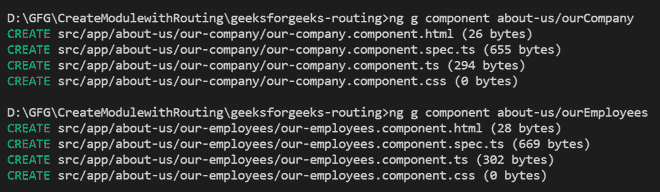
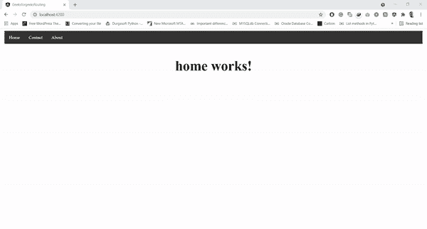

# 什么是角度 9/8 中的布线和嵌套布线？

> 原文:[https://www . geesforgeks . org/什么是角度路由和嵌套路由-9-8/](https://www.geeksforgeeks.org/what-is-routing-and-nested-routing-in-angular-9-8/)

在本文中，我们将学习 Angular 中的路由和嵌套路由概念。我们将通过制作不同组件的路线来实现在不同组件之间建立路由的概念，当用户点击链接时，它将被导航到与所需组件相对应的一个页面链接。让我们了解 Angular 中的路由。

**路由:** Angular 为过于复杂的简单场景提供了广泛的导航功能。定义导航项目和相应的视图称为路由。路由允许用户创建具有多个视图的*单页应用程序*，并允许在它们之间导航。用户可以在这些视图之间切换，而不会丢失应用程序状态和属性。Angular 提供了一个单独的路由器模块，用于在应用程序中调整导航。在本文中，我们将了解如何在 Angular 应用程序中执行路由和嵌套路由。

**语法:**

```
ng new app_name
```

*   For routing, you will need components. Use the below command to create the component.

    **语法:**

    ```
    ng g c component_name
    ```

    路由意味着导航，嵌套路由意味着子导航或子页面导航。在这里，我们将三个主要链接命名为**主页、联系我们、关于我们**。在**关于我们**组件中，我们将创建另外两个子组件名为**我们的公司&我们的员工**。

*   In *app.module.ts*, import **RouterModule, Routes** from @angular/router.

    **语法:**

    ```
    import { RouterModule, Routes } from '@angular/router';
    ```

*   然后在的导入*app-routing . module . ts***中定义路径。

    ```
    const routes: Routes = [
     { path: '', component: HomeComponent },
     { path: 'aboutus', component: AboutUsComponent },
     { path: 'contactus', component: ContactUsComponent }
    ];

    @NgModule({
     imports: [RouterModule.forRoot(routes)],
     exports: [RouterModule]
    })
    ```** 

*   **将路由器链接的路径定义为 HTML 中*app.component.html*的组件名。

    ```
    <a class="active" href="#home" routerLink="/">Home</a>
    <a href="#contact" routerLink="/contactus">Contact</a>
    <a href="#about" routerLink="/aboutus">About</a>
    ```** 

*   **在*app.component.html*应用路由器插座。路由视图呈现在<路由器出口>中。

    ```
    <router-outlet></router-outlet>
    ```** 

*   **定义**about-us.component.html、contact-us.component.html**&**home.component.html 的 HTML。****
*   **现在 angular 网络应用准备运行了。**

****项目结构:**我们的项目结构如下图所示:**

**

项目结构** 

**让我们按照步骤为应用程序构建路由和嵌套路由。**

****步骤 1:** 创建简单角度应用。在这一步中，我们将使用命令行参数创建一个简单的 angular 应用程序作为示例。我们需要在命令提示符下运行以下命令:**

```
ng new geeksforgeeks-routing
```

**一旦我们运行了这个命令，在命令提示符下，创建路由模块会询问两件事，我们需要回答**是**。**

****

****第二步:**在这一步中，安装过程成功后，我们将使用给定的 HTML 代码更新我们的**app.component.html**。**

## **app.component.html**

```
<!DOCTYPE html>
<html>
  <head>
    <style>
      ul {
        list-style-type: none;
        margin: 0;
        padding: 0;
        overflow: hidden;
        background-color: #333;
      }

      li {
        float: left;
      }

      li a {
        display: block;
        color: white;
        text-align: center;
        padding: 14px 16px;
        text-decoration: none;
      }

      li a:hover {
        background-color: #04aa6d;
      }

      .active {
        background-color: #333;
      }
    </style>
  </head>
  <body>
    <ul>
      <li><a class="active" href="#home" routerLink="/">Home</a></li>
      <li><a href="#contact" routerLink="/contactus">Contact</a></li>
      <li><a href="#about" routerLink="/aboutus">About</a></li>
    </ul>

    <div style="text-align: center; font-weight: bolder; font-size: 50px">
      <router-outlet></router-outlet>
    </div>
  </body>
</html>
```

****第三步:**在这一步中，我们将创建三个组件作为**主页**、**联系人-us** 、**T7】和**关于-us** 。为了创建这些组件，我们需要运行下面提到的两个命令:****

```
ng g component home
ng g component contactUs
ng g component aboutUs
```

**成功创建组件后，我们需要使用这两个组件创建一个简单的路径&同时我们需要将所有这些组件导入到我们的模块文件中。**

**

安装过程** 

****第四步:**我们需要导入 *app.module.ts* 文件中所有需要的组件，这些组件安装成功后，**

## **app.module.ts**

```
import { NgModule } from '@angular/core';
import { BrowserModule } from '@angular/platform-browser';
import { FormsModule } from '@angular/forms';

import { RouterModule, Router } from '@angular/router';
import { AppRoutingModule } from './app-routing.module';

import { AppComponent } from './app.component';
import { HomeComponent } from './home/home.component';
import { ContactUsComponent } from './contact-us/contact-us.component';
import { AboutUsComponent } from './about-us/about-us.component';

@NgModule({
  declarations: [
    AppComponent,
    HomeComponent,
    ContactUsComponent,
    AboutUsComponent
  ],
  imports: [BrowserModule, FormsModule],
  bootstrap: [AppComponent]
})
export class AppModule {}
```

****步骤 5:** 在这一步中，我们将更新我们的路由模块文件。**

## **app-routing.module.ts**

```
import { NgModule } from "@angular/core";
import { RouterModule, Routes } from "@angular/router";
import { AboutUsComponent } from "./about-us/about-us.component";
import { ContactUsComponent } from "./contact-us/contact-us.component";
import { HomeComponent } from "./home/home.component";

const routes: Routes = [
  {
    path: "",
    component: HomeComponent,
  },
  {
    path: "aboutus",
    component: AboutUsComponent,
  },
  {
    path: "contactus",
    component: ContactUsComponent,
  },
];

@NgModule({
  imports: [RouterModule.forRoot(routes)],
  exports: [RouterModule],
})
export class AppRoutingModule {}
```

**现在，让我们使用下面的命令运行我们的 angular 应用程序:**

```
ng serve
```

****步骤 6:** 创建嵌套路由**

**在我们的应用程序中，我们还需要两个嵌套的路由。现在，我们需要为这个关于我们的组件再创建两个组件。要为“关于组件”创建子组件，我们需要运行以下命令:**

```
ng g component about-us/ourCompany
ng g component about-us/ourEmployees
```

**

安装过程** 

****步骤 7:** 更新路由文件**

**为了添加我们新创建的组件，我们需要更新我们现有的 *app-routing.module.ts* 文件:**

## **app-routing.module.ts**

```
import { NgModule } from "@angular/core";
import { RouterModule, Routes } from "@angular/router";
import { AboutUsComponent } from "./about-us/about-us.component";
import { OurCompanyComponent } from 
    "./about-us/our-company/our-company.component";
import { OurEmployeesComponent } from 
    "./about-us/our-employees/our-employees.component";
import { ContactUsComponent } from "./contact-us/contact-us.component";
import { HomeComponent } from "./home/home.component";

const routes: Routes = [
  {
    path: "",
    component: HomeComponent,
  },
  {
    path: "aboutus",
    children: [
      {
        path: "",
        component: AboutUsComponent,
      },
      {
        path: "our_employees",
        component: OurEmployeesComponent,
      },
      {
        path: "our_company",
        component: OurCompanyComponent,
      },
    ],
  },
  {
    path: "contactus",
    component: ContactUsComponent,
  },
];

@NgModule({
  imports: [RouterModule.forRoot(routes)],
  exports: [RouterModule],
})
export class AppRoutingModule {}
```

****步骤 8:** 现在，我们需要在我们的 about-us 组件中创建两个按钮。因此，我们需要更新文件:**

## **about-us.component.html**

```
<p>about-us works!</p>

<a class="btn btn-primary" routerLink="/aboutus/our_employees">Our Employees</a>
<br>
<a class="btn btn-primary" routerLink="/aboutus/our_company">Our Company</a>
```

## **our-company.component.html**

```
<p>our-company works!</p>

<a class="btn btn-primary" routerLink="/aboutus">Back</a>
```

## **our-employees.component.html**

```
<p>our-employees works!</p>

<a class="btn btn-primary" routerLink="/aboutus">Back</a>
```

**现在，我们需要使用下面的命令运行这个角度应用程序:**

```
ng serve
```

****输出:****

****