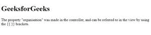
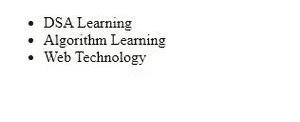
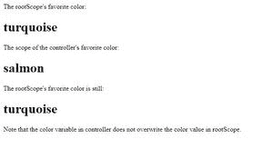

# AngularJS 中的范围是什么？

> 原文:[https://www.geeksforgeeks.org/what-is-scope-in-angularjs/](https://www.geeksforgeeks.org/what-is-scope-in-angularjs/)

在本文中，我们将了解 Angular JS 中的作用域是什么，以及如何使用作用域。Angular JS 中的 Scope 是 HTML(视图)和 JavaScript(控制器)之间的绑定部分，是一个内置对象。它包含应用程序数据和对象。它可用于视图和控制器。它是一个具有可用属性和方法的对象。Angular JS 中有两种类型的范围。

*   $范围
*   $rootScope

### 如何使用示波器？

当我们在 AngularJS 中创建一个控制器时，我们将传递$scope 对象作为参数。在 AngularJS 中，它创建一个不同的$scope 对象，并将其注入到应用程序中的每个控制器中。因此，一个控制器内附加到$scope 的数据和方法不能在另一个控制器上访问。在嵌套控制器中，子控制器将获取父控制器的作用域对象。因此，子控制器可以访问添加到父控制器的属性，但是父控制器不能访问附加到子控制器的属性。

**理解范围:**如果我们看到一个 AngularJS 应用程序，包括:

*   HTML 视图。
*   模型，当前视图可用的数据。
*   控制器，制作/改变/删除/控制数据的 JavaScript 函数。

作用域是模型，它是一个 JavaScript 对象，其属性和方法对视图和控制器都可用。

**示例 1:** 在本例中，我们将看到$scope 对象的使用&还将看到数据是如何从控制器传输到视图组件的，该视图组件是通过使用插值进行渲染的。

## 超文本标记语言

```ts
<!DOCTYPE html>
<html>

<head>
    <script src=
"https://ajax.googleapis.com/ajax/libs/angularjs/1.6.9/angular.min.js">
    </script>
</head>

<body>
    <div ng-app="gfg" ng-controller="myCtrl">
        <h1>{{organisation}}</h1>
    </div>

    <p>
        The property "organisation" was made in 
        the controller, and can be referred to 
        in the view by using the {{ }} brackets.
    </p>

    <script>
        var geeks = angular.module("gfg", []);
        geeks.controller("myCtrl", function($scope) {
            $scope.organisation = "GeeksforGeeks";
        });
    </script>
</body>

</html>
```

**输出:**



由控制器生成的属性可以在视图中引用。

**示例 2:** 在示例 1 中，我们只使用了单个作用域，但是用于更大的应用程序，这可能是 HTML DOM 中可以访问某些作用域的部分。

## 超文本标记语言

```ts
<!DOCTYPE html>
<html>

<head>
    <title>AngularJS | Scope</title>
    <script src=
"https://ajax.googleapis.com/ajax/libs/angularjs/1.6.9/angular.min.js">
    </script>
</head>

<body>
    <div ng-app="gfg" ng-controller="control">
        <ul>
            <li ng-repeat="x in names">{{x}}</li>
        </ul>
    </div>

    <script>
        var geeks = angular.module("gfg", []);
        geeks.controller("control", function($scope) {
            $scope.names = [
                "DSA Learning",
                "Algorithm Learning",
                "Web Technology",
            ];
        });
    </script>
</body>

</html>
```

**输出:**



在上面的例子中，下面的例子中只有一个作用域，你会看到不止一个作用域。

**根作用域:**根作用域是在所有应用程序中都包含的带有 ng-app 指令&的 HTML 元素上创建的作用域。根范围的可用性在整个应用程序中。

**示例 3:** 如果在当前作用域&根作用域中用相同的名称声明了任何变量，那么应用程序将使用当前作用域。在本例中，我们将看到名为“color”的变量是如何被当前范围使用的。

## 超文本标记语言

```ts
<!DOCTYPE html>
<html>

<head>
    <script src=
"https://ajax.googleapis.com/ajax/libs/angularjs/1.6.9/angular.min.js">
    </script>
</head>

<body ng-app="myApp">
    <p>The rootScope's favorite color:</p>
    <h1>{{color}}</h1>

    <div ng-controller="myCtrl">
        <p>The scope of the controller's favorite color:</p>
        <h1>{{color}}</h1>
    </div>

    <p>The rootScope's favorite color is still:</p>
    <h1>{{color}}</h1>

    <p>
        Note that the color variable in controller 
        does not overwrite the color value in 
        rootScope.
    </p>

    <script>
        var app = angular.module("myApp", []);
        app.run(function($rootScope) {
            $rootScope.color = "turquoise";
        });
        app.controller("myCtrl", function($scope) {
            $scope.color = "salmon";
        });
    </script>
</body>

</html>
```

**输出:**



控制器的作用域和根作用域中都存在一个名为“color”的变量。