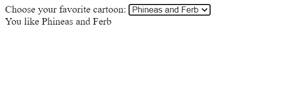
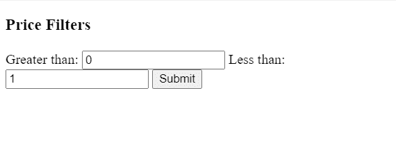

# Angular 中的 change 和 ngModelChange 有什么区别？

> 原文:[https://www . geesforgeks . org/change-and-ng model-change-in-angular/](https://www.geeksforgeeks.org/what-is-the-difference-between-change-and-ngmodelchange-in-angular/)的区别是什么

**变更:**
当用户提交对元素值的变更时，针对<输入>、<选择>和<文本区域>元素触发变更事件。对于元素值的每次更改，不一定会触发更改事件。变更是一个 DOM 事件，它可以触发 HTML 标签和元素的变更。

*   **语法:**

    ```tshtml
    <input  (change)="function($e)">
    ```

*   **示例:**
    HTML 文件:

```tshtml
<label>Choose your favorite cartoon:
  <select class="cartoon" name="cartoon">
    <option value="">Select One …</option>
    <option value="Tom and Jerry">Tom and Jerry</option>
    <option value="Doraemon">Doraemon</option>
    <option value="Phineas and Ferb">Phineas and Ferb</option>
  </select>
</label>

<div class="result"></div>
```

打字脚本文件:

```tshtml
const selectElement = document.querySelector('.cartoon');

selectElement.addEventListener('change', (event) => {
  const result = document.querySelector('.result');
  result.textContent = `You like ${event.target.value}`;
});
```

*   **输出**
    

**ngModelChange:**
当用户想要更改模型时，通过在输入中输入文本，事件回调将触发并为模型设置新值。我们不能在没有 ngModel 的情况下使用 mgModelChange，因为 ngModel 类具有带有 EventEmitter 实例的更新函数。只有当模型将更改或更新时，才会触发 ngModelChange。

*   **语法**

```tshtml
<input [(ngModel)]="value" (ngModelChange)="function($e)">

```

*   **示例**
    HTML 文件:

```tshtml
<div style="color: red" *ngIf="isInvalid">
          Please check your ranges
</div>
<form (submit)="onSubmit()"
      id="inputForm"
      class="form-group" 
      class="row">
    <h3>Price Filters</h3>
    <span>Greater than:</span>
    <input type="number" name="greaterThanValue" 
         [(ngModel)]="greaterThanValue" 
         (ngModelChange)="onChange($event)" 
         placeholder="0">
    <span>Less than:</span>
    <input type="number" name="lessThanValue" 
         [(ngModel)]="lessThanValue" 
         (ngModelChange)="onChange($event)">
    <input type="submit">
</form>
```

*   打字脚本文件:

```tshtml
import { Component } from '@angular/core';

@Component({
  selector: 'my-app',
  templateUrl: './app.component.html',
  styleUrls: [ './app.component.css' ]
})
export class AppComponent  {

  public greaterThanValue = 0;
  public lessThanValue = 1;
  public isInvalid: boolean = false;

  public onChange(event: any): void {
    this.isInvalid =
     this.greaterThanValue > this.lessThanValue;
  }
}
```

*   **输出**T2】



**差异:**

<figure class="table">

| change | 模型改变 |
| --- | --- |
| Changes are bound to the HTML onchange event. This is a DOM event. | The modelchange is bound to the model variable that is bound to your input. |
| No such class is needed. | The ngModelChange requires the ngModel class to work. |
| Change events are bound to classic input change events. | The model change will be triggered when the model changes. You cannot use this event without the ngModel instruction. |
| When the user changes the input, the change triggers. | When the model changes, ngModelChange will trigger whether the change is caused by the user or not. |

</figure>