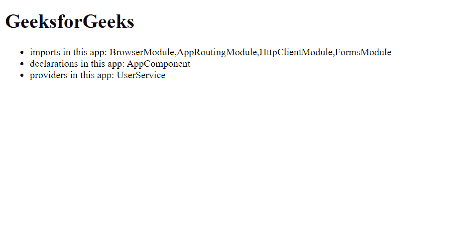

# NgModule 中的声明、提供者和导入有什么区别？

> 原文:[https://www . geeksforgeeks . org/什么是声明-提供者-导入-in-ngmodule/](https://www.geeksforgeeks.org/what-is-the-difference-between-declarations-providers-and-import-in-ngmodule/)

让我们首先讨论一下这些术语:

*   **声明:**
    *   声明用于**声明属于**当前模块的**组件、指令、管道。**
    *   声明内部的一切都是相互了解的。
    *   声明用于使当前模块中的指令(包括组件和管道)对当前模块中的其他指令可用。
    *   指令、组件或管道的选择器只有在声明或导入时才与 HTML 匹配。
*   **提供商:**
    *   提供者用于使**服务**和值为**依赖注入**所知。
    *   它们被添加到根范围，并被注入到具有它们作为**依赖项的其他服务或指令中。**
*   **进口:**
    *   导入**使**其他模块的导出申报**在当前模块中可用**。
    *   用于**导入支持模块**如 FormsModule、RouterModule、CommonModule 等。

**差异:**

<figure class="table">

| **声明** | **提供者** | **进口**

 |
| Declarations are used to give instructions. | Providers are used to do services. | Import makes export declarations of other modules available in the current module. |
| Used to declare components, instructions and pipes belonging to the current module. | Used to inject services required by components, instructions and pipelines into our modules. | Used to import support modules such as FormsModule and RouterModule. |
| 前任。AppComponent。 | Ex。 Status service. | Ex。 Browser module. |
| 在@NgModule 的 Declarations 数组中定义@NgModule({Declarations:[]，)} | 在@ ng module 的 Providers 数组中定义。@NgModule({提供者:[ ]，)}

 | 在导入数组中定义于@NgModule。@NgModule({进口:[]，)} |

</figure>

**使用三个**声明**、**进口**和**提供商的示例**:**

本项目中使用的提供者是名为 **UserService 的定制服务。**

```ts
ng g s User

```

**user.service.ts**

## java 描述语言

```ts
import { Injectable } from '@angular/core';

@Injectable({
  providedIn: 'root'
})
export class UserService {

  constructor() { }
}
```

该**用户服务**在**应用模块**中用作提供商

**app.module.ts**

## java 描述语言

```ts
// imports for the application
import { BrowserModule } from '@angular/platform-browser';
import { NgModule } from '@angular/core';
import { HttpClientModule } from '@angular/common/http';
import { FormsModule } from '@angular/forms';
import { AppRoutingModule } from './app-routing.module';
// declarations for the application
import { AppComponent } from './app.component';
// providers for the application
import { UserService } from './user.service';

@NgModule({
  declarations: [
    AppComponent,
  ],
  imports: [
    BrowserModule,
    AppRoutingModule,
    HttpClientModule,
    FormsModule
  ],
  providers: [UserService],
  bootstrap: [AppComponent]
})
export class AppModule { }
```

**app.component.html**

## 超文本标记语言

```ts
<h1>GeeksforGeeks</h1>
<ul>
    <li>imports in this app: BrowserModule,
      AppRoutingModule, HttpClientModule, FormsModule</li>
    <li>declarations in this app: AppComponent</li>
    <li>providers in this app: UserService</li>
</ul>
```

**输出:**

