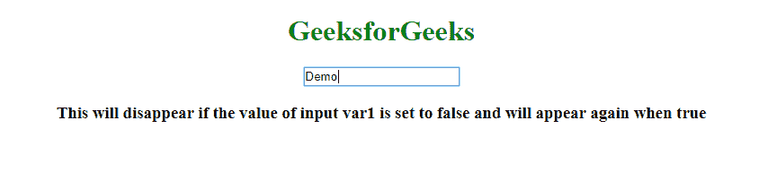

# ng-if 和 data-ng-if 指令有什么区别？

> 原文:[https://www . geeksforgeeks . org/ng-if 和 ng-if-data 指令的区别是什么/](https://www.geeksforgeeks.org/what-is-the-difference-between-ng-if-and-data-ng-if-directives/)

ng-if 是 AngularJS 中的一个指令，用于在表达式或变量的值为 false 时移除 HTML 元素，这与 ng-hide 不同，后者只是在 DOM 中隐藏 HTML 元素。

**语法:**

```
<element angular_directive=expression> Contents... </element>
```

很少有其他选项表现得像 **ng-if** 。*它们在功能上没有区别。*

*   ng:如果
*   ng_if
*   x-ng-if
*   数据-ng-if

**注意:**最佳做法是仅使用 ng-if。

这些选项出现在图片中的原因是，在 AngularJS 中，我们使用 camel case **(示例:ngIf)** 来引用指令，但是当我们在 HTML 中使用它时，因为 HTML 不区分大小写，所以我们使用破折号分隔的形式**(示例:ng-if)** 或上面列表中提到的其他分隔符。所以 AngularJS 规范化了(这意味着它将分隔符形式转换成了 camelcase。)元素的标记，并计算出该元素属于哪个指令。

**例 1:** 本例使用**“data-ng-if”**指令。

```
<!DOCTYPE html>
<html>

<head>
    <title>
        What is the difference between ng-if
        and data-ng-if directives ?
    </title>

    <script src=
"https://ajax.googleapis.com/ajax/libs/angularjs/1.6.9/angular.min.js">
    </script>
</head>

<body ng-app="">
    <center>
        <h1 style="color:green">
            GeeksforGeeks
        </h1>

        <input ng-model="var1">

        <div data-ng-if="var1">
            <h3>
                This will disappear if the value of
                input var1 is set to false and will 
                appear again when true
            </h3>
        </div>
    </center>
</body>

</html>
```

**输出:**


**例 2:** 本例使用**“ng-if”**指令。

```
<!DOCTYPE html>
<html>

<head>
    <title>
        What is the difference between ng-if
        and data-ng-if directives ?
    </title>

    <script src=
"https://ajax.googleapis.com/ajax/libs/angularjs/1.6.9/angular.min.js">
    </script>
</head>

<body ng-app="">
    <center>
        <h1 style="color:green">
            GeeksforGeeks
        </h1>

        <input ng-model="var1">

        <div ng-if="var1">
            <h3>
                This will disappear if the value of
                input var1 is set to false and will 
                appear again when true
            </h3>
        </div>
    </center>
</body>

</html>
```

**输出:**
