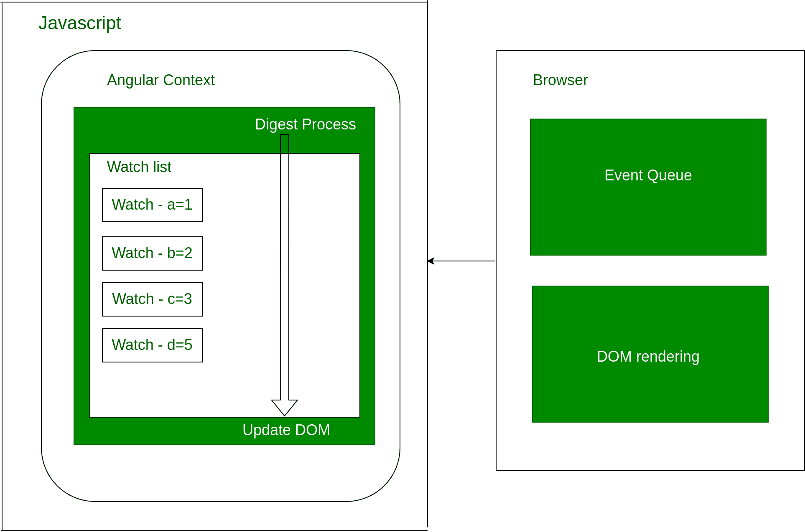

# AngularJs 中的消化周期是多少？

> 原文:[https://www . geeksforgeeks . org/什么是消化循环 in angular js/](https://www.geeksforgeeks.org/what-is-the-digest-cycle-in-angularjs/)

*   **AngularJs watch:** It is provided by AngularJs Framework to keep track of scope variables and the change in their values. Watches are automatically created by AngularJs Framework. It is usually done for data bindings and for which variables are decided by AngularJs Framework. Custom functions that are created for watches are called watch listeners.

    

*   **手表计数:**如果手表计数在 2000 以下，性能更好。我们可以使用角度观察者扩展来计算它们。Angular 对数据绑定变量执行监视，但是如果我们愿意，也可以使用 watch 函数对普通变量执行监视。它将我们明确想要观察的变量作为参数。
*   **观察列表:**维护与角度应用相关的所有观察列表。即所有被监控的数据绑定。包括根目录在内的所有范围都有一个监视列表。

**消化周期**

**dirty checking**


*   每当摘要进程在变量中发现任何修改时，都会自动执行监视侦听器。它记录更改，然后通知 AngularJs 框架更新 DOM。因此，在每个摘要过程结束时，DOM 都会更新。
*   Angular Context 是 AngularJs 框架的一个运行时环境。
*   第一个摘要进程对观察器执行脏检查，并检查是否有任何修改
    它再次对前一个周期执行第二个周期的脏检查，观察侦听器。因为可能有些变量已经被别人改变了。最少执行 2 次迭代，最多可以运行 10 次。尽管为了获得更好的性能，最好尽量缩短摘要周期。最大值后引发错误。

**一级和二级更新**

*   **第一级更新:**假设变量 b 被任何事件更新，那么在第一个周期期间，Digest 周期通知 AngularJs 框架这些变化，并在此之后经历第二个周期。因为没有更多的更新，所以它更新 DOM 并完成它。*   **Second level watch updates:** Whenever there is a change encountered in the first cycle for any particular watch say c, digest process executes watch listener for it. Now watch listener further modifies variable a to a new value. After the first cycle, c gets updated. During the second cycle, we encounter changes in a and thus update takes place for a. Now a third cycle takes place and there are no more modifications encountered. DOM gets updated.
    An example for second level updates:

    ```ts
    $scope.a = 1;
    $scope.b = 2;
    $scope.c = 3;

    $scope.$watch('a', function( newValue, oldValue ) {
           if( newValue != oldValue ) {
               console.log("a is modified to " +newValue );
    }
    });

    $scope.$watch('b', function( newValue, oldValue ) {
           if( newValue != oldValue ) {
               console.log("b is modified to " +newValue );
    }
    });

    $scope.$watch('c', function( newValue, oldValue ) {
           if( newValue != oldValue ) {
               console.log("c is modified to " +newValue );
                    if( $scope.c > 50 ) {
                         $scope.a = 1000;  
                     }
    }
    });

    $rootscope.$watch( function() {
           console.log(" digest iteration started ");
    });
    ```

    考虑到作用域变量 a、b、c 是数据绑定的，适合摘要过程。如果我们在浏览器中检查角度应用程序并打开控制台。我们可以跟踪这些变化，因为打印报表会帮助我们。假设 c 有一个带有输入框的双向绑定，我们可以很容易地跟踪它被修改的次数。事实上，我们也可以通过在$rootscope 上应用$watch 函数来检查摘要过程。
    **$watch:** 这个函数取三个参数——watch 表达式、listener 和 object 相等。除了表达式，其他两个都是可选的。

    *   摘要过程从根作用域开始，然后识别其他作用域。如果我们的代码使用 DOM 事件(ng-click)、带有回调的 ajax、带有回调的计时器、浏览器位置更改、像$apply 这样的手动调用，那么它必然会对所有这些事件进行摘要处理。*   As we know, the browser is responsible to render the DOM and it may have events like Timer, On-click. The browser maintains a queue for these events called Event Queue. And it sends those to Javascript. Consequently, a digest takes place for them. If events are not related to Javascript i.e written in Jquery or other languages, then it is our duty to write $apply function for maintaining digest for them.

    ```ts
    $scope.$apply(function() {    
    }); 
    ```

    **消化周期完整场景:**
    