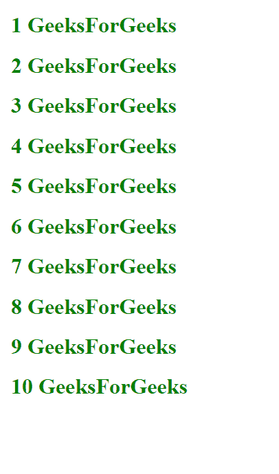

# Angular 2 模板中的 let-*是什么意思？

> 原文:[https://www . geeksforgeeks . org/angular-2-templates 中的 let-in-是什么意思/](https://www.geeksforgeeks.org/what-is-the-meaning-of-let-in-angular-2-templates/)

Angular 中的 let 关键字声明了模板中引用的模板输入变量。在 Angular 中，微语法用于以紧凑友好的字符串配置指令。通过将字符串转换为<ng-template>标签上的属性，可以直接将变量嵌入模板，这是 angular 中给出的一种能力。</ng-template>

**语法:**

```
let-variable_name = "Exported_var"
```

或者

```
let-variable_name
```

**用法:**作为一个微语法，**让**在 angular 中创建临时变量，可以通过组件类的变量进行链接。所以为了将组件变量信息带到模板中，让我们使用它。

**示例 1:** 在这个示例中，有一个使用 ng-template 标记创建嵌入式变量的非常简单的实现。这里形成了变量，其值被赋值为“极客”。下面的代码将被写入组件的模板文件中，这是一个 angular 5 更新。

*   **模板文件:**

## 超文本标记语言

```
<!DOCTYPE html>
<html lang="en">

<head>
    <meta charset="UTF-8">
    <meta name="viewport"
          content="width=device-width, initial-scale=1.0">
    <meta http-equiv="X-UA-Compatible" content="ie=edge">
    <title>let-* in Angular 2</title>
</head>

<body>
    <ng-template [ngTemplateOutlet]=
                 "TheGeekTemplate" [ngTemplateOutletContext]="
                 {
                  GeeksForGeeks: 'This is GeeksForGeeks'
                 }"
                 #TheGeekTemplate let-GFG="GeeksForGeeks">
        <div>{{GFG}}</div>

    </ng-template>

</body>

</html>
```

**输出:**在本例中，模板引用是由**# GeekTemplate**创建的，它在下一个 ng-template 标签中位于**【ngTemplateoutletcontext】**属性下。变量 GFG 是由 let 关键字定义的变量，该关键字有一个字符串作为导出变量，模板中的**【ngtemplateoletcontext】**属性为该变量分配了一个新值。对于变量 Geek，不提供值，因此它采用赋予**$隐式**的隐含值，即默认值。

```
This is GeeksForGeeks
```

**示例 2:** 这个示例是在 ngFor 指令中使用 let 的演示。这里，一个变量项将被链接到组件类，并直接用于名为 **elt** 的变量中，该变量由 **let-elt** 制造。

*   **模板文件:**

## 超文本标记语言

```
<!DOCTYPE html>
<html lang="en">

<head>
    <meta charset="UTF-8">
    <meta name="viewport"
          content="width=device-width, initial-scale=1.0">
    <meta http-equiv="X-UA-Compatible" content="ie=edge">
    <title>let-* in Angular 2</title>
</head>

<body>

    <!--The item variable used as -->
    <ng-template ngFor let-elt [ngForOf]="array">
        <div style="color:green;">
            <h1>{{elt}} GeeksForGeeks</h1>
        </div>
    </ng-template>
</body>

</html>
```

*   **组件文件:**

## java 描述语言

```
import { Component } from '@angular/core';

@Component({
  selector: 'app-root',
  templateUrl: './app.component.html',
  styleUrls: ['./app.component.css']
})
export class AppComponent {

  // The array variable in component file
  array=[1, 2, 3, 4, 5, 6, 7, 8, 9, 10]
}
```

**输出:**这里的输出将是 GeeksForGeeks 和索引一起写了 10 次，在代码中数组变量是一个数组，元素在 1 到 10 的范围内。元素由嵌入的变量项使用 let 显示，同时还有写在上面的 GeeksForGeeks。



**let-* Vs let-* = " Var ":**let-* = " Var "将选取在< ng-template >标记的 ngTemplateOutletContext 属性中定义的变量的值，而" let-* "将选取在$隐式变量名下给定的相同属性中定义的默认值。

**示例 3:** 这里形成了两个变量，一个变量赋值，第二个变量的值将链接到一个导出变量。下面的代码将被写入组件的模板文件中。

*   **模板文件:**

## 超文本标记语言

```
<!DOCTYPE html>
<html lang="en">

<head>
    <meta charset="UTF-8">
    <meta name="viewport"
          content="width=device-width, initial-scale=1.0">
    <meta http-equiv="X-UA-Compatible" content="ie=edge">
    <title>let-* in Angular 2</title>
</head>

<body>
    <ng-template [ngTemplateOutlet]=
                 "TheGeekTemplate" [ngTemplateOutletContext]="{
                     $implicit: 'Default Value',
                     GeeksforGeeks: 'This is GeeksforGeeks'
                 }"
                 #TheGeekTemplate let-GFG="GeeksforGeeks" let-Geek>
        <div>{{GFG}}</div>
        <div>{{Geek}}</div>

    </ng-template>
</body>

</html>
```

**输出:**

```
This is GeeksForGeeks
Default Value
```