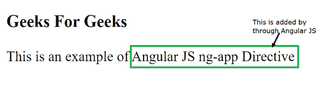
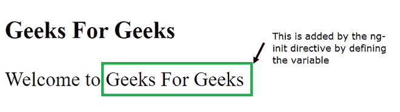
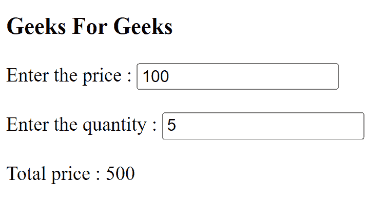

# ng-app、ng-init 和 ng-model 指令在 AngularJS 中的作用是什么？

> 原文:[https://www . geeksforgeeks . org/ng-app-ng-init-and-ng-model-instructions-in-angular js/](https://www.geeksforgeeks.org/what-is-the-role-of-ng-app-ng-init-and-ng-model-directives-in-angularjs/)

在本文中，我们将了解 angularJS 中的指令，并探讨各种指令的作用，如 AngularJS 中的 ng-app、ng-init 和 ng-model。

AngularJS 指令是一个赋予 HTML 文档新功能的命令。当我们使用 AngularJS 指令时，它将首先找到 HTML 文档中的所有指令，然后相应地解析 HTML 文档。

**ng-app:**ng-app 是用于定义 AngularJS 应用程序的指令。通过将它放在 HTML 文档中，它表明这是一个 AngularJS 应用程序。

## 超文本标记语言

```ts
<!DOCTYPE html>
<html>

<head>
    <title>ng-app</title>
    <script src=
"https://code.angularjs.org/1.6.9/angular.min.js">
    </script>
</head>

<body>
    <h3>Geeks For Geeks</h3>
    <div ng-app="">
        This is an example of {{"Angular JS"
        + "ng-app" + "Directive"}}
    </div>
</body>

</html>
```



**ng-init:**ng-init 是用于初始化应用程序数据的指令。简单地说，它在 AngularJS 中用作局部变量。有时我们需要在您的应用程序中使用一些本地数据，所以通过使用 ng-init 指令可以实现。

## 超文本标记语言

```ts
<!DOCTYPE html>
<html>

<head>
    <title>ng-init</title>
    <script src=
"https://code.angularjs.org/1.6.9/angular.min.js">
    </script>
</head>

<body>
    <h3>Geeks For Geeks</h3>
    <div ng-app="" ng-init=
        "Website = 'Geeks For Geeks'">
        Welcome to {{Website}}
    </div>
</body>

</html>
```



**ng-model:**ng-model 是用于将 HTML 控件的值绑定到应用程序数据的指令。它用于绑定 HTML 文档中的数据。

## 超文本标记语言

```ts
<!DOCTYPE html>
<html>

<head>
    <title>ng-model</title>
    <script src=
"https://code.angularjs.org/1.6.9/angular.min.js">
    </script>
</head>

<body>
    <h3> Geeks For Geeks </h3>
    <div ng-app="" ng-init="price=100; quantity=5">
        Enter the price : 
            <input type="text" ng-model="price"> 
            <br><br>

        Enter the quantity : 
            <input type="text" ng-model="quantity"> 
            <br><br>
        Total price : {{price * quantity}}
    </div>
</body>

</html>
```

