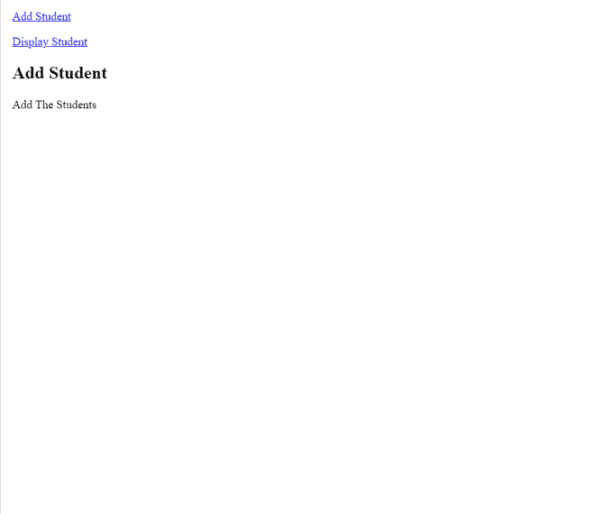
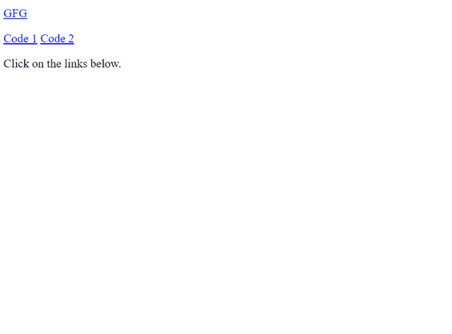

# 在 AngularJS 中$routeProvider 的作用是什么？

> 原文:[https://www . geeksforgeeks . org/routeprovider-in-angularjs/](https://www.geeksforgeeks.org/what-is-the-role-of-routeprovider-in-angularjs/)的角色是什么

路由允许我们创建单页应用程序。为此，我们使用 ng-view 和 ng-template 指令，以及$routeProvider 服务。

我们使用$routeProvider 来配置路由。

config()接受一个以$routeProvider 为参数的函数，路由配置进入函数内部。

$routeProvider 是一个简单的应用编程接口，它接受 when()或其他()方法。

我们需要安装 ngRoute 模块。

```ts
<html>
   <head>
      <title>GFG</title>
      <script src = 
"https://ajax.googleapis.com/ajax/libs/angularjs/1.3.14/angular.min.js">
       </script>
      <script src = 
"https://ajax.googleapis.com/ajax/libs/angularjs/1.3.14/angular-route.min.js">
      </script>
   </head>

   <body>

      <div ng-app = "mainApp">
         <p><a href = "#addStudent">
              Add Student</a></p>
         <p><a href = "#viewStudents">
              Display Student</a></p>
         <div ng-view></div>

         <script type = "text/ng-template" 
                 id = "addStudent.htm">
            <h2> Add Student </h2>
            {{message}}
         </script>

         <script type = "text/ng-template" 
                 id = "viewStudents.htm">
            <h2> Display Student </h2>
            {{message}}
         </script>
      </div>

      <script>
         var mainApp = 
angular.module("mainApp", ['ngRoute']);
         mainApp.config(
['$routeProvider', function($routeProvider) {
            $routeProvider

            .when('/addStudent', {
               templateUrl: 'addStudent.htm',
               controller: 'AddStudentController'
            })

            .when('/viewStudents', {
               templateUrl: 'viewStudents.htm',
               controller: 'ViewStudentsController'
            })

            .otherwise({
               redirectTo: '/addStudent'
            });
         }]);

         mainApp.controller(
'AddStudentController', function($scope) {
            $scope.message = "Add The Students";
         });

         mainApp.controller(
'ViewStudentsController', function($scope) {
            $scope.message = "Display all the students";
         });
      </script>

   </body>
</html>
```



***<u>解说:</u>***

*   $ RouterProvider 是 config (mainApp 模块)下的一个函数，使用键作为“$ RouterProvider”。
*   $routeProvider.when 定义了 URL "/addStudent "。
*   默认视图由“否则”设置。
*   “控制器”用于视图。

**如何配置$routeprovider？**

$ routeProvider 是创建$route 服务的。

通过在$route 服务之前配置$routeProvider，我们可以在将要显示的 HTML 模板中设置路由。

$routeProvider 是在调用 when()和 other()函数的帮助下配置的。

**when()** 函数以路由路径和一个 JavaScript 对象为参数。

**否则** ( **)** 取一个 JavaScript 对象作为参数。

**在 AngularJS 中配置路由的语法:**

```ts
var app = angular.module("appName", ['ngRoute']);  

app.config(function($routeProvider) {  
$routeProvider  
 .when('/1stview', {  
  templateUrl: '1stview.html',  
  controller: 'Controller1'  
 })  
 .when('/view2', {  
  templateUrl: '2ndview.html',  
  controller: 'Controller2'  
 })  
 .otherwise({  
  redirectTo: '/1stview'  
 });  
}); 
```

路径是哈希(#)符号后的网址。

路线包含两个属性 **:**

1.  templateUrl
2.  控制器

**当用户点击链接时，可以使用$routeProvider 来定义页面。**

```ts
<!DOCTYPE html>
<html>
    <script src=
"https://ajax.googleapis.com/ajax/libs/angularjs/1.6.9/angular.min.js">
  </script>
    <script src=
"https://ajax.googleapis.com/ajax/libs/angularjs/1.6.9/angular-route.js">
   </script>

    <body ng-app="myApp">
        <p><a href="#/!"> GFG</a></p>
        <p>Click on the links below.</p>

        <a href="#!C">Code 1</a>
        <a href="#!C++">Code 2</a>

        <div ng-view></div>

        <script>
            var app = angular.module("myApp", ["ngRoute"]);
            app.config(function ($routeProvider) {
                $routeProvider
                    .when("/", {
                        templateUrl: "main.htm",
                    })
                    .when("/C", {
                        templateUrl: "C.htm",
                    })
                    .when("/C++", {
                        templateUrl: "C++.htm",
                    });
            });
        </script>
    </body>
</html>
```

