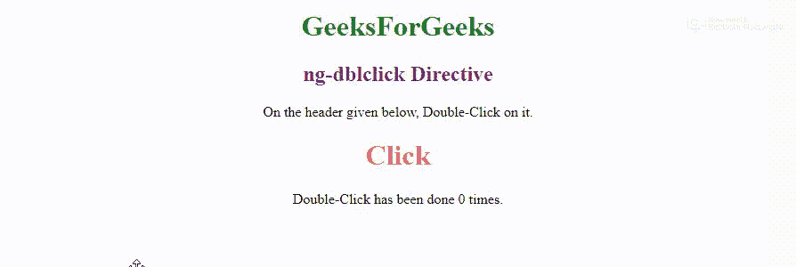

# 在 AngularJs 中双击事件有什么用？

> 原文:[https://www . geeksforgeeks . org/双击事件的用途是什么 angularjs/](https://www.geeksforgeeks.org/what-is-the-use-of-a-double-click-event-in-angularjs/)

AngularJS 中的 **ng-dblclick 事件**对于获取双击事件的 HTML 元素很有用，这是定义好的。如果用户希望在双击 HTML 元素时触发函数或其他事件，那么将需要这个事件。HTML 的所有元素都将支持它。

基本上，ng-dblclick 的指令将告诉 AngularJS 当双击它时，HTML 或 HTML 元素需要做什么。但是，它不会重写元素的原始 ondblclick 事件，因为它们都将被执行。

**语法:**

```
<element ng-dblclick="expression"> </element>

```

**参数值:**

*   **expression:** The execution of the expression, when double-click is done on any element.

    **示例:**(该示例将增加变量“count”的值，每次双击标题时。)

    ```
    <!DOCTYPE html>

    <html>
    <script src=
    "https://ajax.googleapis.com/ajax/libs/angularjs/1.6.9/angular.min.js">
    </script>

    <head>
        <title>
            AngularJS ng-dblclick Directive
        </title>
    </head>

    <body style="text-align:center;" ng-app="">
        <h1 style="color:green">
          GeeksForGeeks
      </h1>
        <h2 style="color:purple">
          ng-dblclick Directive
      </h2>
        <p>On the header given below, 
          Double-Click on it.</p>
        <h1 style="color:#EA6964" 
            ng-dblclick="count = count + 1"
            ng-init="count=0">Click</h1>

        <p>Double-Click has been done {{count}} times.</p>
        <p></p>
    </body>

    </html>
    ```

    **输出:**
    