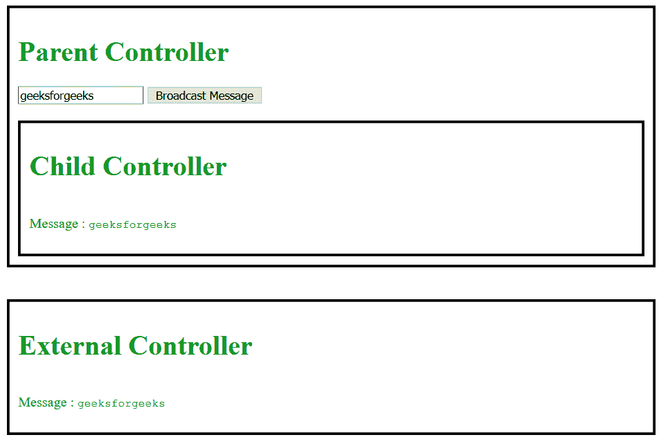

# 我们为什么要用$rootScope。$用 AngularJS 广播？

> 原文:[https://www . geeksforgeeks . org/why-do-we-use-root scope-broadcast-in-angularjs/](https://www.geeksforgeeks.org/why-do-we-use-rootscope-broadcast-in-angularjs/)

**$rootScope。$broadcast** 用于广播一个**“全球”**事件，该特定范围的任何听众都可以捕捉到该事件。后代范围可以通过使用 **$scope 来捕获和处理这个事件。$on** 。

**语法:**

```
$rootScope.$broadcast(name, args)

$scope.$on(name, listener);

```

其中**监听器**指定捕捉到事件时要调用的函数。

**进场:**

*   创建您想要从中引发/广播事件的父控制器。
*   使用$rootScope。$broadcast in AngularJS 从 ParentController 广播事件。
*   创建一个子控制器或外部控制器(即不是父控制器的直接后代)来捕获和处理事件。
*   使用$scope。AngularJS 中的$on 用于捕获相应的事件。

**示例:**这个程序使用了$rootScope。$broadcast 使用上面讨论的方法引发事件。

```
<!DOCTYPE html>
<html>

<head>
    <script src=
"http://ajax.googleapis.com/ajax/libs/angularjs/1.7.8/angular.js">
  </script>
    <script type="text/javascript">
        var app = angular.module('app', []);
        app.controller('ParentController', function(
                       $rootScope, $scope) {
            $scope.broadcastMessage = function() {
                $rootScope.$broadcast('newEvent', {
                    message: $scope.parentMessage
                });
            };

        });
        app.controller('ChildController', function($scope) {
            $scope.$on('newEvent', function(event, args) {
                $scope.message = args.message;
            });
        });
        app.controller('ExternalController', function($scope) {
            $scope.$on('newEvent', function(event, args) {
                $scope.message = args.message;
            });
        });
    </script>
    <style type="text/css">
        h1,
        code {
            color: green;
        }

        p {
            color: green;
            display: inline-block;
        }

        div {
            border-color: black;
            border-style: solid;
            padding: 10px;
        }
    </style>
</head>

<body ng-app="app">
    <div ng-controller="ParentController">
        <h1>Parent Controller</h1>
        <input ng-model="parentMessage">
        <button ng-click="broadcastMessage()">
          Broadcast Message
      </button>

        <br>
        <br>
        <div ng-controller="ChildController">
            <h1>Child Controller</h1>
            <p>Message :</p>

            <code>{{message}}</code>
        </div>
    </div>
    <br>
    <br>
    <div ng-controller="ExternalController">
        <h1>External Controller</h1>
        <p>Message :</p>

        <code>{{message}}</code>
    </div>
</body>

</html>
```

**输出:**
