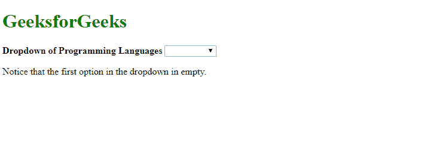
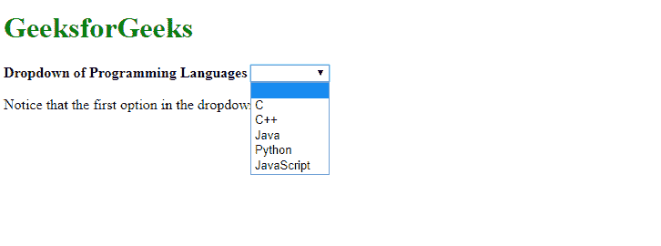
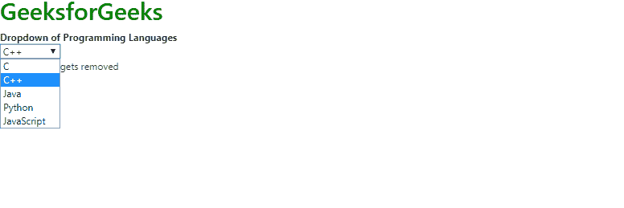

# 为什么 AngularJS 在 select 中包含一个空选项？

> 原文:[https://www . geeksforgeeks . org/为什么-angularjs-include-a-empty-option-in-select/](https://www.geeksforgeeks.org/why-does-angularjs-include-an-empty-option-in-select/)

AngularJS 是一个包含几个内置功能的 Javascript 框架，旨在让开发人员更容易、更高效地进行开发。下拉列表就是其中之一。下拉列表是一个图形用户界面元素，允许用户从值列表中选择一个值。当下拉列表处于活动状态时，会向用户显示一个值列表，一次可以从中选择一个值。选择一个值后，下拉列表返回到默认状态。

然而，在使用 AngularJS 下拉列表时，我们发现 select 下拉列表中的第一个选项总是空的。为了更好地理解，请看下面的例子。

**示例:**

```ts
<!DOCTYPE html>
<html>

<head>
    <script src=
"https://cdnjs.cloudflare.com/ajax/libs/angular.js/1.0.3/angular.js"
        integrity=
        "sha256-ZYJ4XH6kZrqD1MlZWZZmQj6MBe/TvysMc33LPchVuo8="
        crossorigin="anonymous">
    </script>
</head>

<body>
    <h1 style="color:green;">
        GeeksforGeeks
    </h1>

    <strong>
        Dropdown of Programming Languages
    </strong>

    <div ng-App="myApp"
        ng-controller="MyCtrl">
        <select ng-model='form.type'
                ng-options=
        'name.val as name.label for name in allNames'>
        </select>
    </div>

    <p>
        Notice that the first option 
        in the dropdown in empty.
    </p>

    <script>
        var myApp = angular.module('myApp', []);

        function MyCtrl($scope) {

            $scope.allNames = [{
                label: 'C',
                val: 'C Language'
            }, {
                label: 'C++',
                val: 'C++ Language'
            }, {
                label: 'Java',
                val: 'Java Language'
            }, {
                label: 'Python',
                val: 'Python Language'
            }, {
                label: 'JavaScript',
                val: 'JavaScript Language'
            }];

        }
    </script>
</body>

</html>
```

**输出:**



**说明与更正:**一般情况下，选项列表会转移到 *ng-option* 。然后这些选项以*图形用户界面格式*显示给用户。但是，当 **ng-model** 引用的某个值在转移到 **ng-option** 的列表中不存在时，就会在 GUI 列表中创建一个空选项，如上图所示。纠正此错误最简单的方法是从 **ng 选项**列表中引用一个有效值。引用的值必须在列表中可用。
我们可以用这个代码引用一个有效值。在这里， **i** 将是我们要引用的值的索引。

```ts
$scope.form = {type : $scope.allNames[i].val}; 
```

只需将此代码添加到列表下方，即可从 select 中删除空选项。在下面给出的例子中，我们修改了上面的例子，从下拉列表中删除了空选项。我们将 **i** 的值设置为 1。这样做后，空选项将消失，默认选择的值将设置为 C++。

**示例:**

```ts
<!DOCTYPE html>
<html>

<head>
    <script src=
"https://cdnjs.cloudflare.com/ajax/libs/angular.js/1.0.3/angular.js"
        integrity=
        "sha256-ZYJ4XH6kZrqD1MlZWZZmQj6MBe/TvysMc33LPchVuo8="
        crossorigin="anonymous">
    </script>
</head>

<body>
    <h1 style="color:green;">
        GeeksforGeeks
    </h1>

    <strong>
        Dropdown of Programming Languages
    </strong>

    <div ng-App="myApp" ng-controller="MyCtrl">
        <select ng-model='form.type'
                ng-options=
        'name.val as name.label for name in allNames'>
        </select>
    </div>

    <p>Empty option gets removed</p>

    <script>
        var myApp = angular.module('myApp', []);

        function MyCtrl($scope) {

            $scope.allNames = [{
                label: 'C',
                val: 'C Language'
            }, {
                label: 'C++',
                val: 'C++ Language'
            }, {
                label: 'Java',
                val: 'Java Language'
            }, {
                label: 'Python',
                val: 'Python Language'
            }, {
                label: 'JavaScript',
                val: 'JavaScript Language'
            }];

            $scope.form = {
                type: $scope.allNames[1].val
            };
        }
    </script>
</body>

</html>
```

**输出**
