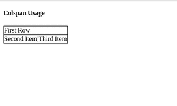

# 为什么 colspan 在 Angular 2 中不是已知的原生属性？

> 原文:[https://www . geesforgeks . org/why-is-colspan-not-a-known-native-attribute in-angular-2/](https://www.geeksforgeeks.org/why-is-colspan-not-a-known-native-attribute-in-angular-2/)

为了理解它，我们需要对文档对象模型(DOM)和超文本标记语言(HTML)有一个清晰深入的了解。
基本上，DOM 是对象的模型，是文档的逻辑树表示，而 HTML 是我们用来构建网页的标记语言。
每个 HTML 属性都有到 DOM 对象属性的一对一映射。

**例:**名

```
<label for="fname">First Name </label>
<input type="text" id="fname" name="fname" disabled >
```

所以，上面的例子包含两个标签标签和输入。正如我们所观察到的，在输入标签中定义了一个“禁用”的属性。
同样，如果你谈论 DOM 属性，禁用也存在于输入对象内部。
但是它们是 HTML 标签的某些属性在 DOM 中不可用的情况。
例:科尔斯潘。就像 colspan 一样，所以当你试图在 Angular 2+中使用它们进行属性绑定时，你会得到一个错误，说“不能绑定到 colspan，因为它不是‘TD’的已知属性”。
同样，我们有一些属性是在 DOM 中定义的，但在 HTML 中没有。

**示例:**

```
<h2 [textContent]="title"></h1>
```

解决方案:
为了将它们用于属性绑定，您需要使用以下语法“[attr.colspan]”。

```
import {Component} from '@angular/core';

@Component({

selector:'app-colspan',
template:
`
<h4> Colspan Usage </h4>
<table>
  <tr>
   <td [attr.colspan]="colSpan">First Item </td>
  </tr>
  <tr>
   <td>Second Item</td>
   <td>Third Item </td>
  </tr>
</table>
`,
styles:[`

table, tr, td{
border: 1px solid black;
border-collapse:collapse;
}
`]
})

export class ColSpanComponent{

colSpan="2"

}
```

**输出:**
