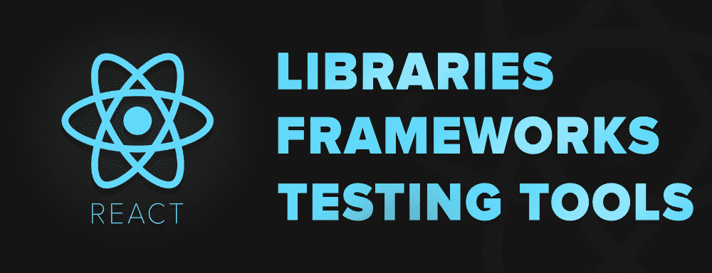

# 8 个对 React 开发者有用的测试工具、库和框架

> 原文:[https://www . geeksforgeeks . org/8-有用-测试-工具-库-框架-针对反应-开发人员/](https://www.geeksforgeeks.org/8-useful-testing-tools-libraries-and-frameworks-for-react-developers/)

我们都知道开发者对最受欢迎的库 [React](https://www.geeksforgeeks.org/reactjs/) 的喜爱。使用 React 很容易学习，也很容易构建任何网站的用户界面。如果您正在构建一个应用程序，不管是什么，您都应该在将应用程序提供给用户之前对其进行测试。

如果你是一个致力于 React 库的前端开发人员，你可能有一些最喜欢的工具或框架来测试你的 React 应用程序。许多开发人员使用 Jest、酵素或其他一些流行的工具和库来测试 React 应用程序的组件。然而，每个工具或框架对每个人来说都不一样。开源生态系统中有大量的测试框架和工具可以用来测试 React 应用程序。

无论您是在进行单元测试、集成测试还是端到端测试，选择正确的测试工具集和框架是在 React 中利用 TDD 的关键因素。在这个博客中，我们来谈谈一些流行的 React 测试框架和库，很多人在日常工作中都会用到它们。

### 1.[是](https://github.com/facebook/jest)

Jest 是最受欢迎的测试框架，每周下载量超过 **16M** 。由**脸书**创建和维护。该团队使用它来测试所有的 JavaScript 代码，包括 React 应用程序。它也被 Airbnb、优步、Intuit 和其他团队采用。Jest 自带测试运行器和断言功能。这个框架对于想要尝试非常快的 JavaScript 代码的初学者来说也很好。

*   非常快的表现。当他们从摩卡切换到 Jest 时，Airbnb 的总测试运行时间从 **12 分钟减少到只有 4.5 分钟**。
*   它进行快照、并行化和异步方法测试。
*   模拟您的函数，包括第三方 node_module 库
*   可以使用实时快照来管理具有较大对象的测试。
*   带报告指南的标准语法。
*   兼容 React，VueJS，Angular 和很多项目。

### 2.[摩卡](https://github.com/mochajs/mocha)

Mocha 是另一个受 Javascript 开发人员欢迎的测试框架。它为 NodeJS 程序、异步测试、测试覆盖报告和任何声明库的使用提供浏览器支持。它可以完全控制如何测试您的代码，使用哪些工具，同时您可以插入和取出链中的大多数支持库和工具。Jest 是流行的框架，但它有一些问题，如嘲讽令人困惑，所以摩卡是这种情况下的替代选择。

*   在 Node.js 上运行，并为异步前端和后端测试提供支持
*   有助于错误跟踪。
*   摩卡加酵素和柴的组合因断言、嘲讽等而流行。酶+摩卡是测试用 ReactJS 编写的 web 应用程序的好组合。

### 3.[柴](https://github.com/chaijs/chai)

Chai 是 node 和浏览器的一个流行的断言和期望库，可以与任何 javascript 测试框架配对。断言是一种在测试中声明预期结果的方式。摩卡没有内置断言库，所以很多开发人员会选择柴和摩卡一起测试 React 应用程序。像 expect、should 和 assert 这样的功能可以帮助您在测试中声明期望什么。它可以用来对函数进行断言，也可以在以后使用酵素对组件进行断言。

### 4.[茉莉](https://github.com/jasmine/jasmine)

Jasmine 是一个很棒的 BDD 开源框架和测试运行器，用于测试各种 javascript 应用程序。它包括在几个不同分辨率的设备上对用户界面的可见性测试和响应测试。许多使用 Angular CLI 的开发人员喜欢使用 Jasmine 来测试应用程序。开发人员大多将其与巴别塔和酶结合起来[测试 React 应用程序](https://jasmine.github.io/tutorials/react_with_npm)。您可以阅读关于[助手实用程序库](https://github.com/tommyh/jasmine-react)的信息，该库被指定用于测试 React 应用程序。以下是 jasmine 框架的一些优点…

*   茉莉不需要文档对象模型。
*   对前端和后端测试都有帮助。
*   异步功能测试。
*   嘲弄的请求。
*   自定义相等检查器断言。
*   自定义匹配器断言。
*   坚实的文件和社区支持。

请记住，Jasmine 不支持快照测试、代码覆盖工具、并行化(需要第三方工具)和本机 DOM 操作(需要第三方工具)。

### 5.[酶](https://github.com/enzymejs/enzyme)

酶是一个测试工具，旨在帮助开发人员测试反应组件没有任何麻烦。酵素是 Airbnb 开发和维护的最常用的框架之一。开发人员将其与其他框架(如 Jest、Chai 或 Mocha)相结合，以测试 React 应用程序。这种酶仅用于渲染组件、访问事物、查找元素、与元素交互以及模拟事件。柴或 Jest 可以用来为它做断言。您可以测试 React 组件的输出，抽象组件的呈现。从链接[酶与 Jest 阅读更多关于测试反应应用的信息。](https://blog.bitsrc.io/how-to-test-react-components-with-jest-and-enzyme-in-depth-145fcd06b90)

*   使用浅渲染。
*   访问组件的业务实现。
*   进行全 DOM 渲染。
*   在浅层渲染中使用**反作用挂钩**，有一些限制。

### 6.[柏树 IO](https://github.com/cypress-io/cypress)

Cypress 是一个非常快速的端到端测试框架，它使您能够在没有任何额外测试框架的情况下编写测试。它允许你在真实的浏览器或命令行中运行你的测试。除了在真实浏览器中测试代码，您还可以并行使用浏览器开发工具。该框架自带控制面板，可以让您控制测试的状态。使用柏树的一些优点和优势是…

*   带快照的时间旅行
*   截图和视频
*   自动等待
*   控制网络流量，而无需接触服务器来测试边缘情况
*   内置的并行化和负载平衡使调试更容易。
*   与页面组件交互的很好的应用编程接口。

### 7.[反应-测试-库](https://github.com/testing-library/react-testing-library)

React-testing-library 由 Kent c . dods 创建，并得到了大量开发人员的支持。它允许您轻松地测试组件，并在测试中模拟用户行为。类似于酵素，这个库是一套完整的 React DOM 测试实用程序，专注于模拟实际的用户动作和工作流。阅读文章[重温 2019 年的反应检测](https://codeburst.io/revisiting-react-testing-in-2019-ee72bb5346f4)，在反应检测库和酶之间做出选择。您可以使用 react-testing-library 做以下事情…

*   查询文本、标签、显示值、角色和测试中的元素
*   引发任何事件
*   等待元素以等待方式出现

这个库有一些限制，而且您不能进行浅层渲染，也不能访问组件的内部业务，例如状态。

### 8.[木偶师](https://github.com/puppeteer/puppeteer)

Puppeteer 不是一个 javascript 框架，它是一个无头 Chromium Node 库，提供了通过 DevTools 协议控制 Chrome 或 Chromium 的 API。您可以启动 chromium，并使用提供的 API 在页面之间导航，获取按钮，然后单击它们。木偶师在一个实际的浏览器上运行，它允许你用一个类似于浏览器的应用编程接口编写端到端的测试。你可以用木偶师做更多的事情，比如生成截图，从 spa 生成预渲染的内容，自动化表单提交、键盘输入等操作。您可以将[木偶师和 Jest](https://blog.bitsrc.io/testing-your-react-app-with-puppeteer-and-jest-c72b3dfcde59) 结合起来，端到端地测试您的 React 应用程序。

*   轻松的自动化用户界面测试、表单提交和键盘输入
*   轻松创建网页截图和 PDF 文件
*   支持测试 Chrome 扩展。

木偶师不支持大量的扩展，但是未来是光明的，有希望的。

### 结论

我们可以看到每一个测试库和框架都有它的优点和缺点。无论是单元测试、集成测试还是端到端测试，选择合适的工具都有助于获得最佳结果。要测试 React 组件，将正确的测试框架(如 Jest 等)与正确的断言/操作库(如酵素等)相结合，对于创建一个平滑灵活的工作流非常重要，它可以在您升级、扩展和修改代码时进行调整。