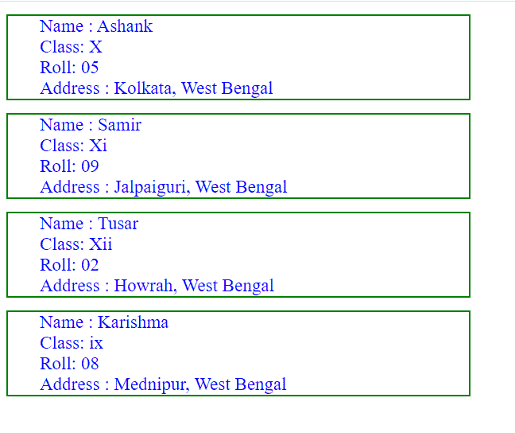
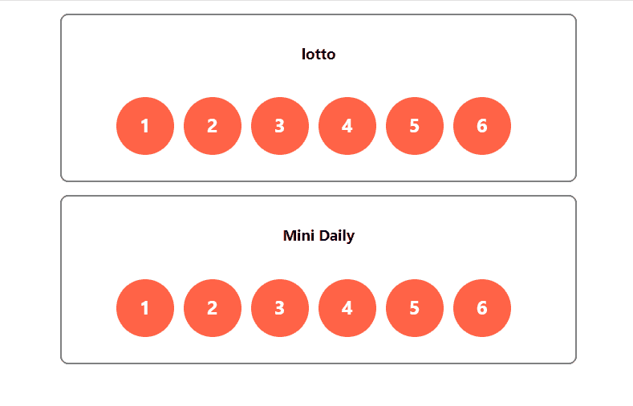

# 8 种反应组件的样式

> 原文:[https://www . geesforgeks . org/8-风格反应方式-组件/](https://www.geeksforgeeks.org/8-ways-to-style-react-components/)

React 是一个用于构建用户界面的 JavaScript 库。React 使创建交互式用户界面变得轻松。为应用程序中的每个状态设计简单的视图，当数据发生变化时，React 将高效地更新和呈现正确的组件。

大约有八种不同的方法来设计 React Js 组件的样式，下面提到了其中一些组件的名称和解释。

1.  内嵌 CSS
2.  普通 CSS
3.  JS 中的 CSS
4.  样式化组件
5.  CSS 模块
6.  Sass 与 SCS
7.  较少的
8.  可样式化的

**内嵌 CSS:** 在内嵌样式中，我们基本上创建样式的对象。并使用反应技术在样式属性的组件中呈现它，以将 JavaScript 变量合并到 JSX 中(使用“{ 0 }”)

**示例 1:** 此示例说明了如何使用内联样式对组件进行样式反应。

**index.js:**

## java 描述语言

```
import React from 'react'
import ReactDOM from 'react-dom'
import App from './App'

ReactDOM.render(<App />, document.querySelector('#root'))
```

**App.js**

## java 描述语言

```
import React, { Component } from 'react'
import StudentList from './StudentList'

const App = () => {
  return (
    <div>
      <StudentList
        name='Ashank'
        classNo='X'
        roll='05'
        addr='Kolkata, West Bengal'
      />
      <StudentList
        name='Samir'
        classNo='Xi'
        roll='09'
        addr='Jalpaiguri, West Bengal'
      />
      <StudentList
        name='Tusar'
        classNo='Xii'
        roll='02'
        addr='Howrah, West Bengal'
      />
      <StudentList
        name='Karishma'
        classNo='ix'
        roll='08'
        addr='Mednipur, West Bengal'
      />
    </div>
  )
}

export default App
```

**StudentList.js:** 是 App 组件渲染的 StudentList 组件。它显示每个学生的详细信息。

## java 描述语言

```
import React, { Component } from 'react'

class StudentList extends Component{
  render(){
    const {name, classNo, roll, addr} = this.props
    const ulStyle = {border: '2px solid green', width:'40%', listStyleType:'none'}
    const liStyle = {color : 'blue', fontSize:'23px'}
    return(
      <ul style={ulStyle}>
        <li style={liStyle}>Name : {name}</li>
        <li style={liStyle}>Class: {classNo}</li>
        <li style={liStyle}>Roll: {roll}</li>
        <li style={liStyle}>Address : {addr}</li>
      </ul>
    )
  }
}

export default StudentList
```

**输出:**



使用内嵌样式进行造型

**例 2:**

**index.js :**

## java 描述语言

```
import React from 'react'
import ReactDOM from 'react-dom'
import App from './App'

ReactDOM.render(<App />, document.querySelector('#root'))
```

**App.js**

## java 描述语言

```
import React from 'react';
import Lottery from './Lottery'

function App() {
  return (
    <div>
      <Lottery />
      <Lottery title='Mini Daily'/>
    </div>
  );
}

export default App;
```

**Ball.js:** 负责设计每个球的球组件

## java 描述语言

```
import React, { Component } from 'react'

class Ball extends Component{
  render(){
    const ballStyle = {
      backgroundColor: 'tomato',
      borderRadius: '50%',
      width:'3em',
      height:'2.25em',
      textAlign:'center',
      paddingTop: '0.75em',
      display:'inline-block',
      marginRight: '0.5em',
      marginTop: '1em',
      color:'white',
      fontWeight: 'bold',
      fontSize: '1.5em'
    }
    return(
      <div style={ballStyle}>
        {this.props.num}
      </div>
    )
  }
}

export default Ball
```

**彩票. js:** 负责渲染单张彩票卡的彩票组件由六个球组件组成。

## java 描述语言

```
import React,{ Component } from 'react'
import Ball from './Ball'

class Lottery extends Component{
  static defaultProps = {
    title : 'lotto',
    numbers : [1,2,3,4,5,6]
  }

  render(){
    const lotteryStyle={
      border: '2px solid grey',
      borderRadius: '10px',
      width:'40em',
      textAlign:'center',
      margin: '1em auto auto',
      padding: '1em 0 2em 0'
    }
    return(
      <div style={lotteryStyle}>
        <h3>{this.props.title}</h3>
        <div>
          {this.props.numbers.map(n => (
            <Ball num={n} />
          ))}
        </div>
      </div>
    )
  }
}

export default Lottery
```

**输出:**



内嵌样式

**普通 CSS:** 在外部 CSS 样式化技术中，我们基本上为每个组件创建一个外部 CSS 文件，并对类进行所需的样式化。并在组件中使用这些类名。按照惯例，外部 CSS 文件的名称与带有“”的组件的名称相同。' css '扩展。如果使用的类名遵循格式**“组件名-上下文”**(这里的上下文表示我们使用这个类名的地方)会更好。例如，如果我们为一个名为“盒子”的组件的头部设置样式，一个更好的类名应该为这个元素设置样式，应该是**“盒子头”。**

**示例:**这个示例说明了如何用外部样式表对组件进行样式反应。

**index.js:**

## java 描述语言

```
import React from 'react'
import ReactDOM from 'react-dom'
import App from './App'

ReactDOM.render(<App />, document.querySelector('#root'))
```

**App.js :**

## java 描述语言

```
import React, { Component } from 'react'
import StudentList from './StudentList'

const App = () => {
  return (
    <div>
      <StudentList
        name='Ashank'
        classNo='X'
        roll='05'
        addr='Kolkata, West Bengal'
      />
      <StudentList
        name='Samir'
        classNo='Xi'
        roll='09'
        addr='Jalpaiguri, West Bengal'
      />
      <StudentList
        name='Tusar'
        classNo='Xii'
        roll='02'
        addr='Howrah, West Bengal'
      />
      <StudentList
        name='Karishma'
        classNo='ix'
        roll='08'
        addr='Mednipur, West Bengal'
      />
    </div>
  )
}

export default App
```

**StudentList.js:** 是 App 组件渲染的 StudentList 组件。它显示每个学生的详细信息。

## java 描述语言

```
import React, { Component } from 'react'

class StudentList extends Component{
  render(){
    const {name, classNo, roll, addr} = this.props
    return(
      <ul className='StudentList'>
        <li className='StudentList-details'>Name : {name}</li>
        <li className='StudentList-details'>Class: {classNo}</li>
        <li className='StudentList-details'>Roll: {roll}</li>
        <li className='StudentList-details'>Address : {addr}</li>
      </ul>
    )
  }
}

export default StudentList
```

**学生列表。CSS:** 由于外部没有地方添加 CSS 代码，这里我添加一张 CSS 代码的截图。

## 半铸钢ˌ钢性铸铁(Cast Semi-Steel)

```
.StudentList{
    border: 2px solid green;
    width: 40%:
    list-style-type: none;
    }

.StudentList-details{
    color: blue;
    font-size: 23px;
    }
```

**输出:**


外部 CSS 样式

**JS 中的 CSS:**“react-jss”将 jss 和 react app 集成在一起，为组件添加样式。它有助于用 Javascript 编写 CSS，并允许我们以更具描述性的方式描述样式。它使用 javascript 对象以声明的方式描述样式，使用“createUseStyles”方法来反应 jss，并使用 className 属性将这些样式合并到功能组件中。

安装第三方 react-jss 包的命令

```
npm install react-jss
```

**示例:**

**index.js:**

## java 描述语言

```
import React from 'react'
import ReactDOM from 'react-dom'
import App from './App'

ReactDOM.render(<App />, document.querySelector('#root'))
```

**App.js**

## java 描述语言

```
import React, { Component } from 'react'
import StudentList from './StudentList'

const App = () => {
  return (
    <div>
      <StudentList
        name='Ashank'
        classNo='X'
        roll='05'
        addr='Kolkata, West Bengal'
      />
      <StudentList
        name='Samir'
        classNo='Xi'
        roll='09'
        addr='Jalpaiguri, West Bengal'
      />
      <StudentList
        name='Tusar'
        classNo='Xii'
        roll='02'
        addr='Howrah, West Bengal'
      />
      <StudentList
        name='Karishma'
        classNo='ix'
        roll='08'
        addr='Mednipur, West Bengal'
      />
    </div>
  )
}

export default App
```

**StudentList.js:** 是 App 组件渲染的 StudentList 组件。它显示每个学生的详细信息。

## java 描述语言

```
import React, { Component } from 'react'
import {createUseStyles} from 'react-jss'

const styles = createUseStyles({
  student : {
    border : '2px solid green',
    width: '40%',
    listStyleType:'none'
  },

  studentDetails : {
    color : 'blue',
    fontSize : '23px'
  }
})

const StudentList = (props) => {
  const classes = styles()
  const {name, classNo, roll, addr} = props
  return(
    <ul className={classes.student}>
      <li className={classes.studentDetails}>Name : {name}</li>
      <li className={classes.studentDetails}>Class: {classNo}</li>
      <li className={classes.studentDetails}>Roll: {roll}</li>
      <li className={classes.studentDetails}>Address : {addr}</li>
    </ul>
  )
}

export default StudentList
```

**输出:**


在 JS 中使用 CSS 进行样式化

**样式组件:**样式组件允许我们在 JavaScript 中创建的变量下设置 CSS 的样式。style components 是一个第三方包，使用它我们可以创建一个组件作为 JavaScript 变量，该变量已经用 CSS 代码进行了样式化，并在我们的主组件中使用了该样式化的组件。style-components 允许我们创建定制的可重用组件，这样维护起来就不那么麻烦了。

安装第三方样式组件包的命令

```
npm install --save styled-components
```

**示例:**

**index.js:**

## java 描述语言

```
import React from 'react'
import ReactDOM from 'react-dom'
import App from './App'

ReactDOM.render(<App />, document.querySelector('#root'))
```

**App.js**

## java 描述语言

```
import React, { Component } from 'react'
import StudentList from './StudentList'

const App = () => {
  return (
    <div>
      <StudentList
        name='Ashank'
        classNo='X'
        roll='05'
        addr='Kolkata, West Bengal'
      />
      <StudentList
        name='Samir'
        classNo='Xi'
        roll='09'
        addr='Jalpaiguri, West Bengal'
      />
      <StudentList
        name='Tusar'
        classNo='Xii'
        roll='02'
        addr='Howrah, West Bengal'
      />
      <StudentList
        name='Karishma'
        classNo='ix'
        roll='08'
        addr='Mednipur, West Bengal'
      />
    </div>
  )
}

export default App
```

**StudentList.js:** 是 App 组件渲染的 StudentList 组件。它显示每个学生的详细信息。

## java 描述语言

```
import React, { Component } from 'react'
import styled from 'styled-components'

//styled component Li
const Li = styled.li`
  color : blue;
  font-size : 23px
`

//Styled component Ul
const Ul = styled.ul`
  border : 2px solid green;
  width: 40%;
  list-style-type:none
`

const StudentList = (props) => {
  const {name, classNo, roll, addr} = props
  return(
    <Ul>
      <Li>Name : {name}</Li>
      <Li>Class: {classNo}</Li>
      <Li>Roll: {roll}</Li>
      <Li>Address : {addr}</Li>
    </Ul>
  )
}

export default StudentList
```

**输出:**


使用样式化组件进行样式化

**CSS Modules:**CSS 模块是一个简单的 CSS 文件，但一个关键的区别是，默认情况下，当它被导入时，CSS 模块中的每个类名和动画都在导入它的组件的本地范围内。CSS 文件名也应该遵循格式**“文件名.模块. CSS”**。这允许我们为 CSS 类使用有效的名称，而不用担心与应用程序中的其他类名冲突。

要使用 CSS 模块创建一个普通的 CSS 文件，请使用以下语法从组件中导入您创建的模块

```
import styles from './filename.module.css
```

**示例:**

索引. js:

## java 描述语言

```
import React from 'react'
import ReactDOM from 'react-dom'
import App from './App'

ReactDOM.render(<App />, document.querySelector('#root'))
```

**App.js**

## java 描述语言

```
import React, { Component } from 'react'
import StudentList from './StudentList'

const App = () => {
  return (
    <div>
      <StudentList
        name='Ashank'
        classNo='X'
        roll='05'
        addr='Kolkata, West Bengal'
      />
      <StudentList
        name='Samir'
        classNo='Xi'
        roll='09'
        addr='Jalpaiguri, West Bengal'
      />
      <StudentList
        name='Tusar'
        classNo='Xii'
        roll='02'
        addr='Howrah, West Bengal'
      />
      <StudentList
        name='Karishma'
        classNo='ix'
        roll='08'
        addr='Mednipur, West Bengal'
      />
    </div>
  )
}

export default App
```

**学生名单. js:t1**

## java 描述语言

```
import React, { Component } from 'react'
import style from './StudentList.module.css'

const StudentList = (props) => {
  const {name, classNo, roll, addr} = props
  return(
    <ul className={style.list}>
      <li className={style.details}>Name : {name}</li>
      <li className={style.details}>Class: {classNo}</li>
      <li className={style.details}>Roll: {roll}</li>
      <li className={style.details}>Address : {addr}</li>
    </ul>
  )
}

export default StudentList
```

**StudentList.module.css:** 由于外部没有地方添加 css 代码，这里我添加一个 CSS 代码的截图。

## 半铸钢ˌ钢性铸铁(Cast Semi-Steel)

```
.list{
    border: 2px solid green;
    width: 40%:
    list-style-type: none;
    }

.details{
    color: blue;
    font-size: 23px;
    }
```