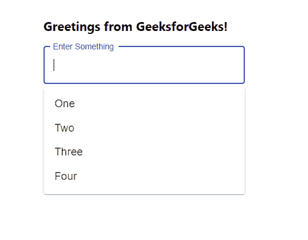
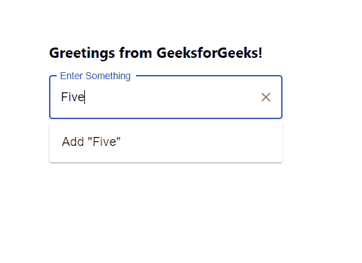

# 使用 ReactJS

在下拉菜单中动态添加新选项

> 原文:[https://www . geesforgeks . org/add-new-options-in-drop down-dynamic-using-reactjs/](https://www.geeksforgeeks.org/adding-new-options-in-dropdown-dynamically-using-reactjs/)

在下拉菜单中创建我们自己的选项意味着，每当用户键入除选项中显示的值之外的任何新值时，该新值都应该作为选项添加到下拉菜单中。【React 的 Material UI 有这个组件可供我们使用，非常容易集成。

**创建反应应用程序并安装模块:**

**步骤 1:** 使用以下命令创建一个反应应用程序:

```jsx
npx create-react-app foldername
```

**步骤 2:** 创建项目文件夹(即文件夹名**)后，使用以下命令移动到该文件夹中:**

```jsx
cd foldername
```

**步骤 3:** 创建 ReactJS 应用程序后，使用以下命令安装 **material-ui** 模块:

```jsx
npm install @material-ui/core
npm install @material-ui/lab
```

**项目结构:**如下图。


项目结构

**App.js:** 现在在 **App.js** 文件中写下以下代码。在这里，App 是我们编写代码的默认组件。

## java 描述语言

```jsx
import React from 'react'
import TextField from '@material-ui/core/TextField';
import Autocomplete,
{ createFilterOptions } from '@material-ui/lab/Autocomplete';
const filter = createFilterOptions();

const App = () => {

  // Our sample dropdown options
  const options = ['One', 'Two', 'Three', 'Four']

  return (
    <div style={{ marginLeft: '40%', marginTop: '60px' }}>
      <h3>Greetings from GeeksforGeeks!</h3>
      <Autocomplete
        filterOptions={(options, params) => {
          const filtered = filter(options, params);
          // Suggest the creation of a new value
          if (params.inputValue !== '') {
            filtered.push(`Add "${params.inputValue}"`);
          }
          return filtered;
        }}
        selectOnFocus
        clearOnBlur
        handleHomeEndKeys
        options={options}
        renderOption={(option) => option}
        style={{ width: 300 }}
        freeSolo
        renderInput={(params) => (
          <TextField {...params} label="Enter Something"
            variant="outlined" />
        )}
      />
    </div>
  );
}

export default App
```

**运行应用程序的步骤:**从项目的根目录使用以下命令运行应用程序:

```jsx
npm start
```

**输出:**现在打开浏览器，转到***http://localhost:3000/***，会看到如下输出:



所有可用选项

现在，如果我们开始键入除这些选项之外的任何其他文本，它将显示**添加**功能来添加我们的用户键入选项，如下所示:



添加新选项

**注意:**现在你可以用 handleChange()函数处理这个新的输入，并根据用户需要将其推送到我们的选项数组中。