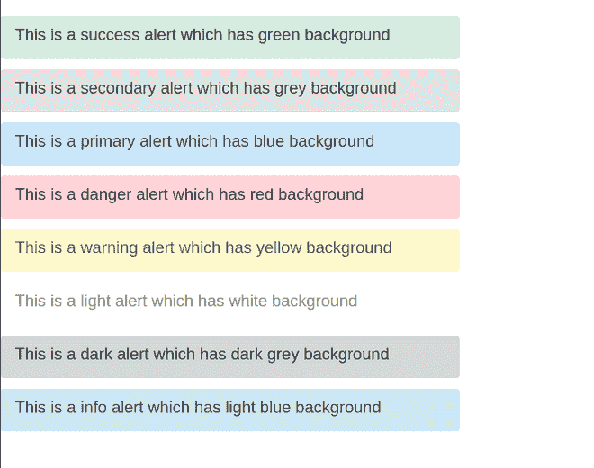

# 反应-引导中的警报

> 原文:[https://www.geeksforgeeks.org/alerts-in-react-bootstrap/](https://www.geeksforgeeks.org/alerts-in-react-bootstrap/)

**简介:** React-Bootstrap 是一个前端框架，设计时考虑到了 React。Bootstrap 被重新构建并修改为 React，因此它被称为 React-Bootstrap。警报用于在屏幕上弹出通知。根据具体情况，警报的性质和主题会有所变化。

**创建反应应用程序并安装模块:**

**步骤 1:** 使用以下命令创建一个反应应用程序:

```jsx
npx create-react-app foldername
```

**步骤 2:** 创建项目文件夹(即文件夹名**)后，使用以下命令移动到该文件夹中:**

```jsx
cd foldername
```

**步骤 3:** 创建 ReactJS 应用程序后，使用以下命令安装所需的模块:

```jsx
npm install react-bootstrap bootstrap
```

**项目结构:**如下图。


项目结构

**App.js:** 现在在 **App.js** 文件中写下以下代码。在这里，App 是我们编写代码的默认组件。

## java 描述语言

```jsx
import react from "react";
import Alert from "react-bootstrap/Alert";

const App = () => {
  return (
    <div>
      <Alert variant="success" style={{ width: "42rem" }}>
        <Alert.Heading>
          This is a success alert which has green background
        </Alert.Heading>
      </Alert>

      <Alert variant="secondary" style={{ width: "42rem" }}>
        <Alert.Heading>
          This is a secondary alert which has grey background
        </Alert.Heading>
      </Alert>

      <Alert variant="primary" style={{ width: "42rem" }}>
        <Alert.Heading>
          This is a primary alert which has blue background
        </Alert.Heading>
      </Alert>

      <Alert variant="danger" style={{ width: "42rem" }}>
        <Alert.Heading>
          This is a danger alert which has red background
        </Alert.Heading>
      </Alert>

      <Alert variant="warning" style={{ width: "42rem" }}>
        <Alert.Heading>
          This is a warning alert which has yellow background
        </Alert.Heading>
      </Alert>

      <Alert variant="light" style={{ width: "42rem" }}>
        <Alert.Heading>
          This is a light alert which has white background
        </Alert.Heading>
      </Alert>

      <Alert variant="dark" style={{ width: "42rem" }}>
        <Alert.Heading>
          This is a dark alert which has dark grey background
        </Alert.Heading>
      </Alert>

      <Alert variant="info" style={{ width: "42rem" }}>
        <Alert.Heading>
          This is a info alert which has light blue background
        </Alert.Heading>
      </Alert>
    </div>
  );
};

export default App;
```

使用以下命令运行服务器:

```jsx
npm start
```

**输出:**

