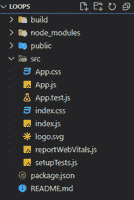
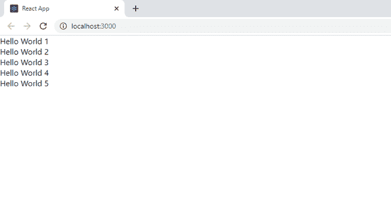
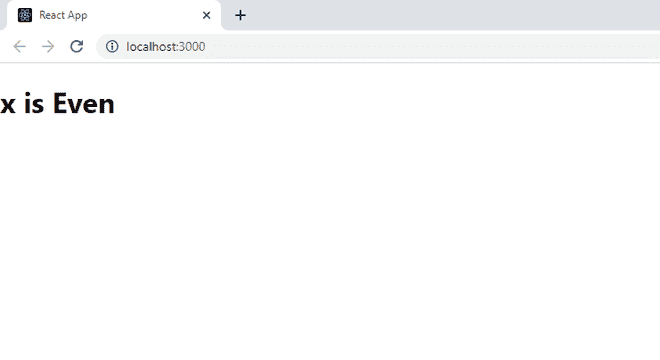

# ReactJS 中的 for 循环和 if-else 块的替代项

> 原文:[https://www . geeksforgeeks . org/for-loops-and-if-else-blocks-in-reactjs/](https://www.geeksforgeeks.org/alternatives-of-for-loops-and-if-else-blocks-in-reactjs/)

如果您曾经尝试在 React 中使用 for 循环，那么您一定很熟悉说明意外标记的错误，如果您也使用 If 条件，同样的错误也会出现。

**伪码:**

```jsx
import React from 'react'
import ReactDOM from 'react-dom'
import Component from "./Component"

function App() {
  return (
    <div>
        {
          for(let i =0 ; i< 5 ; i++)
             </Component>
        }
    </div>
}

const rootElement = document.getElementById('root')
ReactDOM.render(<App />, rootElement)
```

**解释:**浏览器不理解 react.js，所以 Babel 等 webpack 在编译时将 React.js 转换为 JavaScript。React.js 中的一切都可以归结为简单的 JavaScript。所以如果你用 react.js 写了一些不是有效 JavaScript 的东西，那么你会得到编译错误。上面代码中的问题是，return 语句总是需要一个值，但是 for 循环和 if 块不返回任何值。所以使用这些的替代方法应该会有所回报。

**步骤 1:** 创建反应应用程序

```jsx
npx create-react-app loops
```

**步骤 2:** 创建项目文件夹(即循环)后，使用以下命令移动到该文件夹:

```jsx
cd loops
```

**项目结构:**如下图。



**1。For 循环备选方案:**通过使用**地图，您几乎可以完成 for 循环所做的任何事情。另外，Map 返回一个数组，这样就不会有任何编译错误。不要忘记在返回每个组件时添加一个关键道具。**

****语法:****

```jsx
{ arr.map((parameter) => (//logic) )}
```

## **App.js**

```jsx
import React from 'react'
import ReactDOM from 'react-dom'

function App() {
const items = [1,2,3,4,5]
  return (
    <div>
      { items.map((item,index) => 
       (<div key={index}> Hello World {item} </div>) )}
    </div>
  )
}

export default App;
```

****运行应用程序的步骤:**打开终端，键入以下命令。**

```jsx
npm start
```

****输出:**现在打开浏览器，转到 http://localhost:3000/**

****

****for loop 但在 return 之外:**这里我们在 return 语句之外的数组中循环并存储组件数组，然后在 return 语句内部呈现数组。**

****语法:****

```jsx
for(initialization; condition; updation) {  //logic }
```

## **App.js**

```jsx
import React from 'react'
import ReactDOM from 'react-dom'

function App() {
const items = [1,2,3,4,5]
let components = [] 
for(let i = 0 ; i < items.length ; i++ ){
  components.push(<div>Hello Word {items[i]}</div>)
}
  return (
    <div>
      {components}
    </div>
  )
}

export default App;
```

****运行应用程序的步骤:**打开终端，键入以下命令。**

```jsx
npm start
```

****输出:**现在打开浏览器，转到 http://localhost:3000/**

****

****2。If-else 块替代:** [三元运算符](https://www.geeksforgeeks.org/javascript-ternary-operator/)的作用与 if-else 块相同。如果你只是想要一个 If 条件检查，那么你可以在 else 部分写 **null** 。**

****语法:****

```jsx
{ (condition) ? true : false }
```

****App.js****

## **App.js**

```jsx
import React from 'react'
import ReactDOM from 'react-dom'

function App() {
const x = 12
  return (
    <div>
        {x % 2 === 0 ? (<h1>x is Even</h1>) : (<h1> x is Odd</h1>)}
    </div>
  )
}
```

****运行应用程序的步骤:**打开终端，键入以下命令。**

```jsx
npm start
```

****输出:**现在打开浏览器，转到 http://localhost:3000/**

****