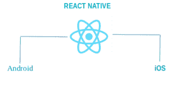
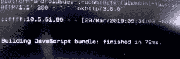
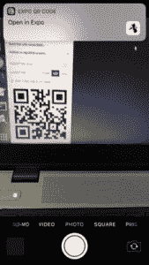

# 安卓& iOS 应用开发使用 React Native with Expo

> 原文:[https://www . geesforgeks . org/Android-IOs-app-development-use-react-native-with-Expo/](https://www.geeksforgeeks.org/android-ios-app-development-using-react-native-with-expo/)

**EXPO！** **世博会与“反应原生”有何不同？**我应该从世博会开始我的项目吗？当新手想要开始应用程序开发之旅时，他/她会想到很多问题。

但是，你很幸运，因为你降落在正确的地方。我会尽力用简单的方式解释一切。

根据 React Native 的官方文件，它用于:

```
“Build native mobile apps using JavaScript and React”.
```

让我为你分解它

React Native 是一个帮助我们使用单一 javascript 代码库构建应用程序(安卓和 iOS)的框架。它允许更快的开发，因为开发人员只需要知道开发两个应用程序(iOS 和 android)的 javascript。


**学一次，到处写**

这个框架使用 React.js 库——当今市场上讨论最多的词之一。现在，可能会出现一个问题——React 和 React Native 有什么区别？答案是 React Native 使用带有 JSX 的原生组件——一个 javascript 扩展，看起来像 HTML，而 React 使用 web 组件。

像视图和文本这样的本地组件的行为类似于 web 组件的“div”和“span”。《反应原生》中的造型让你感觉像是 CSS。唯一的区别是，在 React Native 中，字段名是用 CamelCase(比如字体大小)而不是虚线样式(比如字体大小)写的。它给人一种编写网络应用的感觉。

等等！这可能会出现在学习 React.js 之前先学习 React Native 的另一个问题。我会说..不要。你可以开始了。我已经在没有 React.js 知识的情况下开始了我的 React Native 之旅，但是是的，需要一些基本的 React 组件知识，比如 JSX、组件、状态和道具。

我希望你有一些反应原生的照片。现在让我们来探索使用 React Native 的市场。有许多流行的应用程序是使用 React Native 构建的，比如脸书、优步、Skype、insta gram……也许有一天你的应用程序会出现在这个列表中！

现在，让我们探索什么是世博会？它与 React Native 有何不同？

根据世博会官方文件，

```
“Expo let you build native iOS and Android apps by writing JavaScript”.
```

如果您查看 React native 的定义，这两个定义看起来很相似。世博会正在做“反应-本地人”做的事情。它们都允许我们使用 javascript 构建原生应用程序(iOS 和 Android)，但有所不同。你可以认为 Expo 是帮助我们更快开发 React-Native 应用程序的帮手。

世博应用实际上是 React-Native 应用。唯一不同的是，Expo 自带 SDK (Expo SDK)，只需几行代码就能为我们提供推送通知、脸书和谷歌登录等服务。它允许我们在一分钟内开始我们的项目。我们不需要 Xcode(适用于 iOS)和安卓工作室(适用于安卓)来开始。所以，更容易开始。

现在，你可能想知道为什么我要从“反应原生”开始我的旅程。我会利用世博会。但是布罗姆引用了一句话

```
“Everything comes with a price”.
```

世博会开始是好的，但也有一些缺点。让我们列出世博会的优点和缺点。

**优势:**

1.  项目设置非常简单，几分钟就可以完成。
2.  应用程序共享很容易(使用二维码和链接)。您可以使用“expo publish”命令发布您的应用程序，并可以共享该链接。不需要建造。apk(针对安卓)和。ipa(适用于 iOS)。
3.  世博会可以两者兼得。apk 和。ipa 非常容易。
4.  它提供脸书、谷歌登录、推送通知等服务，你可以轻松地将这些服务集成到你的应用程序中，而无需花费太多精力。

**缺点:**

1.  我面临的最大劣势是 apk 或 ipa 大小。是的，基本的“你好世界”应用程序大约有 20 到 25 MB 大。原因是集成库。
2.  您不能使用用 Java/Objective-C 编写的本机模块

就这样！这都是关于用世博会来回应本土。

等等！我们知道什么是世博会。它和 React Native 有什么关系，但是如何和 Expo 建立项目，从哪里开始？以下是你问题的答案。

让我们从您的第一个 Expo React Native 项目的设置开始。

假设你已经安装了 NodeJS(如果没有，按照这个[链接](https://www.digitalocean.com/community/tutorials/how-to-install-node-js-on-ubuntu-18-04#installing-using-nvm))。现在，使用 npm 安装 **expo-cli** 命令行实用程序:

```
npm install -g expo-cli
```

这将在您的机器上安装 expo-cli。在继续之前，我想告诉你它的两个主要部分:

第一部分是世博会。它是一个工具，帮助我们在我们的开发过程中，像在我们的项目设置，在建设 APK 或投资促进机构，等等。第二部分是 Expo 客户端应用程序，我们必须安装在我们的安卓或 iOS 手机上，以扫描二维码(您可以使用“expo start”命令获得)，这将在我们的安卓或 iOS 手机上打开一个项目。迷茫！

如果你不明白。没关系，我会一步一步解释的。

安装 expo-cli 后，让我们使用以下命令创建您的项目:

```
expo init myApp
```

它会询问选择模板的问题。按回车键选择空白。你也可以用例子来探讨第二个问题。现在，使用 blank，然后按照下面两个命令运行您的项目。

```
cd myApp 
expo start

```

这将生成二维码。


生成二维码

下一步是安装世博客户端应用。Expo 客户端应用可以使用手机中的 play store(适用于安卓)和 app store(适用于 iOS)安装。

现在，是时候使用 Expo 运行您的第一个 React Native 应用程序了。您可以通过使用 Expo 客户端应用程序(已安装在安卓或 iOS 手机上)扫描二维码(在您的终端中生成)来查看您的第一个应用程序。在安卓系统中，只要你扫描一次，它就会编译/捆绑你的项目在你的设备上运行。


项目正在进行捆绑。捆绑过程完成后，应用程序将在您的设备上运行。

等等！你可能会用同样的方式思考，你可以在你的 iOS 设备上运行，这在某种程度上是正确的，但是二维码的扫描是使用相机完成的。(二维码扫描功能已在 iOS 的 Expo 中删除)。只要打开你的相机，只要你扫描一下，就会有通知来->在博览会上打开你的应用。点击它，它将开始编译/捆绑你的应用程序，在你的 iOS 设备上运行。


点击通知，将开始捆绑过程。

万岁！您已经使用 Expo 成功运行了第一个应用程序。

这不是一个简单的过程吗？保存更改后，您可以修改 app.js 的代码，并看到应用程序的自动重新加载。

感谢阅读！