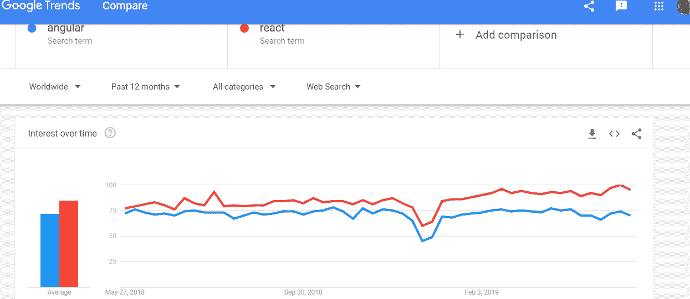
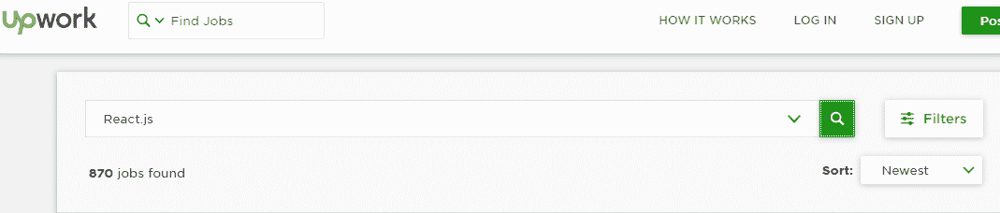

# Angular vs ReactJS:2019 年最抢手的前端开发框架是哪一个？

> 原文:[https://www . geeksforgeeks . org/angular-vs-reactjs-哪一个需求最大-前端-开发-2019 年框架/](https://www.geeksforgeeks.org/angular-vs-reactjs-which-one-is-most-in-demand-frontend-development-framework-in-2019/)

Javascript 是当今开发者中最流行的语言之一。有很多开发人员、新手和经验丰富的人喜欢使用 [Javascript](https://www.geeksforgeeks.org/javascript-tutorial/) 构建他们的应用程序或项目，但是当他们必须为他们的项目选择正确的框架或库时，仍然会有混乱。
**棱角分明和反应堆**是他们最优先考虑的，但他们中的大多数人仍然无法决定哪一个对他们的项目有利。新生想知道哪一个容易学，哪一个在市场上有更多的就业需求。

让我们快速介绍 Angular 和 ReactJs。

AngularJS 由谷歌开发，最初于 2010 年发布。直到 2016 年，它还被称为**。2016 年 angular 团队发布了 *Angular 2* ，这是对 *AngularJS* 的完全重写，实际上是一个全新的框架，所以为了减少与上一个框架的混淆，Angular 团队决定将 JS 从原来的名字中去掉，他们将这个新框架称为 Angular。**

**React 是由脸书开发和维护的。2013 年上映。**

**我们需要记住 ReactJS 是一个构建交互式用户界面的**库**，另一方面 Angular 是一个完整的**框架**。在我们继续之前，让我们看看[斯塔科沃弗洛](https://stackoverflow.com/)调查对角度和反应的描述。**

**

图片来源:史黛西·科沃弗洛** 

**现在让我们看看谷歌趋势对 Angular 和 React 的看法。**

**

图片提供:谷歌趋势** 

**从上面两张图片可以明显看出，ReactJS 的优先级比 Angular 高，谷歌趋势也说 ReactJS 是最受欢迎的库。现在，我们将根据某些因素对两者进行比较，以决定选择哪一个更好。**

****学习曲线:** Angular 是一个完整的成熟框架，所以如果有人想在 Angular 上制作一个应用程序或项目，他们需要深入学习很多东西，比如 Typescript、MVC，还有很多其他概念需要学习，比如指令、模块、装饰器、组件、服务、依赖注入、管道和模板。在高级主题中，它需要学习变化检测、区域、AOT(超前)编译和 rx . js。Angular 提供了许多“开箱即用”的东西。它有严格的编码，给出了清晰的结构，但如果有人想进入 Angular，还有很多东西要学。
另一方面，ReactJs 只是一个库，因此与 Angular 相比，它需要学习的概念更少。React 使用 JSX (Javascript XML)，这是一种将 HTML 编写成 Javascript 的方式。所以我们需要知道 JSX 的语法，如何使用 Redux 编写组件、管理内部状态、配置道具、路由、状态管理。React 不会提供任何“开箱即用”的功能。React 提供了灵活性，它给了开发人员太多的选择来用不同的方式完成相同的任务。在 Angular 的对比中，很容易快速学会。**

****组件和尺寸:** Angular 在 Real [DOM](https://www.geeksforgeeks.org/dom-document-object-model/) 上工作，遵循 MVC 模式。Angular 遵循双向数据流，与 React 相比，它的大小也很大(大约 92KB，可能会改变)。另一方面，React 在虚拟 DOM 上工作，它是真实 DOM 的轻量级副本，或者我们可以说是真实 DOM 的 JS 表示。React 遵循单向数据流，并且 React 的大小(大约 46KB，可能会改变)小于 Angular。**

****迁移和社区支持:** Angular 发布它的更新版本或者每六个月更新一次。因此，在一年内，有两个主要版本或更新进行必要的更改。自从发布以来，开发人员经历了如此多的突破性变化。Angular 得到了谷歌庞大而活跃的社区的支持，目前的版本是 7.0。React 由脸书维护，其当前版本为 16.0。React 中的升级比 Angular 中的更容易，对于 facebook 来说，在发布其新版本时，稳定性也是一个主要问题，因为像推特和 Airbnb 这样的大公司都使用 React。它也有很好的社区支持。**

****流行度:**下面是这两个框架的开源社区参与度和流行度。**

|  | 反应 | 有角的 |
| GitHub 星 | 129K | 48K |
| 贡献者 | One thousand two hundred and ninety-six | Nine hundred and thirty-five |
| 每周下载 | 5M | 440K |

****应用:** Angular 最广泛应用于大型应用，如视频流应用或乐器应用，因为它是成熟的框架性质。另一方面，ReactJS 只是一个库，所以它很适合 SPA(单页应用程序)或者不需要太多格式的地方。**

**谷歌、福布斯、Youtube、Wix 公司使用 Angular，脸书、Instagram、推特、Airbnb、网飞、贝宝、优步公司使用 telegram 和 React。**

****市场趋势或工作:**如果我们尝试在 StackOverflow 和 Upwork 上搜索 Angular 和 React 上的工作，我们会发现以下结果。**

****角度作业****

****

****

****反应作业****

****

****

**从以上两个结果来看，很明显 React 开发人员比 Angular 更可用，其需求也很高。**

****结论:**在我们得出任何结论之前，我们需要记住，没有最好的框架或库。选择框架或库完全取决于您的项目级别、需求和目标。每个框架或库都有一些优点和缺点，像 React 和 Angular。从以上所有因素来看，如果你是一个初学者或较少的编码实践，如果你想要你的项目的稳定性，你可以选择 React，因为它的学习曲线更快，更容易，而且市场上的工作比 Angular 高。如果你选择 Angular，这可能会令人沮丧，因为每 6 个月后，你将经历 Angular 的重大升级。另一件事是，如果你想要一个完整的框架来构建一个大规模的项目，并且喜欢遵循直截了当的编码策略，那么就选择 Angular。**