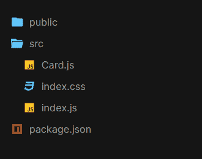
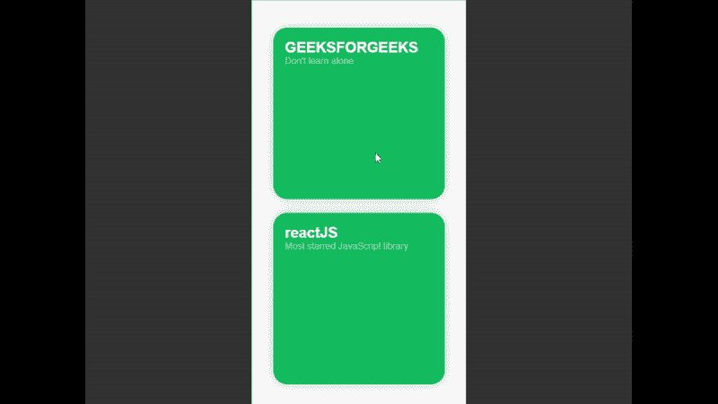

# 使用成帧器运动和 ReactJS 的动画扩展卡

> 原文:[https://www . geesforgeks . org/animated-expansion-card-use-framer-motion-and-reactjs/](https://www.geeksforgeeks.org/animated-expanding-card-using-framer-motion-and-reactjs/)

在这篇文章中，我们将学习如何使用 react 和 framer 创建一个动画扩展卡。

**先决条件:**

1.  Knowledge of JavaScript (ES6).

    我们将使用的 JavaScript 内置方法有:

    1.  [**箭头功能(ES6)**](https://www.geeksforgeeks.org/arrow-functions-in-javascript/)
    2.  [**三元算子**](https://www.geeksforgeeks.org/javascript-ternary-operator/)
    3.  [**JavaScript 中的对象**](https://www.geeksforgeeks.org/objects-in-javascript/)
2.  HTML/CSS 的知识。
3.  反应堆的基本知识

**用于构建本应用程序的反作用挂钩有:**

1.  [**反应使用状态**](https://www.geeksforgeeks.org/reactjs-usestate-hook/)

**框架器:**我们将在本教程中使用的组件和钩子有:

1.  https://www.framer.com/api/frame/
2.  https://www.framer.com/api/scroll/
3.  https://www.framer.com/api/utilities/#useanimation

**创建反应应用程序并安装模块:**

*   **步骤 1:** 现在，您将使用 create-react-app 启动一个新项目，因此请打开您的终端并键入。

    ```jsx
    $ npx create-react-app animated-card
    ```

*   **步骤 2:** 创建项目文件夹(即动画卡片)后，使用以下命令移动到它。

    ```jsx
    $ cd animated-card
    ```

*   **步骤 3:** 添加项目期间需要的 npm 包。

    ```jsx
    $ npm install framer react-icons
    // For yarn
    $ yarn add framer react-icons
    ```

打开 **src** 文件夹，删除以下文件:

1.  logo .. .svg
2.  serviceWorker.js
3.  setupTests.js
4.  App.css 文件
5.  App.js
6.  App.test.js(如果有)

创建一个名为 **Card.js** 的文件。

**项目结构:**你的项目结构树应该是这样的:



项目结构

**示例:**

## index.js

```jsx
import React from "react";
import { Frame, Scroll } from "framer";
import Card from "./Card";
import ReactDOM from "react-dom";

import "./index.css";

// main App HOC
export const App = () => {
  return (
    <Frame height={"100%"} width={"100%"} background={"#333"}>
      <Frame width={375} height={"100%"} background={"#FFF"} center>
        <Scroll width={375} height={"100%"}>
          {/* Card component with props yPos,title,subtitle */}
          <Card
            yPos={48}
            title={"GEEKSFORGEEKS"}
            subtitle="Don't learn alone"
          />
          <Card
            yPos={48 + 300 + 24}
            title={"reactJS"}
            subtitle="Most starred JavaScript library"
          />
        </Scroll>
      </Frame>
    </Frame>
  );
};

const rootElement = document.getElementById("root");
ReactDOM.render(<App />, rootElement);
```

## index.css

```jsx
body {
  margin: 0;
  cursor: pointer;
}
```

## Card.js

```jsx
import React, { useState } from "react";
import { ImCross } from "react-icons/im";
import { Frame, Scroll, useAnimation } from "framer";

// Card component with destructred props :
// yPos, title, subtitle
const Card = ({ yPos, title, subtitle }) => {

  // useState hook to manage the state of
  // expanding of card
  const [state, setState] = useState(false);

  // utility function to handle
  // onTap on card component
  const handleTap = () => {
    state ? controls.start({ y: 0 }) : setState(!state);
  };

  const controls = useAnimation();

  // Variants allow you to define animation
  // states and organise them by name.
  // They allow you to control animations 
  // throughout a component
  // tree by switching a single animate prop.
  const variants = {
    active: {
      width: 320,
      height: 800,
      borderRadius: 0,
      overflow: "visible",
      left: 28,
      right:0,
      y: 0,
      transition: { duration: 0.125, 
                    type: "spring", 
                    damping: 10, 
                    mass: 0.6 }
    },
    inactive: {
      width: 280,
      height: 280,
      borderRadius: 24,
      overflow: "hidden",
      left: 45,
      y: yPos,
      transition: { duration: 0.125, 
                    type: "spring", 
                    damping: 10,
                    mass: 0.6 }
    }
  };

  return (
    // basic container for layout, styling,
    // animation and events.
    <Frame
      y={yPos}
      variants={variants}
      animate={state ? "active" : "inactive"}
      width={300}
      height={300}
      borderRadius={24}
      style={state ? { zIndex: 10 } : { zIndex: 1 }}
      left={37.5}
      onTap={handleTap}
      shadow={
        state
          ? "0 0 0 0 rgba(0, 0, 0, 0)"
          : "0px 0px 20px 0px rgba(0, 0, 0, .25)"
      }
    >
      <Scroll
        width="100%"
        height="100%"
        backgroundColor={null}
        scrollAnimate={controls}
      >
        <Frame
          position="relative"
          backgroundColor={"#09a960"}
          width="100%"
          height={300}
        />
        <Frame position="relative" 
               height={1200} 
               background="white" />

        <Frame
          top={20}
          left={20}
          height={""}
          width={""}
          background={null}
          style={{
            color: "white",
            fontFamily: "sans-serif"
          }}
        >
          <span style={{ fontSize: "1.6em", 
                         fontWeight: 600 }}>
                        {title}
          </span>
          <br />
          <span
            style={{
              fontSize: "1em",
              fontWeight: 500,
              opacity: 0.5
            }}
          >
            {subtitle}
          </span>
        </Frame>
      </Scroll>
      {state && (
        <Frame
          borderRadius={20}
          size={15}
          top={15}
          right={20}
          backgroundColor={"#09a960"}
          onTap={() => {
            setState(false);
          }}
        >
          <ImCross color="red" />
        </Frame>
      )}
    </Frame>
  );
};

export default Card;
```

**运行应用程序的步骤:**从项目的根目录使用以下命令运行应用程序。

```jsx
npm start
```

**输出:**现在打开浏览器，转到 http://localhost:3000/，会看到如下输出:

