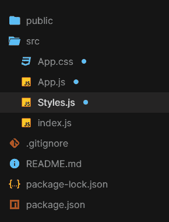
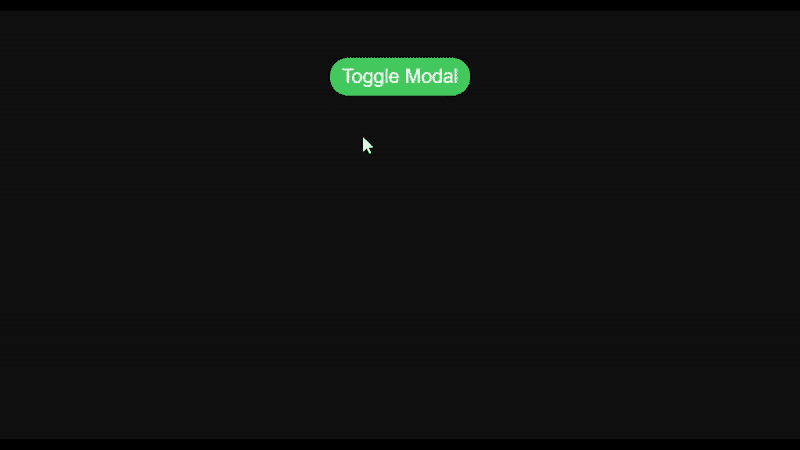

# 使用 react 的动画模态，成帧器-运动&风格-组件

> 原文:[https://www . geesforgeks . org/animated-model-use-react-framer-motion-style-components/](https://www.geeksforgeeks.org/animated-modal-using-react-framer-motion-styled-components/)

在本文中，我们将学习如何使用 react、framer-motion 和 style-components 创建动画模态。

**先决条件:**

1.  JavaScript (ES6)知识。
    *   [**箭头功能(ES6)**](https://www.geeksforgeeks.org/arrow-functions-in-javascript/)
    *   [**三元算子**](https://www.geeksforgeeks.org/javascript-ternary-operator/)
    *   [](https://www.geeksforgeeks.org/html-dom-body-property/)
2.  **HTML/CSS 的知识。**
3.  **ReactJS 的基本知识。

    *   [**反应使用状态**](https://www.geeksforgeeks.org/reactjs-usestate-hook/)** 

****成帧器-运动:**我们将在本教程中使用的组件和属性。**

1.  **https://www.framer.com/api/motion/component/**
2.  **https://www.framer.com/api/motion/animate-presence/**

****创建反应应用程序并安装模块:****

****步骤 1:** 现在，您将使用 create-react-app 启动一个新项目，因此请打开您的终端并键入。**

```jsx
npx create-react-app toggle-modal
```

****步骤 2:** 创建项目文件夹(即切换模式)后，使用以下命令移动到该文件夹。**

```jsx
cd toggle-modal
```

****步骤 3:** 添加项目期间需要的 npm 包。**

```jsx
npm install framer-motion styled-components
//For yarn
yarn add framer-motion styled-components
```

****第五步:**现在用你最喜欢的代码编辑器打开你新创建的项目，我正在使用 Visual Studio Code，会推荐你用同样的。**

**打开 **src** 文件夹，删除以下文件:**

1.  **logo .. .svg**
2.  **serviceWorker.js**
3.  **setupTests.js**
4.  **index.css**
5.  **App.test.js(如果有)**

**创建一个名为**style . js .**的文件**

****项目结构:**你的文件夹结构树应该是这样的。**

**

项目结构** 

****进场:****

*   **我们将创建一个带有“显示模态”属性的模态组件，仅用于管理其可见性状态，并使用成帧运动**动画表示**进行动画化。**
*   ****动画表示**允许组件在从反应树中移除时进行动画输出，并启用退出动画。**
*   **为了给模态容器提供弹簧动画，我们将使用框架-运动**弹簧**动画，刚度= 300。**
*   **modal 的内容是 geeksforgeeks 图像，也是使用成帧器-motion**motion . div**制作的动画**
*   **React **使用 State** 钩子管理‘show modal’的状态，即负责切换模态容器。**
*   ****“显示模式”**实用程序功能，将“显示模式”值设置为与其上一个值相反，以切换模式。**
*   **文档正文的事件侦听器，这样当单击外部或模态时，“显示模态”被设置为 false，而模态则消失。**
*   ****ToggleBtn** 也使用成帧器运动**运动按钮**进行动画制作。**

****示例:****

## **Styles.js**

```jsx
import styled from "styled-components";
import { motion } from "framer-motion";

export const ModalBox = styled(motion.div)`
  position: relative;
  z-index: 2;
  width: 400px;
  height: 200px;
  display: flex;
  justify-content: center;
  align-items: center;
  background: #fff;
`;

export const ModalContent = styled(motion.div)`
  padding: 5px;
`;

export const ModalContainer = styled.div`
  height: 100vh;
  background: #111;
  display: flex;
  flex-direction: column;
  align-items: center;
`;

export const ToggleBtn = styled(motion.button)`
  cursor: pointer;
  font-size: 20px;
  color: #fff;
  padding: 0.5rem 0.8rem;
  margin-top: 3rem;
  background: #3bb75e;
  text-decoration: none;
  border: none;
  border-radius: 50px;
`;
```

## **App.js**

```jsx
import React, { useState } from "react";
import { AnimatePresence } from "framer-motion";
import { ToggleBtn, ModalBox, ModalContent, ModalContainer } from "./Styles";
import "./App.css";

// Modal component with 'showModal' prop only
// to manage its state of visibility and
// animated using framer-motion
const Modal = ({ showModal }) => {
  return (
    <ModalContainer>
      <AnimatePresence>
        {showModal && (
          <ModalBox
            initial={{ opacity: 0, 
                       y: 60, scale: 0.5 }}
            animate={{
              opacity: 1,
              y: 0,
              scale: 1,
              // making use of framer-motion spring animation
              // with stiffness = 300
              transition: { type: "spring", 
                            stiffness: 300 }
            }}
            exit={{ opacity: 0, scale: 0.5, 
                    transition: { duration: 0.6 } }}>
            <ModalContent
              initial={{ y: -30, opacity: 0 }}
              animate={{ y: 0, opacity: 1, 
                         transition: { delay: 0.5 } }}>
              {/* Modal content is geeksforgeeks image */}
              
            </ModalContent>
          </ModalBox>
        )}
      </AnimatePresence>
    </ModalContainer>
  );
};

const App = () => {
  // React useState hook to manage the state of 'showModal'
  // i.e. responsible to toggle the modal container
  const [showModal, setShowModal] = useState(false);

  // utility function to set the showModal value
  // opposite of its last value
  // to toggle modal
  const displayModal = () => {
    setShowModal(!showModal);
    document.getElementById("btn").style.visibility = "hidden";
  };

  // event listener for document body
  // so that on clicking outside the modal,
  // 'showModal' is set to false.
  document.body.addEventListener("click", () => {
    if (showModal) {
      setShowModal(false);
    }
  });

  return (
    <ModalContainer>
      <ToggleBtn
        id="btn"
        initial={{ x: -700 }}
        animate={{
          x: 0,
          transition: { duration: 0.1 }
        }}
        // event listener for the toggle button
        // to display modal on click
        onClick={displayModal}>
        Toggle Modal
      </ToggleBtn>
      {/* passing 'showModal' as a prop to Modal component */}
      <Modal showModal={showModal} />
    </ModalContainer>
  );
};

export default App;
```

## **index.js**

```jsx
import React from "react";
import ReactDOM from "react-dom";
import App from "./App";

ReactDOM.render(
  <React.StrictMode>
    <App />
  </React.StrictMode>,
  document.getElementById("root")
);
```

## **App.css 文件**

```jsx
* {
  margin: 0;
  box-sizing: border-box;
}

img {
  padding: 5px;
  width: 400px;
  overflow: hidden;
}
```

****运行应用程序的步骤:**从项目的根目录使用以下命令运行应用程序。**

```jsx
npm start
```

****输出:**现在打开浏览器，转到 **http://localhost:3000/** ，会看到如下输出。**

****