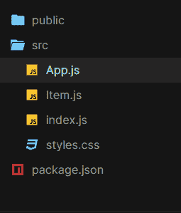
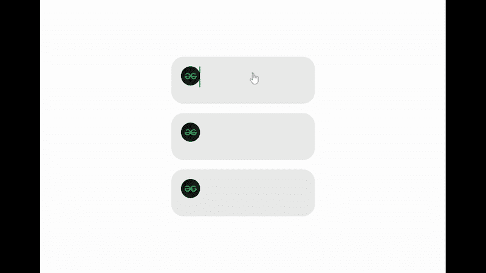

# 使用成帧器-运动和 React.js 的动画共享布局

> 原文:[https://www . geesforgeks . org/animated-shared-layout-use-framer-motion-react-js/](https://www.geeksforgeeks.org/animated-shared-layout-using-framer-motion-and-react-js/)

下面的方法介绍了如何使用成帧器运动和 ReactJS 创建动画共享布局。

**先决条件:**

1.  JavaScript 知识(ES6)
2.  HTML/CSS 的知识。
3.  ReactJS 的基本知识。

**创建反应应用程序并安装模块:**

*   **步骤 1:** 使用以下命令创建一个反应应用程序:

    ```
    npx create-react-app animated-layout
    ```

*   **步骤 2:** 创建项目文件夹(即动画布局)后，使用以下命令移动到它。

    ```
    cd animated-layout
    ```

*   **步骤 3:** 添加项目期间需要的 npm 包:

    ```
    npm install framer-motion
    ```

现在打开 src 文件夹，删除以下文件，创建一个名为 **Item.js.** 的 JavaScript 文件

*   logo .. .svg
*   serviceWorker.js
*   setupTests.js
*   App.test.js(如果有)
*   index.css

**项目结构:**您的项目结构树应该如下所示:



文件夹结构

**示例:**

*   我们将使用 react useState hook 和 frame-motion 组件 **motion** 和 **AnimatePresence** 创建一个**项**组件，即动画布局。
*   **内容**组件用于使用 HTML img 标签和 div &成帧器-运动组件**运动**创建项目的(动画共享布局)内容。
*   **toggleOpen** 是一个实用函数，用于设置“isOpen”值，而不是(！)的最后一个值。
*   在App.js **中，itemList** 代表我们想要创建的动画共享布局的数量，在我们的例子中是 3。
*   在 App.js 中，我们将使用 framer-motion**animated sharedlayout**组件来包装导入的**项**组件，并通过“项列表”数组进行映射来渲染动画布局。

## App.js

```
import React from "react";
import { AnimateSharedLayout } from "framer-motion";
import Item from "./Item";
import "./styles.css";

// This is an example of animating shared layouts 
// using react and framer-motion library.
const itemsList = [
  {
    index: 0,
    content: `Motion components are DOM primitives 
  optimised for 60fps animation and gestures.`
  },
  {
    index: 1,
    content: `Motion can animate:
    Numbers: 0, 10 etc.
    Strings containing numbers: "0vh", "10px" etc.`
  },
  {
    index: 2,
    content: `Transform properties are accelerated by the GPU,
     and therefore animate smoothly. `
  }
];

const App = () => {
  return (
    // The framer-motion component to wrap Item component to animate it 
    <AnimateSharedLayout>
      {/* Mapping through itemList array to render layouts*/}
      {itemsList.map((item) => (
        <Item key={item.index} content={item.content} />
      ))}
    </AnimateSharedLayout>
  );
};

export default App;
```

## Item.js

```
import React, { useState } from "react";
import { motion, AnimatePresence } from "framer-motion";

const Content = ({ content }) => {

  const url = "https://media.geeksforgeeks.org/wp-content/cdn-uploads/" +
    "20200817185016/gfg_complete_logo_2x-min.png"

  return (
    <motion.div
      layout
      initial={{ opacity: 0 }}
      animate={{ opacity: 1 }}
      exit={{ opacity: 0 }}
    >
      
      <div className="row">{content}</div>
    </motion.div>
  );
};

const Item = ({ content }) => {
  // React useState hook is used to manage the state of 'isOpen'
  // that in turn toggles shared layout, user clicks on
  const [isOpen, setIsOpen] = useState(false);

  // Utility function to set 'isOpen' '!'(not) of its last value
  const toggleOpen = () => setIsOpen(!isOpen);

  const url = "https://yt3.ggpht.com/ytc/AAUvwnjJqZG9PvGfC3GoV" +
    "27UlohMeBLxyUdhs9hUbc-Agw=s900-c-k-c0x00ffffff-no-rj"

  return (
    <motion.li
      layout
      title="Click to reveal"
      onClick={toggleOpen}
      initial={{ borderRadius: [25] }}
    >
      <motion.div className="avatar" layout>
        {" "}
        {" "}
      </motion.div>
      <br />
      <AnimatePresence>{isOpen && <Content content={content} />}
      </AnimatePresence>
    </motion.li>
  );
};

export default Item;
```

## styles.css

```
body {
  min-height: 100vh;
  margin: 0;
  display: flex;
  justify-content: center;
  align-items: center;
}

* {
  box-sizing: border-box;
}

ul,
li {
  list-style: none;
  margin: 0;
  padding: 0;
}

ul {
  width: 300px;
  display: flex;
  flex-direction: column;
  background: #fcfcfc;
  padding: 20px;
  border-radius: 25px;
}

li {
  background-color: rgba(214, 214, 214, 0.5);
  border-radius: 10px;
  padding: 20px;
  margin-bottom: 20px;
  overflow: hidden;
  cursor: pointer;
  width: 300px;
}

li:last-child {
  margin-bottom: 0px;
}

.avatar {
  width: 40px;
  height: 40px;
  border-radius: 20px;
}

.avatar img {
  width: 40px;
  border-radius: 100%;
}

.row {
  margin-top: 12px;
}

img {
  width: 250px;
  height: 40px;
}
```

**运行应用程序的步骤:**从项目的根目录使用以下命令运行应用程序:

```
npm start
```

**输出:**现在打开浏览器，转到 **http://localhost:3000/** ，会看到如下输出:

