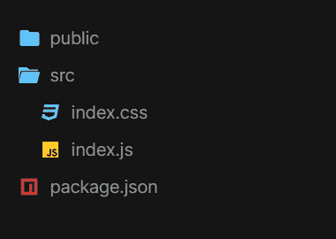

# 使用成帧器和 ReactJS 的动画滑动图像库

> 原文:[https://www . geesforgeks . org/animated-sliding-image-gallery-use-framer-and-reactjs/](https://www.geeksforgeeks.org/animated-sliding-image-gallery-using-framer-and-reactjs/)

下面的方法介绍了如何使用 framer 和 ReactJS 创建动画滑动图像库。

**先决条件:**

1.  JavaScript 知识(ES6)
2.  HTML/CSS 的知识。
3.  ReactJS 的基本知识。

**创建反应应用程序并安装模块:**

*   **步骤 1:** 使用以下命令创建一个反应应用程序:

    ```jsx
    $ npx create-react-app image-gallery
    ```

*   **步骤 2:** 创建项目文件夹，即**图像库**后，使用以下命令移动到该文件夹。

    ```jsx
    $ cd image-gallery
    ```

*   **步骤 3:** 添加项目期间需要的 npm 包。

    ```jsx
    $ npm install framer
    ```

**打开 src 文件夹，删除以下文件:**

1.  logo .. .svg
2.  serviceWorker.js
3.  setupTests.js
4.  App.test.js(如果有)
5.  App.js
6.  App.css

**项目结构:**如下图。



项目结构

## index.js

```jsx
import React from "react";
import { render } from "react-dom";

// Importing framer components : Frame and Page
import { Frame, Page } from "framer";
import "./index.css";

export function MyComponent() {
  // Object array of sliding gallery pages data
  const pages = [
    {
      index: 1,
      // Source of the image
      src:
        "https://media.geeksforgeeks.org/wp-content/" + 
        "cdn-uploads/gfg_200x200-min.png",
      // background color of the page
      background: "#1e1e1e"
    },
    {
      index: 2,
      src:
        "https://media.geeksforgeeks.org/wp-content/" + 
        "cdn-uploads/20190710102234/download3.png",
      background: "#fcfcfc"
    },
    {
      index: 3,
      src:
        "https://yt3.ggpht.com/ytc/AAUvwnjJqZG9PvGfC3Go"+
        "V27UlohMeBLxyUdhs9hUbc-Agw=s900-c-k-c0x00ffffff-no-rj",
      background: "#bcbcbc"
    }
  ];

  return (
    // Framer component with some of its attributes
    <Page
      defaultEffect="none"
      width={350}
      height={350}
      contentWidth="auto"
      alignment="end"
      radius={30}
    >
      {/* Map through the Pages object array and 
          rendering each page with its specified 
          image and background-color
       */}
      {pages.map((page) => (
        // Framer "Frame" component
        <Frame
          width={350}
          height={350}
          radius={30}
          background={page.background}
        >
          
        </Frame>
      ))}
    </Page>
  );
}

// Export default MyComponent;
// rendering "MyComponent"
const rootElement = document.getElementById("root");
render(<MyComponent />, rootElement);
```

## index.css

```jsx
#root {
  width: 100vw;
  height: 100vh;
  display: flex;
  justify-content: center;
  align-items: center;
  background: rgba(0, 85, 255, 1);
  perspective: 1000px;
  cursor: ew-resize;
}

body {
  font-family: sans-serif;
  text-align: center;
  margin: 0;
}

img {
  border-radius: 100%;
  height: 300px;
  width: 300px;
  margin-top: 25px;
  justify-content: center;
  align-items: center;
}
```

**运行应用程序的步骤:**从项目的根目录使用以下命令运行应用程序:

```jsx
$ npm start
```

**输出:**现在打开浏览器，转到 **http://localhost:3000/** ，会看到如下输出。


**参考:**[https://codesandbox . io/s/animated-sliding-image-gallery-9 pplj](https://codesandbox.io/s/animated-sliding-image-gallery-9pplj)