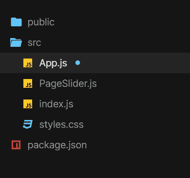
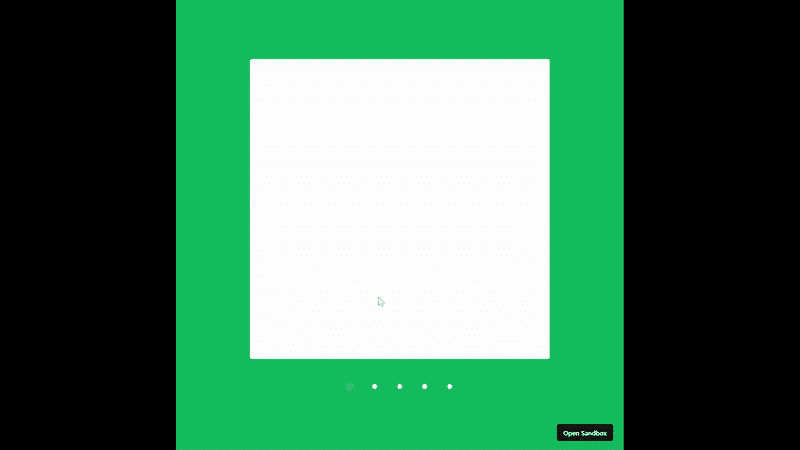

# 使用成帧器-运动和 React.js 的动画滑动页面库

> 原文:[https://www . geeksforgeeks . org/animated-sliding-page-gallery-use-framer-motion-react-js/](https://www.geeksforgeeks.org/animated-sliding-page-gallery-using-framer-motion-and-react-js/)

下面的方法介绍了如何使用 framer-motion 和 ReactJS 创建动画滑动页面库。

**先决条件:**

1.  [JavaScript (ES6)](https://www.geeksforgeeks.org/introduction-to-es6/) 知识
2.  [HTML](https://www.geeksforgeeks.org/html-tutorials/)[CSS](https://www.geeksforgeeks.org/css-tutorials/)的知识。
3.  [ReactJS](https://www.geeksforgeeks.org/react-js-introduction-working/) 基础知识。

**创建反应应用程序并安装模块:**

**步骤 1:** 使用以下命令创建一个反应应用程序:

```jsx
$ npx create-react-app page-gallery
```

**步骤 2:** 创建项目文件夹，即**页面图库**后，使用以下命令移动到该文件夹。

```jsx
$ cd page-gallery
```

**步骤 3:** 添加项目期间需要的 npm 包。

```jsx
$ npm install framer-motion @popmotion/popcorn
```

**打开 src 文件夹，删除以下文件:**

1.  logo .. .svg
2.  serviceWorker.js
3.  setupTests.js
4.  App.test.js(如果有)
5.  index.css。

创建一个名为 **PageSlider.js** 的文件。

**项目结构:**项目结构树应该是这样的:



项目结构

**文件名:App.js**

## java 描述语言

```jsx
import React from "react";
import { useState } from "react";
import { motion, AnimateSharedLayout } from "framer-motion";
import PageSlider from "./PageSlider";
import "./styles.css";

const Pagination = ({ currentPage, setPage }) => {
  // Wrap all the pagination Indicators
  // with AnimateSharedPresence
  // so we can detect when Indicators
  // with a layoutId are removed/added
  return (
    <AnimateSharedLayout>
      <div className="Indicators">
        {pages.map((page) => (
          <Indicator
            key={page}
            onClick={() => setPage(page)}
            isSelected={page === currentPage}
          />
        ))}
      </div>
    </AnimateSharedLayout>
  );
};

const Indicator = ({ isSelected, onClick }) => {
  return (
    <div className="Indicator-container" onClick={onClick}>
      <div className="Indicator">
        {isSelected && (
          // By setting layoutId, when this component
          // is removed and a new one is added elsewhere,
          // the new component will animate out from the old one.
          <motion.div className="Indicator-highlight"
                      layoutId="highlight" />
        )}
      </div>
    </div>
  );
};

const pages = [0, 1, 2, 3, 4];

const App = () => {
  /* We keep track of the pagination direction as well as
   * current page, this way we can dynamically generate different
   * animations depending on the direction of travel */
  const [[currentPage, direction], setCurrentPage] = useState([0, 0]);

  function setPage(newPage, newDirection) {
    if (!newDirection) newDirection = newPage - currentPage;
    setCurrentPage([newPage, newDirection]);
  }

  return (
    <>
      <PageSlider
        currentPage={currentPage}
        direction={direction}
        setPage={setPage}
      />
      <Pagination currentPage={currentPage}
                  setPage={setPage} />
    </>
  );
};

export default App;
```

**文件名:PageSlider.js**

## java 描述语言

```jsx
import React from "react";
import { useRef } from "react";
import { motion, AnimatePresence } from "framer-motion";
import { wrap } from "@popmotion/popcorn";

// Variants in framer-motion define visual states
// that a rendered motion component can be in at
// any given time.

const xOffset = 100;
const variants = {
  enter: (direction) => ({
    x: direction > 0 ? xOffset : -xOffset,
    opacity: 0
  }),
  active: {
    x: 0,
    opacity: 1,
    transition: { delay: 0.2 }
  },
  exit: (direction) => ({
    x: direction > 0 ? -xOffset : xOffset,
    opacity: 0
  })
};

const pages = [0, 1, 2, 3, 4];

const PageSlider = ({ currentPage, setPage, direction }) => {
  /* Add and remove pages from the array to checkout
     how the gestures and pagination animations are
     fully data and layout-driven. */
  const hasPaginated = useRef(false);

  function detectPaginationGesture(e, { offset }) {
    if (hasPaginated.current) return;
    let newPage = currentPage;
    const threshold = xOffset / 2;

    if (offset.x < -threshold) {
      // If user is dragging left, go forward a page
      newPage = currentPage + 1;
    } else if (offset.x > threshold) {
      // Else if the user is dragging right,
      // go backwards a page
      newPage = currentPage - 1;
    }

    if (newPage !== currentPage) {
      hasPaginated.current = true;
      // Wrap the page index to within the
      // permitted page range
      newPage = wrap(0, pages.length, newPage);
      setPage(newPage, offset.x < 0 ? 1 : -1);
    }
  }

  return (
    <div className="slider-container">
      <AnimatePresence
        // This will be used for components to resolve
        // exit variants. It's necessary as removed
        // components won't rerender with
        // the latest state (as they've been removed)
        custom={direction}>
        <motion.div
          key={currentPage}
          className="slide"
          data-page={currentPage}
          variants={variants}
          initial="enter"
          animate="active"
          exit="exit"
          drag="x"
          onDrag={detectPaginationGesture}
          onDragStart={() => (hasPaginated.current = false)}
          onDragEnd={() => (hasPaginated.current = true)}
          // Snap the component back to the center
          // if it hasn't paginated
          dragConstraints={{ left: 0, right: 0, top: 0, bottom: 0 }}
          // This will be used for components to resolve all
          // other variants, in this case initial and animate.
          custom={direction}
        />
      </AnimatePresence>
    </div>
  );
};

export default PageSlider;
```

**文件名： 应用程序.css**

## 半铸钢ˌ钢性铸铁(Cast Semi-Steel)

```jsx
body {
  display: flex;
  justify-content: center;
  align-items: center;
  min-height: 100vh;
  overflow: hidden;
  background: #09a960;
}

* {
  box-sizing: border-box;
}

.App {
  font-family: sans-serif;
  text-align: center;
}

.slider-container {
  position: relative;
  width: 600px;
  height: 600px;
}

.slide {
  border-radius: 5px;
  background: white;
  position: absolute;
  top: 0;
  left: 0;
  bottom: 0;
  right: 0;
}

/* position of indicator container */
.Indicators {
  display: flex;
  justify-content: center;
  margin-top: 30px;
}

.Indicator-container {
  padding: 20px;
  cursor: pointer;
}

.Indicator {
  width: 10px;
  height: 10px;
  background: #fcfcfc;
  border-radius: 50%;
  position: relative;
}

.Indicator-highlight {
  top: -2px;
  left: -2px;
  background: #09f;
  border-radius: 50%;
  width: 14px;
  height: 14px;
  position: absolute;
}
```

**运行应用程序的步骤:**从项目的根目录使用以下命令运行应用程序:

```jsx
$ npm start
```

**输出:**现在打开浏览器，转到 **http://localhost:3000/** ，会看到如下输出:

