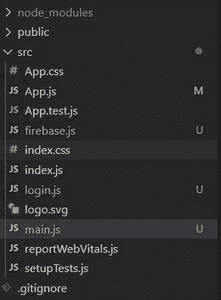
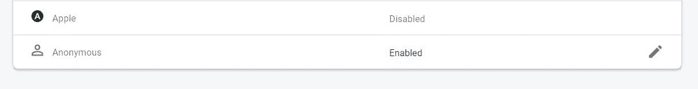
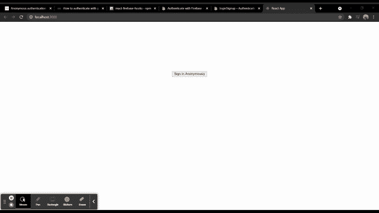

# 在 firebase 中使用 ReactJS 进行匿名身份验证

> 原文:[https://www . geeksforgeeks . org/anonymous-authentication-in-firebase-use-reactjs/](https://www.geeksforgeeks.org/anonymous-authentication-in-firebase-using-reactjs/)

下面的方法介绍了如何在 react 中使用 firebase 进行匿名身份验证。这种类型的身份验证用于创建和使用临时匿名帐户向 Firebase 进行身份验证。我们已经使用 *firebase* 模块实现了这一点。

**创建反应应用程序并安装模块:**

**步骤 1:** 使用以下命令创建一个反应缅甸:

```jsx
npx create-react-app myapp
```

**步骤 2:** 创建项目文件夹(即 myapp)后，使用以下命令移动到该文件夹:

```jsx
cd myapp
```

**项目结构:**我们的项目结构会是这样的。



**步骤 3:** 创建 ReactJS 应用程序后，使用以下命令安装 firebase 模块:

```jsx
npm install firebase@8.3.1 --save
```

**第 4 步:**转到你的 firebase 仪表盘，创建一个新项目并复制你的凭证。

```jsx
const firebaseConfig = {
      apiKey: "your api key",
      authDomain: "your credentials",
      projectId: "your credentials",
      storageBucket: "your credentials",
      messagingSenderId: "your credentials",
      appId: "your credentials"
};
```

**第 5 步:**通过用下面的代码创建 *firebase.js* 文件，将 Firebase 初始化到您的项目中。

## 火库. js

```jsx
import firebase from 'firebase';

const firebaseConfig = {
    // Your Credentials
};

firebase.initializeApp(firebaseConfig);
var auth = firebase.auth();
export default auth;
```

**第 6 步:**进入你的 firebase 仪表盘，启用如下图所示的匿名登录方式。



**步骤 7:** 现在使用以下命令安装 npm 包，即[反应-火焰-钩子](https://www.npmjs.com/package/react-firebase-hooks)。

```jsx
npm i react-firebase-hooks
```

这个包帮助我们倾听用户的当前状态。

**第 8 步:**创建两个文件，即 *login.js* 和 *main.js* ，代码如下。

## log in . js-登入

```jsx
import React from 'react';
import auth from './firebase.js';

const Login = () => {

    // Sign in Anonymously
    const signin = () => {
        auth.signInAnonymously().catch(alert);
    }

    return (
        <div>
            <center>
                <button style={{"marginTop" : "200px"}}
                onClick={signin}>Sign In Anonymously</button>
            </center>
        </div>
    );
}

export default Login;
```

## main.js

```jsx
import React from 'react';
import auth from './firebase';

const Main = () => {

    // Signout function
    const logout = () => {
        auth.signOut();
    }

    return (
        <div style={{"marginTop" : "200px"}}>
            <center>
            Anonymous Login Success
            <button style={{"marginLeft" : "20px"}}
            onClick={logout}>
                Logout
            </button>
            </center>
        </div>
    );
}

export default Main;
```

**第 8 步:**最后导入 *App.js* 文件中所有需要的文件，如下图所示。

## App.js

```jsx
import React from 'react';
import auth from './firebase';
import {useAuthState} from 'react-firebase-hooks/auth';
import Login from './login';
import Main from './main';

function App() {
  const [user] = useAuthState(auth);
  return (
    user ? <Main/> : <Login/>
  );
}

export default App;
```

**运行应用程序的步骤:**从项目的根目录使用以下命令运行应用程序:

```jsx
npm start
```

**输出:**现在打开浏览器，转到***http://localhost:3000/***，会看到如下输出:

