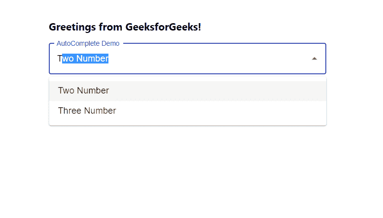

# 在 ReactJS

中自动完成选项自由文本

> 原文:[https://www . geesforgeks . org/auto-completing-the-options-free-text-in-reactjs/](https://www.geeksforgeeks.org/auto-completing-the-options-free-text-in-reactjs/)

自动完成选项自由文本意味着使用选项值自动完成自由文本值。它使用户体验更好，因为用户不需要输入完整的值。【React 的 Material UI 有这个组件可供我们使用，非常容易集成。我们可以使用以下方法从下拉菜单  中自动完成选项自由文本。

**创建反应应用程序并安装模块:**

**步骤 1:** 使用以下命令创建一个反应应用程序:

```
npx create-react-app foldername
```

**步骤 2:** 创建项目文件夹(即文件夹名**)后，使用以下命令移动到该文件夹中:**

```
cd foldername
```

**步骤 3:** 创建 ReactJS 应用程序后，使用以下命令安装 **material-ui** 模块:

```
npm install @material-ui/core
npm install @material-ui/lab
```

**项目结构:**如下图。


项目结构

**App.js:** 现在在 **App.js** 文件中写下以下代码。在这里，App 是我们编写代码的默认组件。

## java 描述语言

```
import React from 'react'
import TextField from '@material-ui/core/TextField';
import Autocomplete from '@material-ui/lab/Autocomplete';

const App = () => {

  // Sample options for dropdown
  const myOptions = ['One Number', 'Two Number',
    'Three Number', 'Four Number', 'Five Number'];

  return (
    <div style={{ marginLeft: '40%', marginTop: '60px' }}>
      <h3>Greetings from GeeksforGeeks!</h3>
      <Autocomplete
        style={{ width: 500 }}
        autoComplete
        options={myOptions}
        renderInput={(params) => (
          <TextField {...params}
            variant="outlined"
            label="AutoComplete Demo"
          />
        )}
      />
    </div>
  );
}

export default App
```

**运行应用程序的步骤:**从项目的根目录使用以下命令运行应用程序:

```
npm start
```

**输出:**现在打开浏览器，转到***http://localhost:3000/***，会看到如下输出:



现在在下拉列表中输入任何自由文本，当选项出现时，只需点击向下箭头，自由文本将自动完成选项的值。