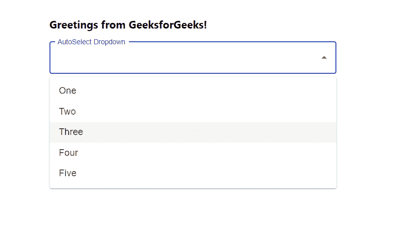

# 从反应中的下拉菜单中自动选择选项

> 原文:[https://www . geesforgeks . org/auto-select-option-from-drop-in-reactjs/](https://www.geeksforgeeks.org/auto-select-option-from-dropdown-in-reactjs/)

从下拉列表中自动选择选项意味着无需强制用户点击任何选项，选项值会自动填充。【React 的 Material UI 有这个组件可供我们使用，非常容易集成。我们可以使用以下方法从下拉菜单  中自动选择选项。

**创建反应应用程序并安装模块:**

**步骤 1:** 使用以下命令创建一个反应应用程序:

```jsx
npx create-react-app foldername
```

**步骤 2:** 在创建项目文件夹(即文件夹名**)后，使用以下命令将**移动到该文件夹:

```jsx
cd foldername
```

**步骤 3:** 创建 ReactJS 应用程序后，使用以下命令安装 **material-ui** 模块:

```jsx
npm install @material-ui/core
npm install @material-ui/lab
```

**项目结构:**如下图。


项目结构

**App.js:** 现在在 **App.js** 文件中写下以下代码。在这里，App 是我们编写代码的默认组件。

## java 描述语言

```jsx
import React from 'react'
import TextField from '@material-ui/core/TextField';
import Autocomplete from '@material-ui/lab/Autocomplete';

const App = () => {

  // Sample options for dropdown
  const myOptions = ['One', 'Two', 'Three', 'Four', 'Five'];

  return (
    <div style={{ marginLeft: '40%', marginTop: '60px' }}>
      <h3>Greetings from GeeksforGeeks!</h3>
      <Autocomplete
        style={{width:500}}
        autoSelect
        options={myOptions}
        renderInput={(params) => (
          <TextField {...params}
            variant="outlined"
            label="AutoSelect Dropdown"
           />
        )}
      />
    </div>
  );
}

export default App
```

**运行应用程序的步骤:**从项目的根目录使用以下命令运行应用程序:

```jsx
npm start
```

**输出:**现在打开浏览器，转到***http://localhost:3000/***，会看到如下输出:



现在，在任何选项上单击下拉菜单外部，选项值将自动填充。这就是自动选择在下拉列表中的工作方式。