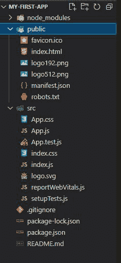

# 构建一个显示“你好，世界！”

> 原文:[https://www . geesforgeks . org/build-a-basic-react-app-the-display-hello-world/](https://www.geeksforgeeks.org/build-a-basic-react-app-that-display-hello-world/)

React 是一个 Javascript 库，由脸书创建，用于构建更好的用户界面网络应用程序和移动应用程序。这是一个用于创建交互式动态应用程序的开源库。

在本文中，我们将看到如何构建一个显示 hello world 的基本 react 应用程序。

*   要创建 react 应用程序，需要在您的系统上安装至少 10 或更高版本的[【node . js】](https://www.geeksforgeeks.org/introduction-to-nodejs/)。如果安装了它，您可以在命令行中使用以下命令进行检查。

```jsx
node -v 
```


*   确保您有一个用于处理项目文件的代码编辑器。

### 让我们创建第一个 react 应用程序:

要构建 react 应用程序，请执行以下步骤:

**步骤 1:** 使用以下命令创建一个 react 应用程序

```jsx
npx create-react-app foldername
```


安装软件包需要几分钟的时间。


**步骤 2:** 完成后，使用以下命令将目录更改为新创建的应用程序

```jsx
cd foldername
```


**项目结构:**如下图创建。



项目文件结构

**第三步:**现在进入 **App.js** 并写下如下代码，如下所示:

## java 描述语言

```jsx
import React from 'react';
import './App.css';

function App() {
    return ( 
      <h1> Hello World! </h1>
    );
}

export default App;
```

**运行应用程序的步骤:**输入以下命令运行应用程序。

```jsx
npm start
```

**输出:**您将在浏览器中看到以下输出。


恭喜你，你已经创建了你的第一个 react 应用程序。你今天学到了一些新东西。不要停止学习，继续。学习[反应](https://www.geeksforgeeks.org/reactjs-tutorials/)