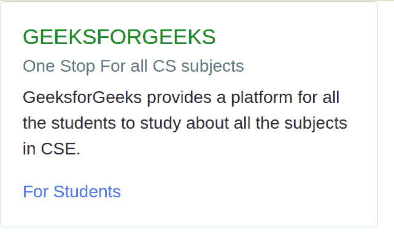

# 反应-引导卡

> 原文:[https://www.geeksforgeeks.org/cards-in-react-bootstrap/](https://www.geeksforgeeks.org/cards-in-react-bootstrap/)

**简介:** React-Bootstrap 是一个前端框架，设计时考虑到了 React。Bootstrap 被重新构建并修改为 React，因此它被称为 React-Bootstrap。卡片是一种由结构化和有组织的信息组成的部分或容器。

**创建反应应用程序并安装模块:**

**步骤 1:** 使用以下命令创建一个 React 应用程序。

```jsx
npx create-react-app foldername
```

**步骤 2:** 在创建项目文件夹(即文件夹名**)后，使用以下命令移动到该文件夹。**

```jsx
cd foldername
```

**步骤 3:** 创建 ReactJS 应用程序后，使用以下命令安装所需的模块。

**属性:****卡**组件有很多属性可以用来组织数据。下表说明了这些属性

*   **标题:**作为卡片的标题。
*   **副标题:**作为上述标题的副标题。
*   **正文:**在本节中，我们将提到所有必要的数据。
*   **链接:**该属性用于为我们的卡片添加链接。

```jsx
npm install react-bootstrap bootstrap
```

**项目结构:**如下图。


项目结构

**App.js:** 现在在 **App.js** 文件中写下以下代码。在这里，App 是我们编写代码的默认组件。

## java 描述语言

```jsx
import Card from "react-bootstrap/Card";
import React from "react";

export default function App() {
  return (
    <>
      <Card style={{ width: "22rem" }}>
        <Card.Body>
          <Card.Title style={{ color: "green" }}>GEEKSFORGEEKS</Card.Title>
          <Card.Subtitle className="mb-2 text-muted">
            One Stop For all CS subjects
          </Card.Subtitle>
          <Card.Text>
            GeeksforGeeks provides a platform for all the students to study
            about all the subjects in CSE.
          </Card.Text>
          <Card.Link href="#"> For Students</Card.Link>
        </Card.Body>
      </Card>
    </>
  );
}
```

**运行应用程序的步骤:**从项目的根目录使用以下命令运行应用程序:

```jsx
npm start
```

**输出:**现在打开浏览器，转到***http://localhost:3000/***，会看到如下输出。

