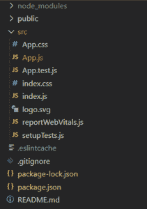
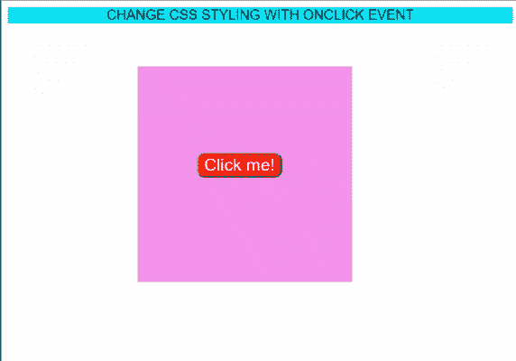

# 使用反应 onClick()事件更改 CSS 样式

> 原文:[https://www . geesforgeks . org/changing-CSS-styling-with-react-onclick-event/](https://www.geeksforgeeks.org/changing-css-styling-with-react-onclick-event/)

设计风格是创建网站的主要任务之一。一次又一次，我们不得不操纵 CSS 样式来为我们正在构建的应用程序提供更好的外观。因此，在本文中，我们将看到如何使用 React 改变 CSS 样式。具体来说，我们将看到一个事件(onClick)如何改变 CSS 样式。在这里，我们将使用 React 钩子来实现问题陈述。React hooks 有助于管理功能组件的状态。

**方法:**在处理功能组件时，引入 React 钩子意义重大。它使状态管理在反应生命周期中变得更加容易。此外，在构建组件时，它更容易，使用的代码也更少。因此，我们将利用 React hooks 的功能来实现我们的问题陈述。在这里，我们将创建一个小应用程序来理解这个概念。因此，基本上，我们将通过使用 onClick()事件来更改容器的背景颜色。我们将首先为我们的应用程序定义 CSS。一旦用户点击按钮，背景颜色就会通过改变状态而改变。React hooks 的原理会让我们更轻松。

现在，让我们从文件结构和编码部分开始。

**创建反应应用程序:**

**步骤 1:** 使用以下命令创建一个反应应用程序:

```jsx
npx create-react-app appname
```

确保应用程序名称以小写字母开头。

**步骤 2:** 创建项目文件夹后。现在，使用以下命令跳转到相应的文件夹:

```jsx
cd appname
```

**项目结构:**现在，文件结构如下图所示:



我们的应用程序文件结构

**第三步:**在上面的文件结构中，我们将只使用 **App.js** 和 **App.css** 文件。让我们首先为我们的应用程序提供 CSS 样式。所有的 CSS 代码都必须写在 **App.css** 文件里面。在 App.css 文件中复制下面提到的代码。

## App.css 文件

```jsx
.App {
  font-family: sans-serif;
  text-align: center;
  background-color: aqua;
}
.cont {
  width: 250px;
  height: 250px;
  margin-top: 50px;
  margin-left: 150px;
  background-color: violet;
}
.button {
  border-radius: 8px;
  font-size: 20px;
  background-color: red;
  color: white;
  margin-left: 70px;
  margin-top: 100px;
}
.cont2 {
  width: 250px;
  height: 250px;
  margin-top: 50px;
  margin-left: 150px;
  background-color: yellow;
}
```

**步骤 4:** 现在，让我们开始在 **App.js** 文件中实现 React hooks 方法。在上面的代码中，我们将初始状态(样式)值设置为字符串。该值是我们将在按钮内部使用的类名。最初，该值被定义为 **cont** ，在我们的 App.css 文件中为其定义了 CSS 样式。我们将该状态值提供给按钮的**类名**。

现在，下一步是为按钮定义 onClick 处理程序。所以， **changeStyle** 是按钮处理程序。为了改变状态值，我们定义了我们的设置状态值，在我们的例子中是设置样式。这是在变更样式中触发的。因此，一旦我们点击按钮，然后执行变更样式，这进一步执行设置样式来改变状态，即继续 2。

## App.js

```jsx
import React, { useState } from "react";
import "./App.css";
const App = () => {
  const [style, setStyle] = useState("cont");

  const changeStyle = () => {
    console.log("you just clicked");

    setStyle("cont2");
  };
  return (
    <>
      <div className="App">CHANGE CSS STYLING WITH ONCLICK EVENT</div>
      <div className={style}>
        <button className="button" onClick={changeStyle}>
          Click me!
        </button>
      </div>
    </>
  );
};
export default App;
```

**第 5 步:**使用以下命令运行代码:

```jsx
npm start
```

**输出:**现在打开浏览器，转到 http://localhost:3000/，会看到如下输出。之后，单击背景颜色变为黄色。



单击按钮后，背景颜色发生变化。