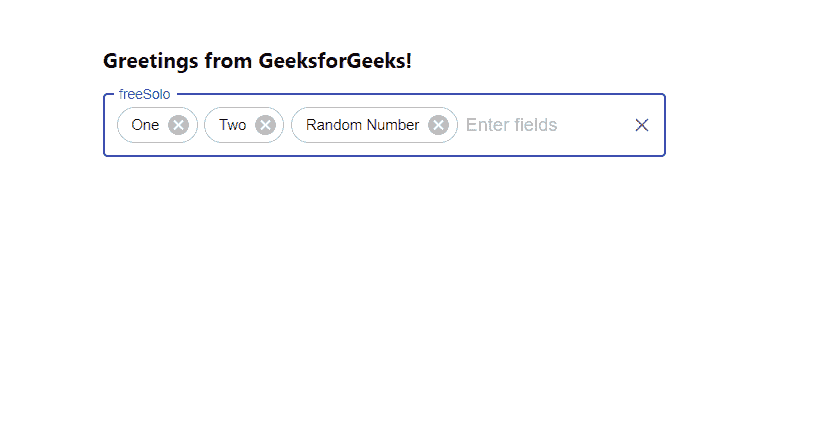

# 如何在 ReactJS 中创建多个下拉选项作为标签？

> 原文:[https://www . geesforgeks . org/choose-multi-options-from-download-as-tag-or-create-using-reactjs/](https://www.geeksforgeeks.org/choose-multiple-options-from-dropdown-as-a-tag-or-create-using-reactjs/)

从下拉菜单中选择**多个**选项和**创建**自己的选项意味着允许用户从下拉菜单中选择多个选项并添加自己的选项。【React 的 Material UI 有这个组件可供我们使用，非常容易集成。我们可以选择多个选项，并使用以下方法创建多个选项。

**创建反应应用程序并安装模块:**

**步骤 1:** 使用以下命令创建一个反应应用程序:

```jsx
npx create-react-app foldername
```

**步骤 2:** 在创建项目文件夹(即文件夹名**)后，使用以下命令将**移动到该文件夹:

```jsx
cd foldername
```

**步骤 3:** 创建 ReactJS 应用程序后，使用以下命令安装 **material-ui** 模块:

```jsx
npm install @material-ui/core
```

**项目结构:**如下图。


项目结构

**App.js:** 现在在 **App.js** 文件中写下以下代码。在这里，App 是我们编写代码的默认组件。

## java 描述语言

```jsx
import React from 'react'
import TextField from '@material-ui/core/TextField';
import Chip from '@material-ui/core/Chip';
import Autocomplete from '@material-ui/lab/Autocomplete';

const App = () => {

  // Sample options for dropdown
  const myOptions = ['One', 'Two', 'Three', 'Four', 'Five'];

  return (
    <div style={{ marginLeft: '40%', marginTop: '60px' }}>
      <h3>Greetings from GeeksforGeeks!</h3>
      <Autocomplete
        multiple
        freeSolo
        style={{width:500}}
        options={myOptions}
        defaultValue={[myOptions[2]]}
        renderTags={(value: string[], getTagProps) =>
          value.map((option: string, index: number) => (
            <Chip variant="outlined"
              label={option}
              {...getTagProps({ index })} />
          ))
        }
        renderInput={(params) => (
          <TextField {...params}
            variant="outlined"
            label="freeSolo"
            placeholder="Enter fields" />
        )}
      />
    </div>
  );
}

export default App
```

**运行应用程序的步骤:**从项目的根目录使用以下命令运行应用程序:

```jsx
npm start
```

**输出:**现在打开浏览器，转到***http://localhost:3000/***，会看到如下输出:



在上面的例子中，我们从可用的选项中选择了 ***【一个】*** 和 ***两个*** ，但也添加了我们自己的选项，即 ***随机数。*** 这就是我们如何在 ReactJS 中使用 Chip 选择和创建多个选项。