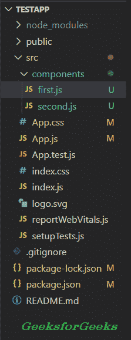

# 在 ReactJS 中使用枚举的条件渲染组件

> 原文:[https://www . geeksforgeeks . org/conditional-rendering-component-use-enums-in-reactjs/](https://www.geeksforgeeks.org/conditional-rendering-component-using-enums-in-reactjs/)

在某些情况下， [React Js](https://www.geeksforgeeks.org/react-js-introduction-working/) 开发人员需要根据特定条件渲染和隐藏[组件](https://www.geeksforgeeks.org/reactjs-class-based-components/)。例如，在构建待办事项列表应用程序时，如果有任何未决任务可用，开发人员需要呈现任务，否则他们需要显示类似“没有未决任务可用”的消息

有几种方法可以在 react Js 中有条件地[渲染组件](https://www.geeksforgeeks.org/reactjs-conditional-rendering/)，如 if-else、三元运算符等。如果只有 2 到 3 个组件可以有条件地呈现，开发人员可以使用 if-else 或 switch case 方法。如果有 3 个以上的组件可以有条件地呈现，if-else 就会变得复杂。因此，开发人员应该使用枚举来保持代码干净。

在本教程中，我们将学习开发人员如何使用枚举有条件地呈现组件。首先，用户需要创建一个新的 react 项目。

**创建反应项目:**

**步骤 1:** 要创建一个新的 React 项目，运行下面的命令到你的终端。

```jsx
npx create-react-app testapp
```

**第二步:**要进入项目目录，运行下面的命令到你的终端。

```jsx
cd testapp
```

现在，您已经成功创建了 react app。

接下来，用户需要在我们的项目中创建 2 到 3 个组件。在“ *src* 文件夹内创建一个“ ***组件*** ”文件夹。另外，在组件文件夹中创建 **first.js** 和 **second.js** 文件。

**项目结构:**应该如下图所示。



在这个文件中，我们将添加一些基本的 React 代码来呈现在网页上。用户需要将以下代码添加到“first.js”文件中。

**文件名:first.js**

## java 描述语言

```jsx
import React, { Component } from 'react';

// Some basic code to render first component
class First extends Component {
  render() {
    return (
      <div>
        <h1 style={{color: "green"}}>GeeksForGeeks</h1>
        <h2>This is a first component</h2>
      </div>
    );
  }
}

export default First;
```