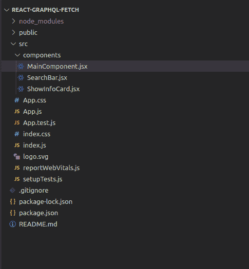
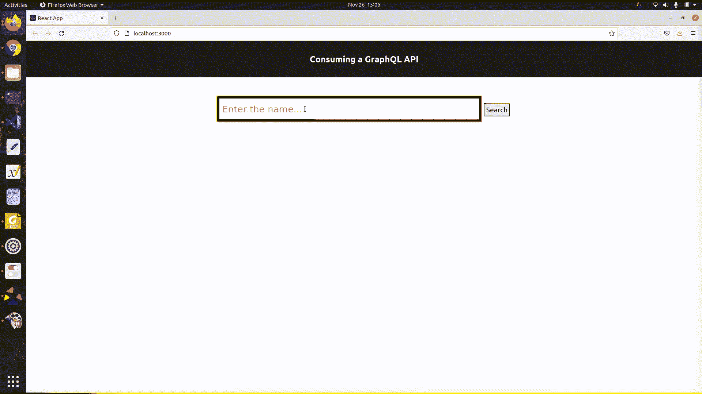

# 使用获取-反应客户端消费一个 GraphQL 应用编程接口

> 原文:[https://www . geesforgeks . org/consuming-a-graph QL-API-using-fetch-react-client/](https://www.geeksforgeeks.org/consuming-a-graphql-api-using-fetch-react-client/)

在本文中，我们将学习开发一个 React 应用程序，它将使用 fetch 从一个公共的 GraphQL API 中获取数据。我们将使用**电影数据库包装器(TMDB )** 应用编程接口来获取带有名称/关键词的可用节目。您可以在本文末尾找到 API 参考和源代码链接。

在进入开发部分之前，要初始化一个简单的 react 应用程序，您可以遵循下面提到的步骤:

**步骤 1:** 创建反应应用程序。

```
npx create-react-app foldername
```

**第二步:**进入项目文件夹。

```
cd foldername
```

**步骤 3:** 创建一个组件文件夹，现在项目结构看起来像:



项目结构

这基本上是我们应用程序所需的初始设置。现在让我们单独看一下每个组件。自定义组件驻留在组件文件夹中，所有的东西都放在 MainComponent.jsx 中，我们将这个组件放在 App.js 中，app . js 本身位于“根”DOM 节点下，这个节点内的所有东西都将由 React DOM 管理。

我们将开发三个组件:

*   **主要组件:**负责应用程序中的提取操作和状态变化。
*   **搜索栏:**获取节目名称/关键词的用户输入的搜索栏。
*   **展示信息卡:**一个可重用的组件，用于显示展示信息。

**步骤 4:** 在 **MainComponent.jsx** 组件中，我们有一个状态变量 *data* ，它将保存 GraphQL API 的响应。

```
const [data, setData] = useState(Object);
```

为了获取信息，我们调用了 *apiEndpoint，*但是首先让我们将 GraphQL *查询*分开，一般来说，要形成一个查询，您必须在字段中指定字段，直到这些字段解析为实际数据。通过这种方式，您可以请求对象上的特定字段，并准确地返回您所请求的内容。任何 GraphQL 查询的结构如下所示:

```
query {
    JSON objects to retrieve
}

```

使用我们的查询变量，我们试图获取所有可用的显示，使用名称/关键字，该关键字作为带有 *$term 的参数传递。*

## MainComponent.jsx(查询部分)

```
const apiEndpoint = "https://tmdb.apps.quintero.io/";
const query = `
    query FetchData($term: String!){
        tv{
            search(term:$term){
              edges{
                node{
                    id
                    originalName
                }
              }
           }
        }
     }
`;
```

为了使用 Fetch API 发出请求，我们将 GraphQL *查询*和*变量*作为一个 JSON 对象发送到端点。GraphQL 端点期望请求的主体是包含查询变量和参数的字符串化 JSON 对象。当请求完成时，用响应对象解决承诺。这个对象基本上是各种响应格式的通用占位符。response.json()用于从响应中提取 json 对象，它返回一个 promise，再次解析并更新*数据*。
**MainComponent.jsx(请求部分)**

## MainComponent.jsx(请求部分)

```
const getData = (term) => {
       fetch(apiEndpoint, {
           method: "POST",
           headers: { "Content-Type": "application/json" },
           body: JSON.stringify({
               query,
               variables: { term }
           })
       })
           .then(res => res.json())
           .then((data) => setData(data))
           .catch(console.error);
 };
```

所以最后我们的 **MainComponent.jsx** 看起来像:

## MainComponent.jsx

```
import React, { useState } from "react";
import SearchBar from "./SearchBar";
import ShowInfoCard from "./ShowInfoCard";

function Main() {
    const [data, setData] = useState(Object);
    const apiEndpoint = "https://tmdb.apps.quintero.io/";
    const query = `
        query FetchData($term: String!){
            tv{
                search(term:$term){
                  edges{
                    node{
                        id
                        originalName
                    }
                  }
                }
              }
        }
    `;

    const getData = (term) => {
        fetch(apiEndpoint, {
            method: "POST",
            headers: { "Content-Type": "application/json" },
            body: JSON.stringify({
                query,
                variables: { term }
            })
        })
            .then(res => res.json())
            .then((data) => setData(data))
            .catch(console.error);
    };
    // console.log(data)
    return (
        <div>
            <SearchBar getData={getData} />
            {data.data ? data.data.tv.search.edges.map(({ node }) => (
                <ShowInfoCard key={node.id} node={node} />
            )) : <div></div>
            }
        </div>
    );

}

export default Main;
```

**步骤 5:** 现在，进入搜索栏组件，该组件用于接收用户输入的名称/关键词。它是一个简单的组件，有一个文本类型的输入字段和一个用于发出搜索请求的按钮。状态变量*术语*被更新以保存来自用户的输入，并且当用户做出搜索请求时作为参数被传递给 *getData()* 。

## SearchBar.jsx 档案

```
import React, { useState } from "react";

function SearchBar({getData}){
    const [term, setTerm] = useState("");
    const onChange = (e) =>{
        setTerm(e.target.value)
    }
    const onSearch = () =>{
        getData(term)
    }
    return(
        <div className="searchbar">
        <input 
            placeholder="Enter the name..."
            type="text" 
            value={term}
            onChange={(event) => {onChange(event)}}
            onKeyUp={(event) => {onChange(event)}}
            onPaste={(event) => {onChange(event)}}
        />
        <button type="button" className="searchButton" 
                onClick={onSearch}>Search
        </button>
        </div>
    );
}

export default SearchBar;
```

**第六步:**我们最后一个组件，是一个可复用的 UI 组件，基本上是一个卡片组件，接收*节点(包含展示信息)*作为道具，只是以任意选择的格式展示。您可以调整 App.css 文件来理解各种设计方面。

## ShowInfoCard.jsx

```
import React from "react";

function ShowInfoCard({ node }) {
    return (
        <div className="datacontainer">
            <div className="dataitem">
              Name : {node.originalName}
            </div>
        </div>
    );
}

export default ShowInfoCard;
```

**第七步:**最后，我们需要在 **App.js** 文件中包含 MainComponent:

## App.js

```
import './App.css';
import React from "react";
import Main from './components/MainComponent';

function App() {
  return (
    <div className="App">
      <header className="App-header">
        <h2>Consuming a GraphQL API</h2>
      </header>
      <Main />
    </div>
  );
}

export default App;
```

**运行应用程序的步骤:**要在您的系统上运行应用程序，请运行以下命令:

> npm 启动

**输出:**



graph QL API:https://github . com/nerdsupremacht/tmdb

提取原料药:[https://developer.mozilla.org/en-US/docs/Web/API/Fetch_API](https://developer.mozilla.org/en-US/docs/Web/API/Fetch_API)