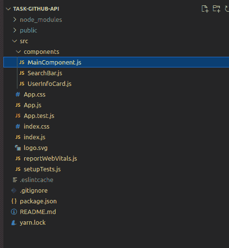
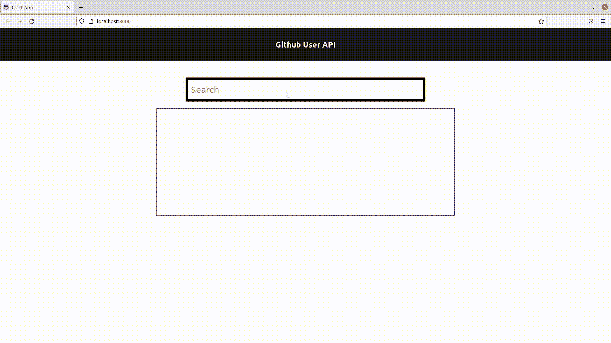

# 使用提取-反应客户端消费休息应用编程接口(Github 用户)

> 原文:[https://www . geesforgeks . org/consuming-a-rest-API-github-user-use-fetch-react-client/](https://www.geeksforgeeks.org/consuming-a-rest-api-github-users-using-fetch-react-client/)

在本文中，您将学习开发一个 React 应用程序，它将使用 fetch 从 REST API 中获取数据。我们将使用 GitHub 用户应用编程接口获取用户的公共信息和他们的用户名。您可以在本文末尾找到 API 参考和源代码链接。

在进入开发部分之前，要初始化一个简单的 react 应用程序，您可以遵循下面提到的步骤:

**步骤 1:** 创建反应应用程序。

```
npx create-react-app foldername
```

**第二步:**进入项目文件夹。

```
cd foldername
```

**第 3 步:**创建一个*组件*文件夹，现在项目结构看起来像:



项目结构

自定义组件驻留在*组件*文件夹中，所有的东西都放在 *MainComponent.js* 中，我们将这个组件放在 *App.js、*中，它本身位于“根”DOM 节点下，这个节点中的所有东西都将由 React DOM 管理。

我们将开发三个组件:

*   **主要组件:**负责应用程序中的提取操作和状态变化。
*   **搜索栏:**获取 GitHub 用户名用户输入的搜索栏。
*   **用户信息卡:**显示 GitHub 用户信息的可重用组件。

**第四步:**在 **MainComponent.js** 组件中，我们有两个状态变量， *username* (来自用户的输入)和 userData(来自 REST API 的响应)。我们需要获取用户数据，每次*用户名有更新。*为了实现这一点，我们将使用 *useEffect* 钩子从 React。

## java 描述语言

```
const [username, setUsername] = useState("");
const [userData, setUserData] = useState({});

useEffect(() => {
     getUserData();
 }, [username]);
```

**第五步:**现在为了得到 GitHub 用户 API 的响应，我们将使用 Fetch 发出 *GET* 请求，这将是 getUserData()函数的角色。

## java 描述语言

```
var gitHubUrl = `https://api.github.com/users/${username}`;

const getUserData = async () => {
        const response = await fetch(gitHubUrl);
        const jsonData = await response.json();
        if (jsonData && jsonData.message !== "Not Found") {
            setUserData(jsonData);
            console.log(jsonData)
        }
        else if (username !== "") {
            console.log('Username does not exist');
        }
        else {
            setUserData({})
        }
    };
```

getUserData()是一个*异步*函数，其中 *fetch(gitHubUrl)* 发出请求并返回一个承诺。请求完成后，承诺以*回应*对象解决。这个对象基本上是各种响应格式的通用占位符。 *response.json()* 用于从响应中提取 json 对象，它返回一个承诺，因此出现 *await。*

所以最后，我们的 **MainComponent.js** 文件是这样的:

## java 描述语言

```
import React, { useState, useEffect } from "react";
import SearchBar from "./SearchBar";
import UserInfoCard from "./UserInfoCard";

function Main() {
    const [username, setUsername] = useState("");
    const [userData, setUserData] = useState(Object);

    useEffect(() => {
        getUserData();
    }, [username]);

    var gitHubUrl = `https://api.github.com/users/${username}`;

    const getUserData = async () => {
        const response = await fetch(gitHubUrl);
        const jsonData = await response.json();
        if (jsonData && jsonData.message !== "Not Found") {
            setUserData(jsonData);
            console.log(jsonData)
        }
        else if (username !== "") {
            console.log('Username does not exist');
        }
        else {
            setUserData({})
        }
    };

    return (
        <div>
            <SearchBar username={username} 
                setUsername={setUsername} />
            <UserInfoCard userData={userData} />
        </div>
    );
}

export default Main;
```

**步骤 6:** 现在，进入搜索栏组件，用于接收*用户名的用户输入。*是一个简单的组件，有一个文本类型的输入字段。一旦有任何变化，它将使用更新后的值触发*设置用户名*。

#### 搜索栏.js

## java 描述语言

```
import React from "react";

function SearchBar({username, setUsername}){

    const onChange = (e) =>{
        setUsername(e.target.value)
    }
    return(
        <div className="searchbar">
        <input 
            placeholder="Search"
            type="text" 
            onChange={(event) => {onChange(event)}}
            onKeyUp={(event) => {onChange(event)}}
            onPaste={(event) => {onChange(event)}}
        />
        </div>
    );
}

export default SearchBar;
```

**第七步:**我们最后一个组件，是一个可复用的 UI 组件，基本上是一个卡片组件，接收*的 userData* 作为道具，只是以任意选择的格式显示。你可以调整 *App.css* 文件来了解各种设计方面。

#### user info card . js-使用者资讯卡. js

## java 描述语言

```
import React from "react";

function UserInfoCard({ userData }) {
    return (
        <div className="datacontainer">
            {userData.avatar_url ? (<div className="dataitem">
               </div>) : (<div></div>)}
            {userData.login ? (<div className="dataitem">Login: 
            {userData.login}</div>) : (<div></div>)}
            {userData.name ? (<div className="dataitem">
            Name : {userData.name}</div>) : (<div></div>)}
            {userData.blog ? (<div className="dataitem">
            Blog: {userData.blog}</div>) : (<div></div>)}
        </div>
    );
}

export default UserInfoCard;
```

这就是全部，这三个组件放在一起，完成了我们的 React 应用程序，您可以从下面提供的源代码链接下载该应用程序，并在您的系统上运行它。源代码确实包含一个额外的组件，用于将检索到的数据存储在本地存储中，这在本文中没有涉及。所以如果你感兴趣，也去看看吧。

**运行应用程序的步骤:**要在您的系统上启动应用程序，请运行以下命令:

```
npm start
```

**输出:**



**GitHub 用户 API:***https://docs.github.com/en/rest/reference/users*

**获取 API:***https://developer.mozilla.org/en-US/docs/Web/API/Fetch_API*

**源代码:***https://github . com/notnotaparas/github-users API*