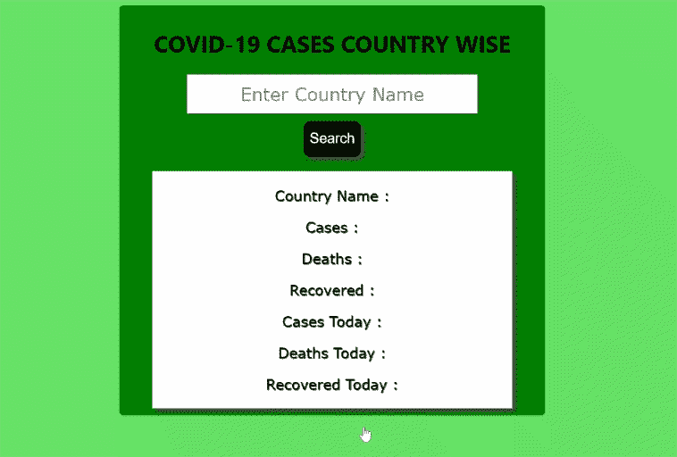

# 使用 ReactJS 和实时 API 的新冠肺炎跟踪器

> 原文:[https://www . geeksforgeeks . org/新冠肺炎-跟踪器-使用-reactjs-和-实时-api/](https://www.geeksforgeeks.org/covid-19-tracker-using-reactjs-and-real-time-api/)

在本文中，我们将使用 [ReactJS](https://www.geeksforgeeks.org/reactjs-tutorials/) 和[实时 API](https://www.geeksforgeeks.org/introduction-to-apis/) 创建一个 web 应用程序新冠肺炎跟踪器。在这个 web 应用程序或网站中，当用户输入国家/地区的名称时，它将显示活动病例数、已恢复病例数、今天的病例数等。

**先决条件:**

*   函数、变量类型、对象等基本 [JavaScript](https://www.geeksforgeeks.org/javascript-tutorial/) 。
*   ReactJS 用于 web 开发的开发设置。
*   重新连接钩子，如[使用状态](https://www.geeksforgeeks.org/reactjs-usestate-hook/)钩子，[使用效果](https://www.geeksforgeeks.org/reactjs-useeffect-hook/)钩子。
*   获取实时数据的 API 知识。
*   网页应用程序的样式和设计的基本属性。

**进场:**

*   设置开发环境，安装所有必需的依赖项。
*   在 App.js 文件中，创建并初始化一个用于保存 web 应用程序代码的组件。
*   在那个 JavaScript 文件中，创建一个表单来接受用户的输入，并使用实时应用编程接口获取和显示细节，并做出反应[使用状态钩子](https://www.geeksforgeeks.org/reactjs-usestate-hook/)和[使用效果钩子](https://www.geeksforgeeks.org/reactjs-useeffect-hook/)。
*   使用 [CSS](https://www.geeksforgeeks.org/css-tutorials/) 作为组件文件的样式，并将 CSS 文件导入到组件文件中。

**注意:**请参考 [ReactJS 设置](https://www.geeksforgeeks.org/reactjs-setting-development-environment/)一文设置开发环境。

下面是上述方法的分步实施。

**步骤 1:** 使用以下命令创建一个反应应用程序:

```jsx
npx create-react-app foldername
```

**步骤 2:** 创建项目文件夹(即文件夹名**)后，使用以下命令移动到该文件夹中:**

```jsx
cd foldername
```

在创建的文件夹中，转到 *src* 文件夹，删除 App.test.js、logo.svg 和 setupTests.js，因为这些文件在这个项目中不是必需的，并添加用于保存应用程序代码的组件文件。我们的组件名是 CovidData，文件名是 **CovidData.js** ，对于样式添加 CSS 文件 **CovidData.css** 。

**项目结构:**如下图。


项目结构

**步骤 3:** 现在，在 **App.js** 中，我们将创建组件文件，该文件将保存应用程序的代码。

**App.js**

## java 描述语言

```jsx
import "./App.css";
import CovidData from "./CovidData";

function App() {
  return <div className="App">
    <CovidData/>
  </div>;
}

export default App;
```

**注意:**我们的组件名是 CovidData，我们已经在 App.js 中导入了这个组件文件。

**第四步:**在 CovidData.js 文件中，我们将创建表单来获取输入，当表单提交后，我们将在 useEffect Hook 的帮助下从 API 中获取数据，并使用 useState Hook 在变量对象中设置获取的。获取数据后，使用 [JSX 表达式](https://www.geeksforgeeks.org/reactjs-introduction-jsx/)传递变量对象以显示数据。为了获得数据，实时应用编程接口我们使用了“https://disease . sh/v3/新冠肺炎/国家”应用编程接口。

【T10】协约国。js

## java 描述语言

```jsx
import React, { useEffect, useState } from "react";
import "./CovidData.css";

function CovidData() {
  const [country, setCountry] = useState("");
  const [cases, setCases] = useState("");
  const [recovered, setRecovered] = useState("");
  const [deaths, setDeaths] = useState("");
  const [todayCases, setTodayCases] = useState("");
  const [deathCases, setDeathCases] = useState("");
  const [recoveredCases, setRecoveredCases] = useState("");
  const [userInput, setUserInput] = useState("");

  useEffect(() => {
    fetch("https://disease.sh/v3/covid-19/countries")
      .then((res) => res.json())
      .then((data) => {
        setData(data);
      });
  }, []);

  const setData = ({
    country,
    cases,
    deaths,
    recovered,
    todayCases,
    todayDeaths,
    todayRecovered,
  }) => {
    setCountry(country);
    setCases(cases);
    setRecovered(recovered);
    setDeaths(deaths);
    setTodayCases(todayCases);
    setDeathCases(todayDeaths);
    setRecoveredCases(todayRecovered);
  };

  const handleSearch = (e) => {
    setUserInput(e.target.value);
  };
  const handleSubmit = (props) => {
    props.preventDefault();
    fetch(`https://disease.sh/v3/covid-19/countries/${userInput}`)
      .then((res) => res.json())
      .then((data) => {
        setData(data);
      });
  };

  return (
    <div className="covidData">
      <h1>COVID-19 CASES COUNTRY WISE</h1>
      <div className="covidData__input">
        <form onSubmit={handleSubmit}>
          {/* input county name */}
          <input onChange={handleSearch} placeholder="Enter Country Name" />
          <br />
          <button type="submit">Search</button>
        </form>
      </div>

      {/* Showing the details of the country */}
      <div className="covidData__country__info">
        <p>Country Name : {country} </p>

        <p>Cases : {cases}</p>

        <p>Deaths : {deaths}</p>

        <p>Recovered : {recovered}</p>

        <p>Cases Today : {todayCases}</p>

        <p>Deaths Today : {deathCases}</p>

        <p>Recovered Today : {recoveredCases}</p>
      </div>
    </div>
  );
}

export default CovidData;
```

**第五步:**对于样式，我们已经使用了基本的 CSS 属性，如对齐方式、字体样式等。

**【co idda . CSS】**

## 半铸钢ˌ钢性铸铁(Cast Semi-Steel)

```jsx
body {
  background-color: rgb(102, 226, 102);
}
.covidData {
  background-color: green;
  width: 30%;
  margin: auto;
  margin-top: 15px;
  border-radius: 6px;
  padding: 10px;
}

/* input stylings */

.covidData__form {
  padding: 10px;
  margin: 20px;
}
.covidData__input input {
  width: 400px;
  height: 50px;
  text-align: center;
  font-size: 25px;
  font-family: Verdana, Geneva, Tahoma, sans-serif;
}
.covidData__input button {
  width: 80px;
  height: 50px;
  margin-top: 10px;
  background-color: black;
  color: white;
  font-size: 20px;
  border-radius: 10px;
  border: none;
  box-shadow: 5px 5px 5px rgb(71, 67, 67);
  cursor: pointer;
}

/* detail stylings */

.covidData__country__info {
  font-size: 20px;
  font-family: Verdana, Geneva, Tahoma, sans-serif;
  width: 500px;
  margin-left: auto;
  margin-right: auto;
  height: auto;
  padding-left: 10px;
  background-color: white;
  margin-top: 20px;
  padding: 2px;
  text-shadow: 1px 1px 1px rgb(71, 67, 67);
  box-shadow: 5px 5px 5px rgb(71, 67, 67);
}
```

**运行应用程序的步骤:**从项目的根目录使用以下命令运行应用程序:

```jsx
npm start
```

**输出:**现在打开浏览器，转到***http://localhost:3000/***，会看到如下输出:

