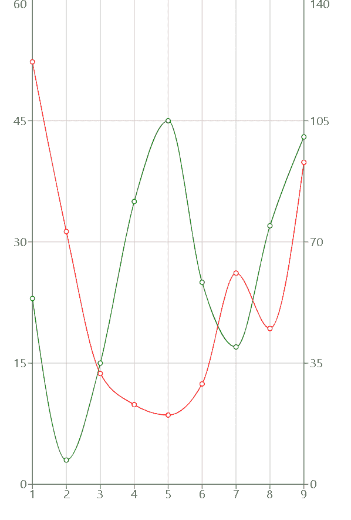
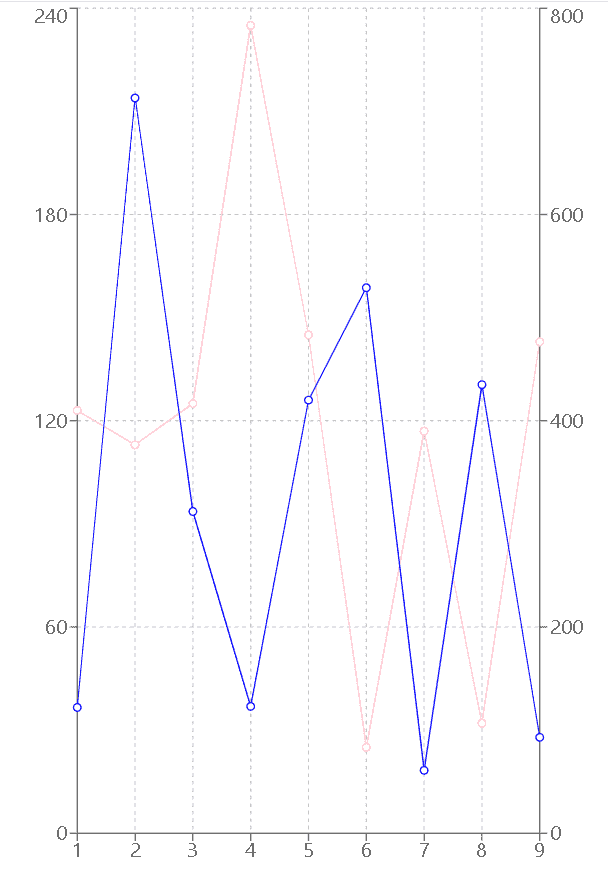

# 使用反应堆中的充电创建双轴折线图

> 原文:[https://www . geeksforgeeks . org/create-a-双轴折线图-使用-recharts-in-reactjs/](https://www.geeksforgeeks.org/create-a-biaxial-line-chart-using-recharts-in-reactjs/)

**简介:**Rechart JS**T3】是一个用来为 React JS 创建图表的库。借助 React 和 D3(数据驱动文档)，该库用于构建折线图、条形图、饼图等。**

**双轴折线图**是有两个 Y 轴而不是一个 Y 轴的折线图。它用于比较具有不同 Y 轴的两个不同系列的数据点。

**方法:**为了使用 recharts 在 react 中创建双轴折线图，我们首先创建一个包含所有数据点和标签的数据变量。然后我们创建一个笛卡尔网格和所有三个轴，即一个 X 轴和两个 Y 轴。此外，将 Y 轴样本添加到两个 Y 轴，以便在绘制折线图时可以参考它们。最后，使用 recharts npm 包中的 line 组件将折线图指向它周围。

**创建 React 应用程序和安装模块的语法:**

**步骤 1:** 使用以下命令创建一个 React 应用程序。

```
npx create-react-app foldername
```

**步骤 2:** 创建项目文件夹即文件夹名称后，使用以下命令移动到该文件夹。

```
cd foldername
```

**步骤 3:** 创建 ReactJS 应用程序后，使用以下命令安装所需的模块。

```
npm install --save recharts
```

**项目结构:**如下图。


**示例 1:** 现在在 App.js 文件中写下以下代码。在这里，App 是我们编写代码的默认组件。

## App.js

```
import React from 'react';
import { LineChart, Line, XAxis, YAxis, CartesianGrid} from 'recharts';

const App = () => {

// Sample data
const data = [
  {x:1, y:23,  z:122},
  {x:2, y:3,   z:73},
  {x:3, y:15,  z:32},
  {x:4, y:35,  z:23},
  {x:5, y:45,  z:20},
  {x:6, y:25,  z:29},
  {x:7, y:17,  z:61},
  {x:8, y:32,  z:45},
  {x:9, y:43,  z:93},
];

return (
        <LineChart width={500} height={700} data={data}>
          <CartesianGrid/>
          <XAxis dataKey="x" />
          <YAxis yAxisId="left-axis" />
          <YAxis yAxisId="right-axis" orientation="right" />
          <Line yAxisId="left-axis" type="monotone" dataKey="y" 
          stroke="green"/>
          <Line yAxisId="right-axis" type="monotone" dataKey="z" 
          stroke="red" />
        </LineChart>
);
}

export default App;
```

**运行应用程序的步骤:**从项目的根目录使用以下命令运行应用程序:

```
npm start
```

**输出:**现在打开浏览器，转到

，你会看到如下输出:



输出

**示例 2:** 现在更改 App.js 文件中的以下代码。

## App.js

```
import React from 'react';
import { LineChart, Line, XAxis, YAxis, CartesianGrid} from 'recharts';

const App = () => {

// Sample data
const data = [
  {x:1, y:123,  z:122},
  {x:2, y:113,   z:713},
  {x:3, y:125,  z:312},
  {x:4, y:235,  z:123},
  {x:5, y:145,  z:420},
  {x:6, y:25,  z:529},
  {x:7, y:117,  z:61},
  {x:8, y:32,  z:435},
  {x:9, y:143,  z:93},
];

return (
        <LineChart width={500} height={700} data={data}>
          <CartesianGrid strokeDasharray="3 3" />
          <XAxis dataKey="x" />
          <YAxis yAxisId="left-axis" />
          <YAxis yAxisId="right-axis" orientation="right" />
          <Line yAxisId="left-axis" type="dashed" dataKey="y" 
           stroke="pink"/>
          <Line yAxisId="right-axis" type="dashed" dataKey="z" 
          stroke="blue" />
        </LineChart>
);
}

export default App;
```

**输出:**使用 ***CTRL+S .*** 保存代码现在打开浏览器，转到***http://localhost:3000/***，会看到如下输出:



**输出**

**参考:**T2】https://recharts.org/en-US/examples