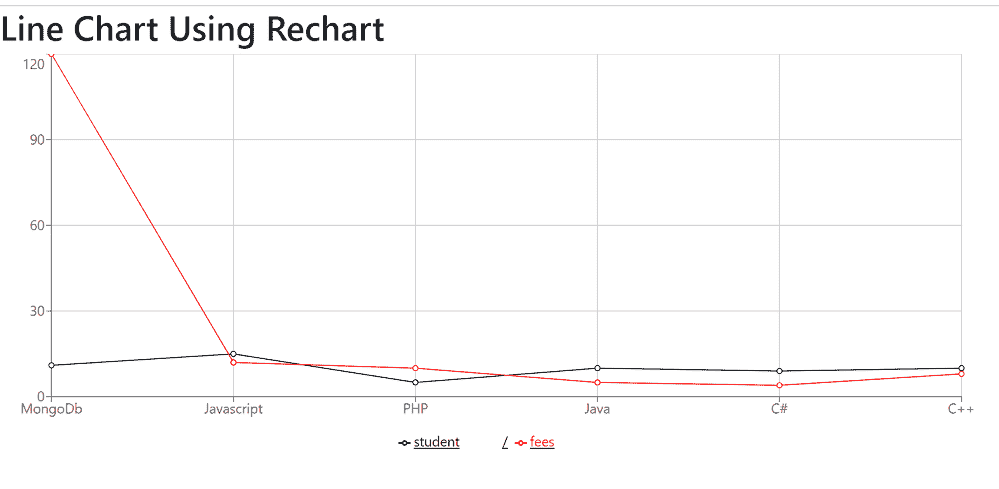

# 使用反应堆中的充电创建折线图

> 原文:[https://www . geeksforgeeks . org/create-a-折线图-使用-recharts-in-reactjs/](https://www.geeksforgeeks.org/create-a-line-chart-using-recharts-in-reactjs/)

**简介:** Rechart JS 是一个用于为 React JS 创建图表的库。借助 React 和 D3(数据驱动文档)，该库用于构建折线图、条形图、饼图等。

**创建反应应用程序并安装模块:**

*   **步骤 1:** 使用以下命令创建一个 React 应用程序。

    ```jsx
    npx create-react-app foldername
    ```

*   **步骤 2:** 创建项目文件夹(即文件夹名)后，使用以下命令移动到该文件夹。

    ```jsx
    cd foldername
    ```

*   **步骤 3:** 创建 ReactJS 应用程序后，使用以下命令安装所需的模块。

    ```jsx
    npm install --save recharts
    ```

**项目结构:**如下图。


项目结构

**示例:**现在在 **App.js** 文件中写下以下代码。在这里，App 是我们编写代码的默认组件。

## App.js

```jsx
import './App.css';
import {
    LineChart,
    ResponsiveContainer,
    Legend, Tooltip,
    Line,
    XAxis,
    YAxis,
    CartesianGrid
} from 'recharts';

// Sample chart data
const pdata = [
    {
        name: 'MongoDb',
        student: 11,
        fees: 120
    },
    {
        name: 'Javascript',
        student: 15,
        fees: 12
    },
    {
        name: 'PHP',
        student: 5,
        fees: 10
    },
    {
        name: 'Java',
        student: 10,
        fees: 5
    },
    {
        name: 'C#',
        student: 9,
        fees: 4
    },
    {
        name: 'C++',
        student: 10,
        fees: 8
    },
];

function App() {
    return (
        <>
            <h1 className="text-heading">
                Line Chart Using Rechart
            </h1>
            <ResponsiveContainer width="100%" aspect={3}>
                <LineChart data={pdata} margin={{ right: 300 }}>
                    <CartesianGrid />
                    <XAxis dataKey="name" 
                        interval={'preserveStartEnd'} />
                    <YAxis></YAxis>
                    <Legend />
                    <Tooltip />
                    <Line dataKey="student"
                        stroke="black" activeDot={{ r: 8 }} />
                    <Line dataKey="fees"
                        stroke="red" activeDot={{ r: 8 }} />
                </LineChart>
            </ResponsiveContainer>
        </>
    );
}

export default App;
```

**运行应用程序的步骤:**从项目的根目录使用以下命令运行应用程序:

```jsx
npm start
```

**输出:**现在打开浏览器，转到***http://localhost:3000/***，会看到如下输出:

