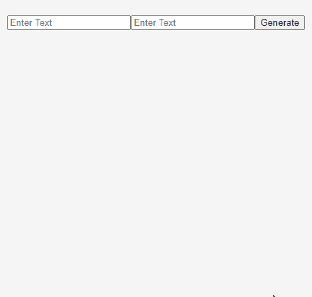

# 使用 ReactJS

创建热图生成器

> 原文:[https://www . geeksforgeeks . org/create-a-meme-generator-by-use-reactjs/](https://www.geeksforgeeks.org/create-a-meme-generator-by-using-reactjs/)

在本教程中，我们将使用 ReactJS 制作一个热图生成器。在热图生成器，我们有两个文本字段，在其中输入第一个文本和最后一个文本。当我们点击 **Gen** 按钮写完文字后，它会创建一个带有图像和文字的模因。

在这个 React 应用中，我们只有一个组件:MemeGenerator。MemeGenerator 包含一个返回受控表单的渲染方法，表单包含两个输入字段和一个 **Gen** 按钮。当 MemeGenerator 组件呈现在屏幕上时，componentDidMount()方法被激活并进行 API 调用，并将接收到的数据存储在数组中。当用户填写输入字段并点击 **Gen** 按钮时，表单被提交，随机图像 URL 被分配给**随机化**状态变量。图像和文本一起显示在屏幕上。

**先决条件:**本项目的先决条件是:

*   反应
*   功能和类别组件
*   对 AJAX 和 API 做出反应
*   ES6

**React 入门:**我们的 React 应用包含两个组件，app 组件和 MemeGenerator 组件。

**Index.js:**

## java 描述语言

```
import React from 'react'
import ReactDOM from 'react-dom'
import App from './App'

ReactDOM.render(<App />, document.getElementById('root'))
```

**App.js** : App 组件渲染单个 MemeGenerator 组件。

## java 描述语言

```
import React from 'react';
import MemeGenerator from './MemeGenerator'

function App() {
    return (
        <div className="App">
            <MemeGenerator />
        </div>
    );
}

export default App;
```

**MemeGenerator.js:** 我们 App 中唯一的组件是 MemeGenerator 组件。它包含四个状态变量，最初，它们都被设置为空字符串或空数组。当组件安装在屏幕上时，会调用一个应用编程接口，并将接收到的数据转换为 JSON 并存储在状态变量**all memeigmgs[]**中。MemeGenerator 组件在屏幕上呈现一个受控的表单，当用户输入时，调用 **handleChange** 方法，状态变量 **topText** 和 **bottomText** 存储用户输入的文本。当用户点击 **Gen** 按钮时， **handleSubmit** 方法被调用，一个随机图像网址被存储在**randoming**变量中。当**随机化**得到值时，模因显示在屏幕上。

下面是我们的模因生成器组件的完整代码。

## java 描述语言

```
// Import React (Mandatory Step).
import React from "react";

// MemeGenerator component to generate a meme
class MemeGenerator extends React.Component {
  state = {
    topText: "",
    bottomText: "",
    allMemeImgs: [],
    randomImg: ""
  };

  // componentDidMount() method to fetch
  // images from the API
  componentDidMount() {

    // Fetching data from the API
    fetch("https://api.imgflip.com/get_memes")
      // Converting the promise recieved into JSON
      .then(response => response.json())
      .then(content =>
          // Updating state variables
        this.setState({
          allMemeImgs: content.data.memes
        })
      );
  }

  // Method to change the value of input fields
  handleChange = event => {
    // Destructuring the event. target object
    const { name, value } = event.target;

    // Updating the state variable
    this.setState({
      [name]: value
    });
  };

  // Method to submit from and create meme
  handleSubmit = event => {
    event.preventDefault();
    const { allMemeImgs } = this.state;
    const rand =
      allMemeImgs[Math.floor(Math.random()
      * allMemeImgs.length)].url;
    this.setState({
      randomImg: rand
    });
  };

  render() {
    return (
      <div>
        // Controlled form
        <form className="meme-form" onSubmit={this.handleSubmit}>
          // Input field to get First text
          <input
            placeholder="Enter Text"
            type="text"
            value={this.state.topText}
            name="topText"
            onChange={this.handleChange}
          />
          // Input field to get Lsst text
          <input
            placeholder="Enter Text"
            type="text"
            value={this.state.bottomText}
            name="bottomText"
            onChange={this.handleChange}
          />
          // Button to generate meme
          <button>Generate</button>
        </form>

        <br />
        <div className="meme">
          // Only show the below elements when the image is ready to be displayed
          {this.state.randomImg === "" ? "" :
            }
          {this.state.randomImg === "" ? "" :
            <h2 className="top">{this.state.topText}</h2>}
          {this.state.randomImg === "" ? "" :
            <h2 className="bottom">{this.state.bottomText}</h2>}
        </div>
      </div>
    );
  }
}

export default MemeGenerator;
```

**App.css:** 如何让 topText 和 lastText 按照图片对齐。以下 CSS 可用于对齐文本

## 半铸钢ˌ钢性铸铁(Cast Semi-Steel)

```
.meme {
  position: relative;
  width: 59%;
  margin: auto;
}

.meme > img {
  width: 100%;
}

.meme > h2 {
  position: absolute;
  width: 80%;
  text-align: center;
  left: 50%;
  transform: translateX(-50%);
  margin: 15px 0;
  padding: 0 5px;
  font-family: impact, sans-serif;
  font-size: 1em;
  text-transform: uppercase;
  color: white;
  letter-spacing: 1px;
  text-shadow: 2px 2px 0 #000;
}

.meme > .bottom {
  bottom: 0;
}

.meme > .top {
  top: 0;
}

form {
  padding-top: 25px;
  text-align: center;
}
```

**输出:**我们的 app 现在已经完成，可以工作了。下面是运行完美的应用程序。

