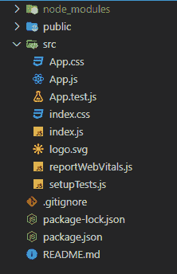
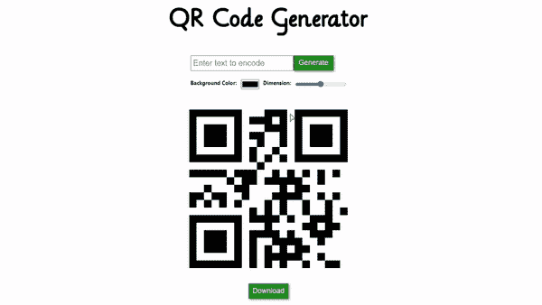

# 使用 ReactJS

创建二维码生成器应用程序

> 原文:[https://www . geesforgeks . org/create-a-QR-code-generator-app-using-reactjs/](https://www.geeksforgeeks.org/create-a-qr-code-generator-app-using-reactjs/)

**简介:**在本文中，我们将制作一个简单的二维码生成器 app。二维码是智能手机上可读的二维条形码。允许在双条码栏中编码超过 4000 个字符。二维码可用于向用户显示文本、打开网址、在地址簿中保持联系或编写消息。

**先决条件:**本项目的先决条件是:

*   [反应](https://www.geeksforgeeks.org/react-js-introduction-working/)
*   [功能组件](https://www.geeksforgeeks.org/reactjs-functional-components/)
*   [反作用钩](https://www.geeksforgeeks.org/introduction-to-react-hooks/)
*   [Javascript 为 6](https://www.geeksforgeeks.org/introduction-to-es6/)

**方法:**我们的 app 包含两个部分。在一个部分中，我们将接受用户输入，例如要编码的文本、二维码的大小、二维码的背景颜色，并存储所有这些内部状态变量。之后，我们将构建所需的应用编程接口字符串来获取二维码图像。在另一部分，我们将显示所需的二维码

**创建反应应用程序:**

**步骤 1:** 在终端中键入以下命令，创建一个 react 应用程序。

```jsx
npx create-react-app qrcode-gen
```

**步骤 2:** 现在，通过运行以下命令转到项目文件夹，即二维码. gen。

```jsx
cd qrcode-gen
```

**项目结构:**如下图。



**示例:**这里 App.js 是我们 App 唯一包含所有逻辑的默认组件。我们将使用一个名为[“创建二维码”](https://goqr.me/api/doc/create-qr-code/#quickstart)的免费开源(无需授权)应用编程接口来获取所需的二维码图像。我们还将有一个按钮来下载二维码图像。

现在在 **App.js** 文件中写下以下代码。

## java 描述语言

```jsx
import { useEffect, useState } from 'react';
import './App.css';

function App() {
  const [temp, setTemp] = useState("");
  const [word, setWord] = useState("");
  const [size, setSize] = useState(400);
  const [bgColor, setBgColor] = useState("ffffff");
  const [qrCode, setQrCode] = useState("");

  // Changing the URL only when the user
  // changes the input
  useEffect(() => {
    setQrCode
 (`http://api.qrserver.com/v1/create-qr-code/?data=${word}!&size=${size}x${size}&bgcolor=${bgColor}`);
  }, [word, size, bgColor]);

  // Updating the input word when user
  // click on the generate button
  function handleClick() {
    setWord(temp);
  }

  return (
    <div className="App">
      <h1>QR Code Generator</h1>
      <div className="input-box">
        <div className="gen">
          <input type="text" onChange={
            (e) => {setTemp(e.target.value)}}
            placeholder="Enter text to encode" />
          <button className="button" 
            onClick={handleClick}>
            Generate
          </button>
        </div>
        <div className="extra">
          <h5>Background Color:</h5>
          <input type="color" onChange={(e) => 
          { setBgColor(e.target.value.substring(1)) }} />
          <h5>Dimension:</h5>
          <input type="range" min="200" max="600"
           value={size} onChange={(e) => 
           {setSize(e.target.value)}} />
        </div>
      </div>
      <div className="output-box">
        
        <a href={qrCode} download="QRCode">
          <button type="button">Download</button>
        </a>
      </div>
    </div>
  );
}

export default App;
```

现在，让我们编辑名为 **App.css** 的文件来设计我们的应用。

## 半铸钢ˌ钢性铸铁(Cast Semi-Steel)

```jsx
@import url('http://fonts.cdnfonts.com/css/lilly');
.App{
  display: flex;
  flex-direction: column;
  justify-content: center;
  align-items: center;
  gap: 50px;
  padding-top: 30px;
}
h1{
  font-family: 'Lilly', sans-serif;
  font-size: 50px;
}
.gen input{
  height: 35px;
  width: 250px;
  font-size: 20px;
  padding-left: 5px;
}
button{
  position: relative;
  height: 38px;
  width: 100px;
  top: -2px;
  font-size: 18px;
  border: none;
  color: whitesmoke;
  background-color: forestgreen;
  box-shadow: 2px 2px 5px rgb(74, 182, 74);
  cursor: pointer;
}
button:active{
  box-shadow: none;
}
.extra{
  padding-top: 20px;
  display: flex;
  justify-content: space-around;
  gap: 10px;
}
.output-box{
  display: flex;
  flex-direction: column;
  align-items: center;
  gap: 40px;
}
```

**运行应用程序的步骤:**从项目的根目录使用以下命令运行应用程序:

```jsx
npm start
```

**输出:**现在打开浏览器，转到 **http://localhost:3000/** ，会看到如下输出:

