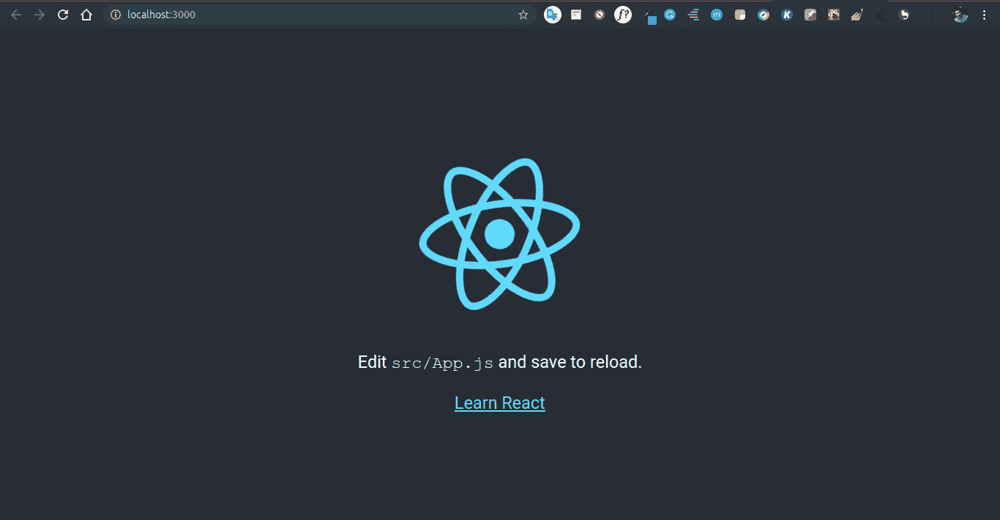

# 使用 ReactJS

创建测验应用程序

> 原文:[https://www . geeksforgeeks . org/create-a-quick-app-using-reactjs/](https://www.geeksforgeeks.org/create-a-quiz-app-using-reactjs/)

React 是一个用于开发交互式用户界面的 JavaScript 库。它由脸书和一个由个人开发者和公司组成的社区管理。react 主要专注于开发单页网页或移动应用。在这里，我们将创建一个问答应用程序来了解 reactjs 的基础知识。

**所需模块:**

*   [npm](https://www.geeksforgeeks.org/node-js-npm-node-package-manager/)
*   [反应](https://www.geeksforgeeks.org/react-js-introduction-working/)
*   反应自举

    ```jsx
    npm install react-bootstrap bootstrap
    ```

**基本设置:**

通过以下命令启动项目–

```jsx
npx create-react-app quiz
```

**NPX** 是一款自带 npm 5.2+的包流器工具，NPX 是好用的 CLI 工具。npx 用于执行节点包。它大大简化了许多事情，其中之一是快速检查/运行节点包，而无需在本地或全局安装它。

现在，转到文件夹创建

```jsx
cd quiz
```


启动服务器-通过在终端中键入以下命令启动服务器–

```jsx
npm start
```

打开*http://localhost:3000/*


将目录更改为 src–

```jsx
cd src
```

删除目录中的所有内容

```jsx
rm *
```

现在创建`index.js`文件

```jsx
touch index.js 
```

这个文件将把我们的应用程序呈现为 html 文件，该文件位于*公共文件夹*中。现在，用文件*src/components/question box . js*和*src/components/resultbox . js*创建一个文件夹名组件，用文件 *src/question/index.js* 保存我们的问题。

```jsx
mkdir components && cd components && touch app.js
```

```jsx
mkdir question && cd question && index.js
```


**编辑 src/index.js 文件**
这个文件包含了我们的 app 逻辑。

```jsx
import React, {Component} from "react";
import ReactDOM from "react-dom";
import "./style.css";
import questionAPI from './question';
import QuestionBox from './components/QuestionBox';
import Result from './components/ResultBox';

class Quiz extends Component {
  constructor() {
    super();
    this.state = {
      questionBank: [],
      score: 0,
      responses: 0
    };
  }

  // Function to get question from ./question
  getQuestions = () => {
    questionAPI().then(question => {
      this.setState({questionBank: question});
    });
  };

  // Set state back to default and call function
  playAgain = () => {
    this.getQuestions();
    this.setState({score: 0, responses: 0});
  };

  // Function to compute scores
  computeAnswer = (answer, correctAns) => {
    if (answer === correctAns) {
      this.setState({
        score: this.state.score + 1
      });
    }
    this.setState({
      responses: this.state.responses < 5
        ? this.state.responses + 1
        : 5
    });
  };

  // componentDidMount function to get question
  componentDidMount() {
    this.getQuestions();
  }

  render() {
    return (<div className="container">
      <div className="title">
        QuizOn
      </div>

      {this.state.questionBank.length > 0 && 
       this.state.responses < 5 && 
       this.state.questionBank.map(({question, answers,
       correct, questionId}) => <QuestionBox question=
       {question} options={answers} key={questionId}
       selected={answer => this.computeAnswer(answer, correct)}/>)}

      {
        this.state.responses === 5
          ? (<Result score={this.state.score}
            playAgain={this.playAgain}/>)
          : null
      }

    </div>)
  }
}

ReactDOM.render(<Quiz/>, document.getElementById("root"));
```

**编辑 src/question/index.js 文件:**该文件包含将要显示的所有问题。

```jsx
const qBank = [
  {
    question:
      "how build the app ?",
    answers: ["vinayak", "sarthak", "somil", "devesh"],
    correct: "vinayak",
    questionId: "099099"
  },
  {
    question:
      "how build the app ?",
    answers: ["vinayak", "sarthak", "somil", "devesh"],
    correct: "vinayak",
    questionId: "093909"
  },
  {
    question:
      "how build the app ?",
    answers: ["vinayak", "sarthak", "somil", "devesh"],
    correct: "vinayak",
    questionId: "009039"
  },
  {
    question:
      "how build the app ?",
    answers: ["vinayak", "sarthak", "somil", "devesh"],
    correct: "vinayak",
    questionId: "090089"
  },
  {
    question:
      "how build the app ?",
    answers: ["vinayak", "sarthak", "somil", "devesh"],
    correct: "vinayak",
    questionId: "01010101"
  },
  {
    question:
      "how build the app ?",
    answers: ["vinayak", "sarthak", "somil", "devesh"],
    correct: "vinayak",
    questionId: "092299"
  },
  {
    question:
      "how build the app ?",
    answers: ["vinayak", "sarthak", "somil", "devesh"],
    correct: "vinayak",
    questionId: "099099"
  },
  {
    question:
      "how build the app ?",
    answers: ["vinayak", "sarthak", "somil", "devesh"],
    correct: "vinayak",
    questionId: "222099"
  },
  {
    question:
      "how build the app ?",
    answers: ["vinayak", "sarthak", "somil", "devesh"],
    correct: "vinayak",
    questionId: "2222099"
  },
  {
    question:
      "how build the app ?",
    answers: ["vinayak", "sarthak", "somil", "devesh"],
    correct: "vinayak",
    questionId: "09922099"
  },
  {
    question:
      "how build the app ?",
    answers: ["vinayak", "sarthak", "somil", "devesh"],
    correct: "vinayak",
    questionId: "222292099"
  },
  {
    question:
      "how build the app ?",
    answers: ["vinayak", "sarthak", "somil", "devesh"],
    correct: "vinayak",
    questionId: "0998999099"
  },
  {
    question:
      "how build the app ?",
    answers: ["vinayak", "sarthak", "somil", "devesh"],
    correct: "vinayak",
    questionId: "099099"
  },
  {
    question:
      "how build the app ?",
    answers: ["vinayak", "sarthak", "somil", "devesh"],
    correct: "vinayak",
    questionId: "099099"
  },
  {
    question:
      "how build the app ?",
    answers: ["vinayak", "sarthak", "somil", "devesh"],
    correct: "vinayak",
    questionId: "099099"
  },
  {
    question:
      "how build the app ?",
    answers: ["vinayak", "sarthak", "somil", "devesh"],
    correct: "vinayak",
    questionId: "09459099"
  },
  {
    question:
      "how build the app ?",
    answers: ["vinayak", "sarthak", "somil", "devesh"],
    correct: "vinayak",
    questionId: "0912219099"
  },

];

// n = 5 to export 5 question
export default (n = 5) =>
  Promise.resolve(qBank.sort(() => 0.5 - Math.random()).slice(0, n));
```

**编辑 src/components/QuestionBox.js 文件:**该文件制作带按钮的问题框。

```jsx
import React, {useState} from "react";
import "../style.css";

// Function to question inside our app
const QuestionBox = ({ question, options, selected}) => {
  const [answer, setAnswer] = useState(options);
  return (
    <div className="questionBox">
        <div className="question">{question}</div>
        {answer.map((text, index) => (
          <button
              key={index}
              className="answerBtn"
              onClick={()=>{
                    setAnswer();
                    selected(text);
                  }}> {text}
         </button>
        ))}
    </div>
  )
};

export default QuestionBox;
```

**编辑 src/components/ResultBox.js 文件:**该文件显示结果。

```jsx
import React from 'react';
import "../style.css";

const Result = ({score, playAgain}) => (
  <div className="score-board">
    <div className="score"> Your score is {score} / 5 correct answer ! ! ! </div>
    <button className="playBtn" onClick={playAgain} > Play Again </button>
  </div>
)

export default Result;
```

**保存所有文件并启动服务器:**

```jsx
npm start
```

在浏览器中打开*<u>http://localhost:3000/</u>*URL。它会显示结果。

<video class="wp-video-shortcode" id="video-391664-1" width="665" height="361" loop="1" autoplay="" preload="metadata" controls=""><source type="video/mp4" src="https://media.geeksforgeeks.org/wp-content/uploads/20200401223721/Screencast-2020-04-01-223648.mp4?_=1">[https://media.geeksforgeeks.org/wp-content/uploads/20200401223721/Screencast-2020-04-01-223648.mp4](https://media.geeksforgeeks.org/wp-content/uploads/20200401223721/Screencast-2020-04-01-223648.mp4)</video>